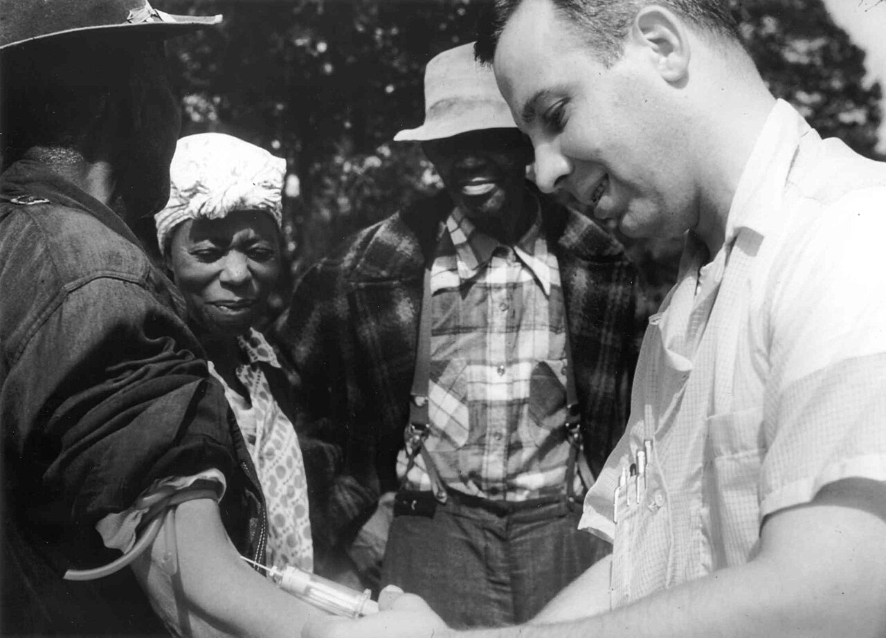
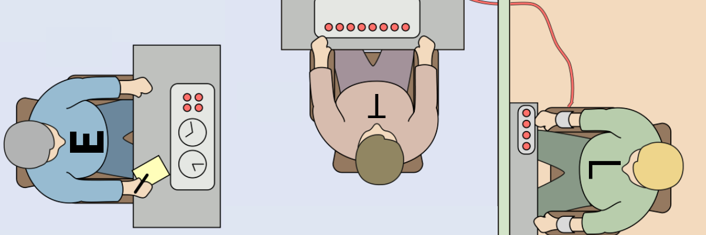
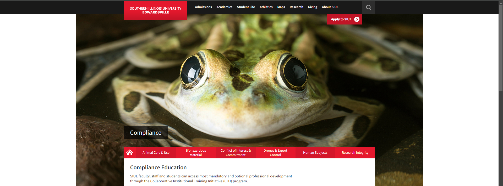
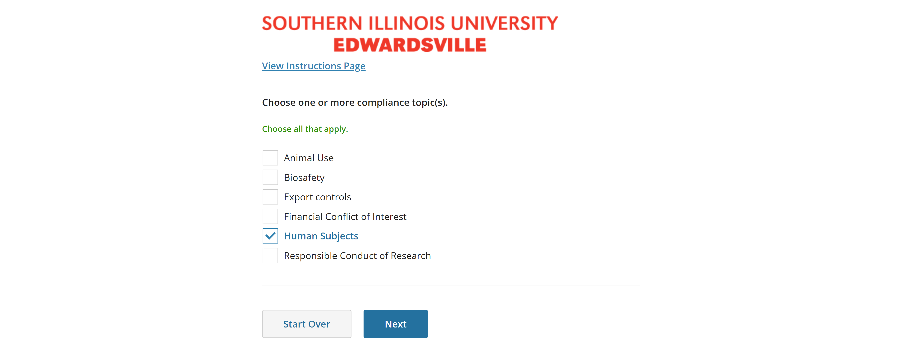
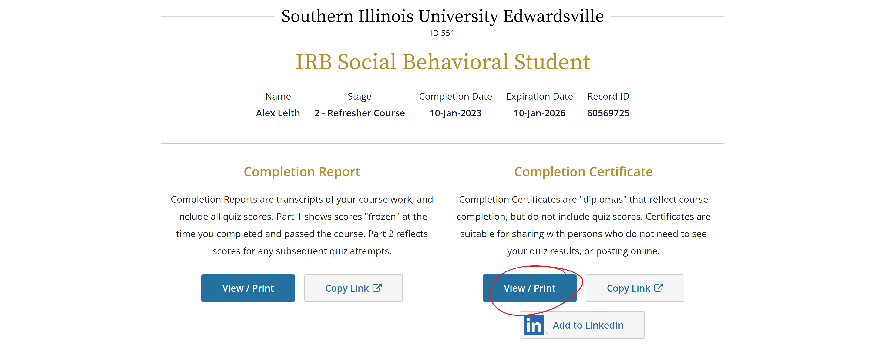
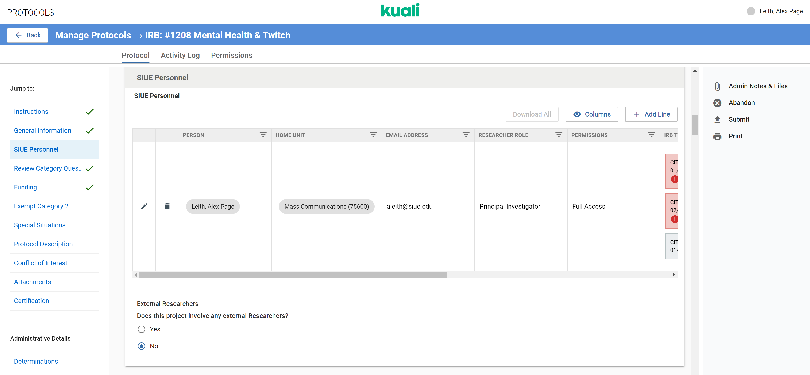
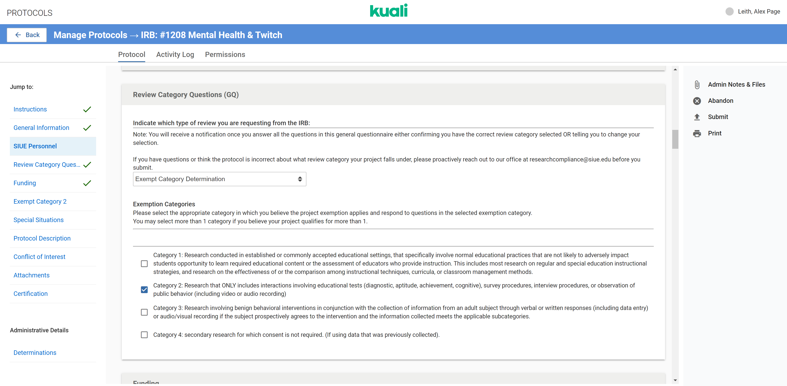

# Research Ethics and the IRB Process

## The Evolution of Research Ethics in Social Science

The history of research ethics in social science is marked by a gradual but significant shift toward protecting human participants, driven by both high-profile ethical violations and the development of formal ethical guidelines. Early social science research often lacked clear ethical standards, resulting in studies that disregarded the rights and welfare of participants. This disregard for ethical considerations led to some of the most notorious examples of unethical research, spurring the creation of ethical frameworks that continue to guide researchers today.

### Early Ethical Violations and the Call for Reform {.unnumbered}

The absence of formal ethical guidelines in the early days of social science research led to numerous studies that, by today's standards, would be considered profoundly unethical. Researchers often prioritized scientific knowledge above their participants' well-being and rights, resulting in severe ethical breaches. Three of the most notorious examples of unethical research during this period are the **Tuskegee Syphilis Study**, the **Milgram Experiments**, and the **Stanford Prison Experiment**.

#### The Tuskegee Syphilis Study (1932-1972) {.unnumbered}

The Tuskegee Syphilis Study is one of the most egregious examples of unethical research in the history of social science and medical research. Conducted by the U.S. Public Health Service (PHS), the study initially aimed to observe the natural progression of untreated syphilis in African American men. The study began in 1932 in Macon County, Alabama, involving 600 African American men---399 of whom had syphilis and 201 who did not. The men were predominantly poor, uneducated sharecroppers who were not informed about the true nature of the study.

The men were told they were being treated for "bad blood," a local term used to describe a variety of ailments, including syphilis. In reality, they were not given any proper treatment for syphilis. Even after penicillin became widely available in 1947 as a highly effective treatment for the disease, the researchers continued to withhold treatment from the participants, opting instead to observe the long-term effects of untreated syphilis. This decision was made despite the clear and unnecessary suffering it caused.

{width="100%"}

The ethical violations in the Tuskegee Syphilis Study were profound. The participants were not informed that they had syphilis, nor were they informed that effective treatment was available. This lack of informed consent meant that the men were essentially used as human guinea pigs, suffering from a disease that could have been cured. The researchers' deception and exploitation of the participants, coupled with the decision to withhold treatment, resulted in needless suffering and death.

The study continued for 40 years before it was exposed by the media in 1972, leading to public outrage. The revelation of the Tuskegee Syphilis Study had far-reaching consequences, significantly undermining trust in the medical establishment, particularly among African Americans. It also led to significant reforms in research ethics, including establishing the National Research Act in 1974 and creating the National Commission for the Protection of Human Subjects of Biomedical and Behavioral Research, which produced the Belmont Report in 1979.

#### The Milgram Experiments (1961-1963) {.unnumbered}

The Milgram Experiments, conducted by psychologist Stanley Milgram at Yale University in the early 1960s, were designed to investigate how individuals would obey authority figures, even when doing so conflicted with their conscience. The experiments were inspired by the atrocities committed during World War II, particularly the Holocaust, and sought to understand how ordinary people could commit or endorse such horrific acts under the influence of authority.

Participants in the Milgram Experiments were told they were participating in a study on learning and memory. They were assigned the role of a "teacher," while another participant (actually an actor, or "confederate") was assigned the role of a "learner." The teacher was instructed to administer electric shocks to the learner each time the learner made a mistake on a memory task. The shocks were fake, but the teacher was unaware of this. With each error, the shock's voltage was to be increased, and the learner (who was not actually being shocked) would act as if they were in severe pain, eventually begging for the experiment to stop.

{width="100%"}

Despite the learner's pleas and the apparent severe pain they were causing, many participants continued to administer shocks when instructed by the experimenter, who was an authority figure in a lab coat. The experimenter would insist that the participant continue, often using prompts like "The experiment requires that you continue" or "You have no other choice; you must go on." Astonishingly, a significant proportion of participants continued to administer shocks up to the highest voltage level, believing they were inflicting severe pain, even potentially lethal harm, on another person.

The Milgram Experiments highlighted the power of authority and the potential for ordinary individuals to commit extreme cruelty under its influence. However, they also raised serious ethical concerns, particularly regarding the use of deception and the psychological distress inflicted on the participants. Many of the participants experienced intense stress, guilt, and anxiety as a result of their actions during the experiment. They were deceived about the true nature of the study. They were not fully informed about the psychological risks involved, raising questions about informed consent and the ethical treatment of participants.

The ethical criticisms of the Milgram Experiments led to stricter regulations regarding the use of deception in research. They emphasized the importance of fully informing participants about the nature and risks of a study. The experiments are now widely cited as a pivotal example in discussions of research ethics, particularly concerning the balance between pursuing scientific knowledge and protecting research participants.

#### The Stanford Prison Experiment (1971) {.unnumbered}

The Stanford Prison Experiment, led by psychologist Philip Zimbardo at Stanford University in 1971, is another infamous study that has been widely criticized for its ethical failings. The experiment aimed to investigate the psychological effects of perceived power, focusing on the struggle between prisoners and prison guards. To do this, Zimbardo and his team created a mock prison environment in the basement of the Stanford psychology building and recruited 24 male college students to participate.

The participants were randomly assigned to play the roles of either guards or prisoners. The guards were given uniforms, sunglasses, and batons, and were instructed to maintain order in the prison. The prisoners were stripped of their personal identity, dressed in smocks, and referred to by numbers rather than their names. The experiment was designed to last two weeks but was terminated after only six days due to the extreme and unethical behavior that quickly emerged.

).](images/police-blindfolding.jpg){width="100%"}

Almost immediately, the guards began to exhibit abusive and authoritarian behavior toward the prisoners. They imposed harsh and degrading punishments, such as forcing prisoners to perform physical tasks like push-ups, depriving them of sleep, and humiliating them in various ways. The prisoners, in turn, became increasingly passive, depressed, and submissive. Some prisoners exhibited signs of severe emotional distress, and at least one had to be removed from the study early due to a mental breakdown.

Zimbardo, who served as both the lead researcher and the prison superintendent, did not intervene to stop the abusive behavior, arguing that the experiment needed to run its course to observe the psychological effects of the prison environment. However, the study spiraled out of control, causing significant psychological harm to the participants. The experiment was only halted when Zimbardo's then-girlfriend, psychologist Christina Maslach, visited the mock prison and expressed her strong objections to the conditions and the treatment of the participants.

The Stanford Prison Experiment has been heavily criticized for its lack of informed consent, the absence of measures to protect participants from harm, and the failure of the researchers to intervene when the situation became dangerous. The study demonstrated the ease with which people could engage in abusive behavior when placed in positions of authority, but it also highlighted the profound ethical responsibilities researchers have to protect their participants. The ethical failings of the Stanford Prison Experiment have since led to stricter regulations on the conduct of social science research, particularly concerning the treatment of participants and the need for rigorous oversight of studies involving potentially harmful situations.

### The Emergence of Ethical Standards {.unnumbered}

The history of social science research is punctuated by significant ethical violations that led to a growing demand for formalized ethical standards to protect human subjects. The widespread outrage and public awareness generated by unethical studies such as the Tuskegee Syphilis Study, the Milgram Experiments, and the Stanford Prison Experiment highlighted the urgent need for ethical guidelines in research. This demand for ethical reform catalyzed the development and adoption of foundational documents that have since shaped the ethical landscape of social science research.

#### The Nuremberg Code (1947) {.unnumbered}

The first significant step toward formalizing ethical standards in research came with adopting the **Nuremberg Code** in 1947. This code was established in response to the atrocities committed by Nazi doctors during World War II, who conducted inhumane medical experiments on concentration camp prisoners without their consent. The subsequent Nuremberg Trials, where these doctors were prosecuted, underscored the need for clear ethical guidelines in medical research.

{width="100%"}

The Nuremberg Code is composed of ten principles, which collectively emphasize the importance of voluntary consent, the necessity of avoiding unnecessary harm, and the obligation of researchers to terminate experiments that are likely to cause injury, disability, or death to participants. The key principles of the Nuremberg Code include:

1.  **Voluntary Consent:** The Code stipulates that "the voluntary consent of the human subject is absolutely essential." This means that participants must be fully informed about the research's nature, purpose, and potential risks and must consent to participate without coercion.

2.  **Beneficence and Non-Maleficence:** Researchers must design experiments that are likely to yield beneficial results for society and avoid unnecessary physical and mental suffering. This principle is rooted in the ethical obligation to maximize benefits and minimize harm.

3.  **Right to Withdraw:** The Code grants participants the right to withdraw from a study if they feel uncomfortable or if the study risks their health or well-being.

4.  **Scientifically Valid Research:** The Code mandates that research be based on prior animal experimentation and a sound understanding of the problem under study, ensuring that it is scientifically valid and justifiable.

While the Nuremberg Code was initially focused on medical research, its principles laid the groundwork for ethical considerations in all research disciplines, including social science. The Code's emphasis on informed consent, beneficence, and protecting participants from harm became foundational concepts that would later influence the development of ethical standards in social science research.

#### The Declaration of Helsinki (1964) {.unnumbered}

Building on the ethical framework established by the Nuremberg Code, the **Declaration of Helsinki** was adopted by the World Medical Association in 1964. This declaration provided a comprehensive set of ethical guidelines for biomedical research involving human subjects and was particularly influential in shaping research practices across various disciplines, including social science.

The Declaration of Helsinki introduced several important ethical principles:

1.  **Informed Consent:** Expanding on the Nuremberg Code, the Declaration of Helsinki emphasizes the necessity of obtaining informed consent from research participants. It requires that participants be adequately informed about the study's aims, methods, potential benefits, risks, and the right to withdraw from the study at any time.

2.  **Risk vs. Benefit Analysis:** The Declaration requires researchers to carefully weigh the risks and benefits of their studies, ensuring that the potential benefits to society outweigh the risks to participants. This principle underscores the importance of beneficence in research ethics.

3.  **Vulnerable Populations:** The Declaration highlights the need for special protections for vulnerable populations, such as children, pregnant women, and those with diminished autonomy. It acknowledges that these groups may be at greater risk of exploitation and harm in research settings.

4.  **Ethical Review Committees:** The Declaration of Helsinki was one of the first documents to recommend the establishment of independent ethical review committees (now known as Institutional Review Boards, or IRBs) to oversee research studies. These committees ensure that studies are conducted ethically and that participants are protected from harm.

Since its adoption, the Declaration of Helsinki has undergone several revisions, reflecting the evolving ethical challenges in research. Its influence extends beyond biomedical research, as many of its principles have been adapted and incorporated into ethical guidelines for social science research.

#### The National Research Act and the Belmont Report (1974-1979) {.unnumbered}

The formal codification of social science research ethics in the United States began in earnest with the passage of the **National Research Act** in 1974. This legislation was enacted in response to growing concerns about the treatment of research participants, particularly in the wake of the Tuskegee Syphilis Study, which had been exposed just two years earlier.

The National Research Act established the **National Commission for the Protection of Human Subjects of Biomedical and Behavioral Research**, a body tasked with developing ethical guidelines for human subject research. The commission's most influential contribution was the 1979 publication of the Belmont Report.

The Belmont Report outlines three fundamental ethical principles that continue to guide social science research:

1.  **Respect for Persons:** This principle encompasses informed consent and the recognition of the autonomy of research participants. It asserts that individuals should be treated as autonomous agents capable of making their own decisions about whether to participate in research. For those with diminished autonomy, such as children or individuals with cognitive impairments, additional protections must be in place.

2.  **Beneficence:** The principle of beneficence requires researchers to minimize potential harm to participants while maximizing the potential benefits of the research. This principle involves carefully assessing risks and benefits and implementing measures to protect participants from harm.

3.  **Justice:** The principle of justice addresses the fair distribution of the benefits and burdens of research. It ensures that no group of people is unfairly burdened by the risks of research or unfairly excluded from its benefits. This principle is particularly relevant in addressing historical injustices in research, such as exploiting marginalized communities.

The Belmont Report has profoundly impacted the ethical conduct of research in the United States and beyond. Its principles are embedded in federal regulations, such as the Common Rule, which governs research involving human subjects in the United States. The Belmont Report also serves as a foundational document for ethical guidelines in various disciplines, including social science.

#### The Impact and Legacy of Emerging Ethical Standards {.unnumbered}

Adopting the Nuremberg Code, the Declaration of Helsinki, and the Belmont Report marked significant milestones in formalizing ethical standards in research. These documents have had a lasting impact on the conduct of social science research, ensuring that the rights and welfare of research participants are prioritized.

The ethical principles articulated in these documents---voluntary consent, informed consent, beneficence, and justice---have become the cornerstones of research ethics. They have shaped the policies and practices of research institutions, guided the development of ethical review processes, and influenced how researchers design and conduct studies.

Moreover, establishing independent ethical review boards, as the Declaration of Helsinki and the Belmont Report recommended, has become a standard research practice. These boards play a critical role in safeguarding the rights and well-being of research participants by reviewing study protocols, assessing potential risks and benefits, and ensuring that ethical principles are upheld.

As social science research continues to evolve, the ethical challenges facing researchers also change. New technologies, such as digital data collection, social media research, and artificial intelligence, present novel ethical dilemmas requiring ongoing reflection and adaptation of ethical standards. Nevertheless, the foundational principles established by the Nuremberg Code, the Declaration of Helsinki, and the Belmont Report remain central to the ethical conduct of research, providing a framework for addressing emerging ethical issues in social science.

## Navigating the IRB Process

Navigating the Institutional Review Board (IRB) process is critical to conducting ethical research involving human participants. The IRB is responsible for reviewing research proposals to ensure that they comply with ethical standards and protect the rights and welfare of participants. As a researcher, particularly within the context of Southern Illinois University Edwardsville (SIUE), understanding the intricacies of this process is essential for gaining approval and conducting your research responsibly. This section will thoroughly explore the key components of the IRB process at SIUE, including creating consent forms, debriefing participants, assessing potential harm, offering incentives, and understanding the submission protocols.

[{width="100%"}](https://www.siue.edu/compliance/training/)

### Completing CITI Certification {.unnumbered}

1.  **Use the SIUE [single sign-on page](https://www.citiprogram.org/Shibboleth.sso/Login?target=https%3A%2F%2Fwww.citiprogram.org%2FSecure%2FWelcome.cfm?inst=551&entityID=https%3A%2F%2Fsts.windows.net%2F99f37d21-0b5c-43ea-9103-e16f02f5aecf%2F) to enter your SIUE e-id and password.**

    If this doesn't work, try the following:

    -   Go to the CITI Program page.

    -   Click on "Log in"

    -   Then, at the top of the page, click on "Log In Through My Organization." (If you have already logged in before, depending on your browser, you may be taken directly to signing in with your e-id and password, if so, proceed to #2 below.)

    -   Choose Southern Illinois University Edwardsville from the drop-down box.

    {width="100%"}

    -   If this is your first time logging into CITI using your SSO, it will ask you to choose one of the following:

        1.  I already have a CITI program account or

        2.  I don't have a CITI program account and need one created. Note: If you select this option, the next step will ask you to press a button that says "Create new CITI Program Account."

2.  At the top left side of the page, you should see "Welcome, [and your name]." In the middle of the page, under "Institutional Courses," Click on the "View Course" button.

3.  You should now see a list of "Active Courses" and Southern Illinois University Edwardsville at the top.

> **IMPORTANT: If courses are not listed, scroll to the bottom of the page and click "Add a Course."**

{width="100%"}

> **Then scroll down until you see a question relating to compliance topics (you only need Human Subjects for this course).**

{width="100%"}

> **Then select your course (you want the Social behavioral student course).**

{width="100%"}

4.  After answering the questions, scroll to the bottom of the page and click **"Next."** This will take you to the stage selection page. Choose Stage 1 if this is your first time getting IRB Certified as a student. Choose Stage 2 if this is a refresher, and click "**Submit."**

5.  You are now ready to complete the course(s). Once completed, the CITI system will provide you with a Certificate of Completion for each course. You may print and save a copy for your records.

### Retrieving Your CITI Certificate {.unnumbered}

Once you have completed your CITI certification, you can review the course or view your record. If you click on the button to view your record, you will be presented with two options: completion report and completion certificate. You will be able to add your certificate to LinkedIn. You can access that through this page's "View/Print" button.

{width="100%"}

Whether you access your IRB certificate through the CITI website or from your LinkedIn profile, it will be identical. Most research courses or teams will request a copy of your CITI Certificate to keep on record since it is commonly requested when completing an IRB proposal.

### Completing IRB Proposal {.unnumbered}

You will submit a proposal to SIUE's Institutional Review Board (IRB) through Kuali's protocols section. Once you have signed into Kuali, you can create a new proposal by selecting the "**+ New Protocol**" button in the top right of the page. You will only need a single new protocol, whether a solo researcher or a group researcher.

In the **General Information** section, the creator of the proposal should be the principal investigator, and their lead unit should be their department; if you are an employee or the department for which the research is being conducted, if you are a student doing research for a course or for a faculty member. The "Study Title" is a general name that summarizes the research you will be conducting. The Study Title and the eventual paper title can be different. Finally, for this course, the project is student-led.

For the **SIUE Personnel** section, you must include the names of all participants at SIUE. You must make sure to include an answer to all sections. You select the "**+ Add Line**" button to add additional researchers. The pencil icon lets you edit the person's information. From there, you must add information to each field. Required information may include a copy of IRB Certificates. You must also grant Access to all participants, including the professor if they supervise the research. There are sections that include researcher experience and researcher involvement that must be answered, even if there is no experience or limited involvement. You select No for external researchers unless you are also working with scholars outside of your university.

[{width="100%"}](https://siue.kuali.co/protocols/portal/protocols)

The next significant stage for discussion is the "**Review Category Questions (GQ)**" section. The GQ section allows you to identify how strict the IRB must be with your study. The less potential harm, the simpler it is to approve your research. For this course, we are strictly doing exempt projects. Exempt projects generally exclude protected classes or projects that may cause atypical harm. If you are doing survey research, you select exempt status and Category 2 since this is a survey procedure. You should have learned the different categories curing your CITI IRB certification process.

{width="100%"}

The following sections are text fields that require you to explain the process of your project. You must ensure that your answers are complete and thorough. It is better to over-explain than under-explain. Further, it is better to answer "N/A" than to leave a field blank. Please review SIUE's [IRB Protocol Guide](https://www.siue.edu/compliance/human-subjects/pdf/IRBProtocolGuidance.pdf) with questions regarding these sections.

You will eventually reach the "**Attachments**" section of the proposal. For the attachments section, you must include your consent forms, recruitment documents, and research materials (e.g., survey questions).

### Developing Consent Forms {.unnumbered}

**Consent forms** are a cornerstone of ethical research, providing participants with all the necessary information to make an informed decision about their involvement in the study. At SIUE, creating a consent form must align with the ethical guidelines and requirements stipulated by the IRB. The consent form must clearly outline the study's purpose, procedures, potential risks, benefits, and measures to ensure participant confidentiality.

Creating a consent form is more than just completing a document; it involves crafting a communication tool that genuinely informs participants. According to the SIUE guidelines, the language used in consent forms should be clear, concise, and devoid of technical jargon that might confuse participants (IRB Protocol Guidance, 2023). For example, it is crucial to break down the information into understandable segments when explaining complex procedures, ensuring that participants fully comprehend their participation.

Moreover, the consent form must explicitly state that participation is voluntary and that participants can withdraw from the study at any point without any negative consequences. This ensures that participants are not coerced or unduly influenced to continue their involvement against their will. The **2023 IRB Protocol Guidance** document from SIUE emphasizes that consent forms should include detailed information on how participants can withdraw and what steps will be taken to handle their data if they choose to do so (IRB Protocol Guidance, 2023).

### Developing Recruitment Materials {.unnumbered}

Recruitment materials play a crucial role in attracting participants to a research study. These materials must be designed to clearly communicate the purpose of the study, the expectations for participation, and the benefits of involvement while adhering to ethical standards. At SIUE, recruitment materials must be developed per the guidelines the Institutional Review Board (IRB) set forth, ensuring transparency and respect for potential participants' autonomy.

{width="100%"}

The recruitment materials should provide an overview of the study, including the study's title, the nature of the research, and the specific requirements for participants (IRB Recruitment Document, 2023). This includes detailing the time commitment required, the type of involvement (e.g., survey, interview), and the confidentiality measures that will be taken to protect participants' identities. The language used in these materials must be accessible, avoiding technical jargon to ensure that potential participants from diverse backgrounds can understand the content.

Moreover, the recruitment materials must emphasize the voluntary nature of participation. This is crucial in ensuring that individuals are not pressured to participate in the study. According to SIUE's IRB guidelines, participants must be informed that they can withdraw from the study at any time without facing any consequences (2023IRB-Research-Participant-Notification, 2023). These materials should also provide clear instructions on expressing interest in participating, such as contact details or survey links, ensuring the process is straightforward and respectful of the participants' time.

### Developing Survey or Interview Questions {.unnumbered}

Survey and interview questions are fundamental components of research data collection, requiring careful design to ensure they effectively gather the necessary information while minimizing bias. At SIUE, the development of these questions must align with IRB protocols, particularly regarding their clarity, neutrality, and relevance to the research objectives.

The survey or interview questions should be constructed to elicit clear, honest responses, avoiding leading or loaded questions that might influence participants' answers. Questions should be directly related to the research objectives and structured logically to facilitate smooth progression through the survey or interview (IRB Protocol Guidance, 2023). It is also important to consider the cultural and contextual appropriateness of the questions, ensuring that they are sensitive to the participants' backgrounds and experiences.

{width="100%"}

In addition, the IRB protocol requires that questions be framed to respect participants' confidentiality and anonymity. For instance, demographic questions should be designed to collect necessary information without compromising participants' identities. This might involve using broader categories for responses or providing options for participants to decline to answer specific questions (Protocols, 2024). Furthermore, the survey or interview process must include clear instructions on how data will be recorded and stored and the steps that will be taken to protect the data from unauthorized access.

### The Debriefing Process {.unnumbered}

**Debriefing** is another crucial aspect of the IRB process, particularly in studies where deception is used or where participants might not be fully aware of the study's purpose during their involvement. Debriefing involves providing participants with a complete explanation of the study after their participation, ensuring they leave with a clear understanding of what the research was about and why certain methodologies, such as deception, were employed.

At SIUE, debriefing is especially important in research that involves sensitive topics or procedures that could cause distress. The debriefing process should be conducted in a manner that is sensitive to the participants' experiences during the study. It should include a thorough explanation of the study's true purpose, an overview of the participant's role, and an opportunity for participants to ask questions or express concerns. Additionally, researchers must provide contact information for follow-up questions and offer resources if the study touches on potentially distressing issues.

The **Research Participant Notification** document is a key tool in this process. It provides participants with formal documentation about the study, their rights, and contact information for any follow-up questions (Research Participant Notification, 2023). Researchers must ensure that this document is provided and explained to participants during the debriefing session.

### Assessing and Minimizing Harm {.unnumbered}

**Assessing potential harm** to participants is a fundamental responsibility when navigating the IRB process. Harm can manifest in various forms, including physical discomfort, psychological distress, or social risks such as breaches of confidentiality. The IRB at SIUE requires that researchers conduct a thorough risk assessment as part of their protocol submission, outlining any potential risks and the measures that will be taken to mitigate them.

When assessing harm, researchers must consider both the likelihood and the severity of potential risks. For instance, a study involving interviews about traumatic experiences must account for the psychological impact of recalling such events on participants. The protocol must detail how these risks will be minimized, such as providing access to counseling services or designing interview questions sensitive to the participant's emotional state.

The **Protocols** document highlights the importance of a detailed risk-benefit analysis, where researchers must justify that the potential benefits of the research outweigh any identified risks (Protocols, 2024). This analysis is crucial for IRB approval, as the board will scrutinize whether the proposed protections are sufficient and appropriate given the nature of the study.

### Offering Incentives {.unnumbered}

**Incentives** can significantly influence participant recruitment and retention, but they must be carefully managed to avoid coercion. The IRB at SIUE requires that any incentives offered to participants be proportional to the time and effort required and not so large that they unduly influence participation, especially in studies involving any level of risk.

Incentives should be described in the IRB protocol submission, with a clear justification of why the chosen incentive is appropriate. For example, offering a small gift card or a modest monetary payment is generally acceptable, but offering a large sum of money might be considered coercive, particularly in studies involving vulnerable populations. The **IRB Protocol Guidance** document advises researchers to carefully consider the ethical implications of incentives and ensure that they do not overshadow the voluntary nature of participation (IRB Protocol Guidance, 2023).

The **Recruitment Document** provided by SIUE is a template for informing potential participants about the study and any incentives they might receive (IRB Recruitment Document, 2023). It is essential to update this document with specific details relevant to your study and ensure that the incentives are described transparently.

### Submission and Review Protocols {.unnumbered}

Navigating the IRB process at SIUE requires careful attention to detail in the submission and review stages. The IRB submission protocol involves several key steps, beginning with completing the IRB application in the Kuali system. Researchers must ensure that all protocol sections are thoroughly completed, including detailed descriptions of the research methods, participant recruitment strategies, and data management plans.

The **Protocols** document emphasizes the importance of thoroughly reading and responding to each question in the IRB submission, as incomplete or vague answers can lead to delays in the review process (Protocols, 2024). Researchers are encouraged to submit their protocols well before the anticipated start date to allow sufficient time for review and any necessary revisions.

Additionally, all student-led research at SIUE requires a faculty advisor's approval and signature, confirming that the student understands the ethical guidelines and that the study is methodologically sound (Faculty Advisor Signature, 2024). This step is crucial for ensuring that the research meets the university's standards and all ethical requirements.

Depending on the study's nature, the IRB review can fall into different categories, such as exempt, expedited, or full board review. Each category has specific requirements and timelines, and researchers must select the appropriate category based on their study's characteristics. The **IRB Protocol Guidance** document provides detailed instructions on determining the correct review category and what each entails (IRB Protocol Guidance, 2023).

## Ethical Considerations Specific to Mass Media Research

When conducting research in mass media, researchers must navigate unique ethical considerations arising from this field's specific nature. Unlike other disciplines, mass media research often involves observing and interacting with individuals in their natural environments, such as during their routine media consumption or within online communities. This approach brings forth specific challenges, particularly related to the **observer effect** and the role of the **observer-as-participant**. These concepts are crucial for understanding the potential influence a researcher can have on the subjects being studied and ensuring the research process's ethical integrity.

### The Observer Effect {.unnumbered}

The **observer effect** refers to the phenomenon where the mere presence of a researcher can alter the behavior of the individuals being observed. This effect is particularly significant in mass media research, where participants' media consumption habits or online activities might change if they are aware of being monitored. For example, suppose individuals know their social media activity is under observation. In that case, they may modify their behavior by avoiding controversial content or engaging more carefully in discussions, leading to results that do not accurately reflect their typical behavior.

The observer effect presents a considerable challenge for researchers aiming to capture authentic data. Suppose the participants alter their behavior due to the awareness of being observed. In that case, the data collected may be skewed, leading to conclusions that are not genuinely representative of the subject's usual actions. This can compromise the validity of the research, making it difficult to draw accurate conclusions about media consumption patterns, audience behavior, or the effects of media content.

To mitigate the observer effect, researchers can employ **unobtrusive measures**---techniques that allow data collection without directly interacting with or influencing the subjects. For instance, researchers might analyze publicly available online data where participants are unaware of the specific focus of the study. However, this approach must be balanced with ethical considerations, particularly regarding the privacy of individuals and the potential implications of observing people without their explicit consent. Even when using unobtrusive measures, researchers must remain vigilant about the ethical implications, especially when dealing with sensitive topics or vulnerable populations.

### The Observer-as-Participant Role {.unnumbered}

Another critical concept in mass media research is the **observer-as-participant role**, in which the researcher not only observes the subjects but also actively engages with them. This dual role can provide valuable insights by allowing the researcher to experience the environment from within, gaining a deeper understanding of the social dynamics, cultural norms, and interactions that influence media consumption and behavior.

For example, a researcher studying online communities might participate in discussions, share content, and interact with community members to better understand how these interactions shape media consumption patterns and influence group behavior. This approach can offer a rich, nuanced perspective that is difficult to achieve through observation alone.

However, the observer-as-participant role also introduces significant ethical challenges. The researcher's involvement in the community can influence the behavior they aim to study, potentially leading to biased results. Moreover, there is the risk of compromising objectivity, as the researcher becomes part of the social fabric they study. Transparency is crucial in this role; researchers must disclose their identity and purpose to the subjects, ensuring that their interactions do not mislead or manipulate the community. Ethical dilemmas can arise if the researcher's participation changes the group dynamics or if their influence leads to outcomes that would not have occurred naturally.

Maintaining a balance between active participation and objective observation is essential but challenging. Researchers must constantly reflect on their role and the potential impact of their actions, taking care not to distort the data or influence the subjects more than necessary. In some cases, researchers may need to withdraw from active participation to ensure their presence does not overly affect the subjects' behavior.

### Ethical Considerations and Strategies for Mitigation {.unnumbered}

The observer effect and the observer-as-participant role highlight the ethical complexities of mass media research. Researchers must consider how their presence and actions might influence the subjects and the collected data. To address these challenges, several strategies can be employed:

1.  **Transparency**: Being transparent with participants about the research objectives and the researcher's role can help mitigate ethical concerns. This includes clear communication about the nature of the study, the role of the researcher, and how data will be collected and used.

2.  **Informed Consent**: When feasible, obtaining informed consent from participants is crucial, particularly when the research involves direct interaction or observation. This ensures that participants are aware of the study and have agreed to participate in it, which can help mitigate the observer effect.

3.  **Minimizing Interaction**: In cases where the observer effect might significantly alter participant behavior, researchers should consider minimizing their interaction with the subjects. This can be achieved through passive observation, anonymized data, or relying on existing data sets that do not involve real-time interaction.

4.  **Ethical Reflection**: Researchers must engage in continuous ethical reflection, considering the potential impacts of their research on the subjects and the community. This involves evaluating the risks and benefits of the research, seeking advice from ethical review boards, and being prepared to adjust the research approach if ethical concerns arise.

5.  **Balancing Roles**: When adopting the observer-as-participant role, researchers should carefully balance their involvement with the need to maintain objectivity. This might involve setting clear boundaries for participation and regularly reviewing the impact of their presence on the group dynamics.
