# Developing Research Questions and Hypotheses

## Formulating Research Questions

### Conceptual Definitions and Operationalization

In mass media research, it is essential to understand the difference between conceptual definitions and operationalization. These two processes form the foundation of how we study and measure abstract phenomena. By clearly defining concepts and determining how they will be measured, researchers can ensure that their studies are both rigorous and meaningful.

Let’s start by discussing the idea of a **concept**. A concept is an abstract idea that represents a phenomenon you are interested in studying. Concepts are the building blocks of research, helping us to focus our inquiry on specific aspects of reality. For example, consider the concept of "media influence." This is a broad idea that could encompass many different types of influence, such as how media shapes public opinion, affects individual behavior, or reinforces cultural norms. Similarly, "audience engagement" is another concept that might refer to how actively people participate in media consumption, interact with content, or share it with others.

To better understand how concepts are used in research, it’s helpful to begin with a broad example. Take the concept of "democracy." Democracy is an abstract idea that can be explored from various angles, such as political participation, freedom of speech, or electoral processes. In research, defining this concept more narrowly allows us to study specific aspects of democracy, such as voter turnout or the impact of media on political knowledge. By narrowing down broad concepts into more specific definitions, researchers can focus their studies and make their findings more relevant and actionable.

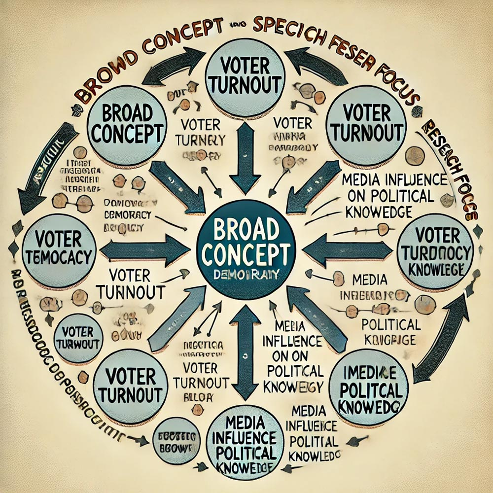{width="100%"}

*Figure 013. A visual representation of the process of narrowing a broad concept into a specific research focus. The image could start with a large circle labeled "Broad Concept" (e.g., "Democracy") and show arrows pointing to smaller circles with more focused aspects (e.g., "Voter Turnout," "Media Influence on Political Knowledge"). This image would help students visualize how broad ideas are refined into researchable topics.*

Once you have a clear concept in mind, the next step is **operationalization**, which is the process of defining how that concept will be measured in your study. Operationalization involves taking an abstract concept and turning it into something that can be observed and quantified. This step is crucial because it bridges the gap between theory and empirical research, allowing you to gather data that can be analyzed and interpreted.

For instance, if you are studying "audience engagement," you need to determine how to measure this concept in a way that reflects its true meaning. One way to operationalize audience engagement might be to look at social media metrics, such as the number of likes, shares, and comments a piece of content receives. These metrics provide tangible data that can be used to assess how engaged an audience is with a particular media message. Similarly, if you were studying "media influence," you might operationalize this concept by measuring changes in public opinion before and after exposure to a specific media campaign.

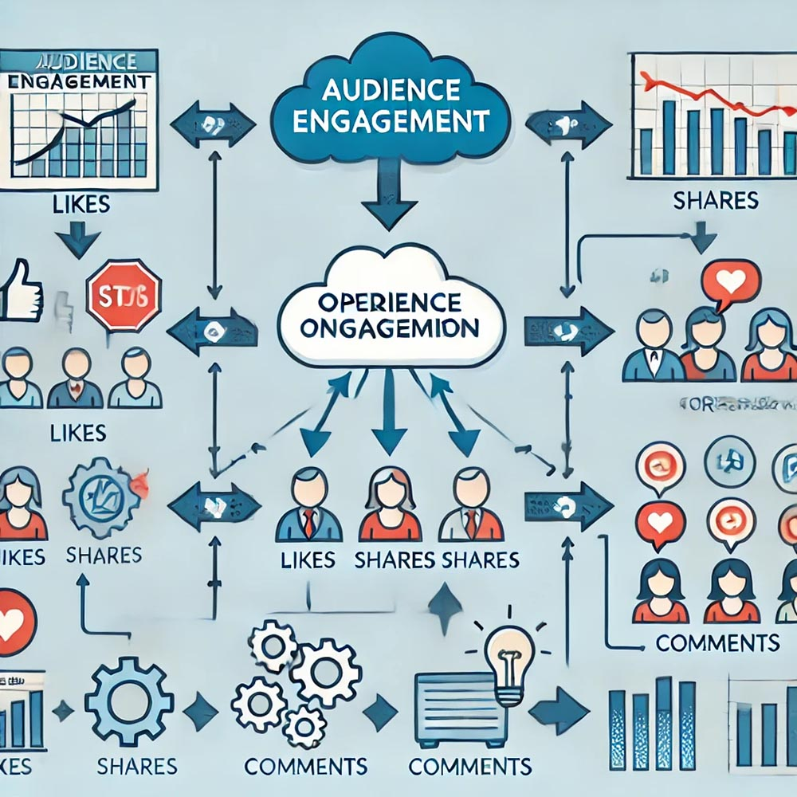{width="100%"}

*Figure 014. A step-by-step flowchart illustrating the operationalization process. The image could begin with an abstract concept (e.g., "Audience Engagement"), followed by arrows pointing to specific measurable variables (e.g., "Likes," "Shares," "Comments"). The final step could show these variables being analyzed in a research context. This visual would help students understand how abstract ideas are translated into measurable data.*

To deepen your understanding of these processes, we will begin by exploring examples of broad concepts and discussing how they can be used in research. For instance, we might start with the concept of "public opinion" and examine how it can be studied through various lenses, such as survey data, media analysis, or behavioral observation. This will help you see how researchers define their concepts and why these definitions are critical for conducting meaningful research.

Next, we will engage in a brainstorming session where you will identify concepts relevant to mass media that interest you. This collaborative activity will allow you to explore different ideas and discuss their meanings and significance with your peers. By the end of this session, you should have a clearer idea of how to articulate your research interests in the form of well-defined concepts.

Following this, we will focus on operationalization, using case studies to illustrate how abstract concepts are transformed into measurable variables. For example, we might look at a study that operationalizes "political participation" by measuring voter registration rates, attendance at political rallies, or participation in online political discussions. By analyzing these case studies, you will learn how researchers make decisions about which variables best capture the essence of the concept they are studying.

Finally, you will have the opportunity to practice creating operational definitions for a list of given concepts. This exercise will challenge you to think critically about how to measure abstract ideas in a way that is both accurate and meaningful. You might, for example, be asked to operationalize the concept of "media literacy" by deciding which behaviors or knowledge indicators best represent this idea. Through this practice, you will develop the skills needed to turn theoretical concepts into practical research tools.

{width="100%"}

*Figure 015. An interactive example or exercise embedded within the textbook. The image could show a blank template for operationalizing a concept, with prompts for students to fill in. For example, the template could ask, "Concept: ___," "Operational Definition: __," "Measurable Variables: ____." This image would provide a hands-on tool for students to apply what they have learned directly in the textbook.*

By the end of this section, you should have a solid understanding of the importance of conceptual definitions and operationalization in research. You will be equipped to define abstract concepts clearly and determine how to measure them effectively in your studies. This foundational knowledge is essential for conducting rigorous research that produces reliable and valid results, contributing to a deeper understanding of the complex phenomena in mass media.

### Constructing Hypotheses

In the research process, constructing hypotheses is a crucial step that allows you to test specific ideas and draw conclusions based on your data. Hypotheses provide a clear direction for your study and help you determine the relationships between variables. There are three key components involved in constructing hypotheses: the **null hypothesis (H0)**, the **alternative hypothesis (H1)**, and the **research question**. Each plays a distinct role in guiding your research and ensuring that your study is focused and methodologically sound.

The **null hypothesis (H0)** is a statement that asserts there is no effect or no relationship between the variables being studied. It serves as a baseline or default position that you seek to test against. The null hypothesis is important because it provides a clear point of comparison. For example, if you are studying the impact of media consumption on political attitudes, your null hypothesis might state, "There is no difference in political attitudes between individuals who consume a high amount of media and those who consume a low amount." This statement assumes that media consumption has no effect, and your research will involve testing whether this assumption holds true.

Understanding and formulating a null hypothesis is fundamental to conducting rigorous research. By starting with the assumption that there is no effect, you can objectively test whether your data provides sufficient evidence to reject this hypothesis. This approach ensures that your conclusions are based on empirical evidence rather than preconceived notions.

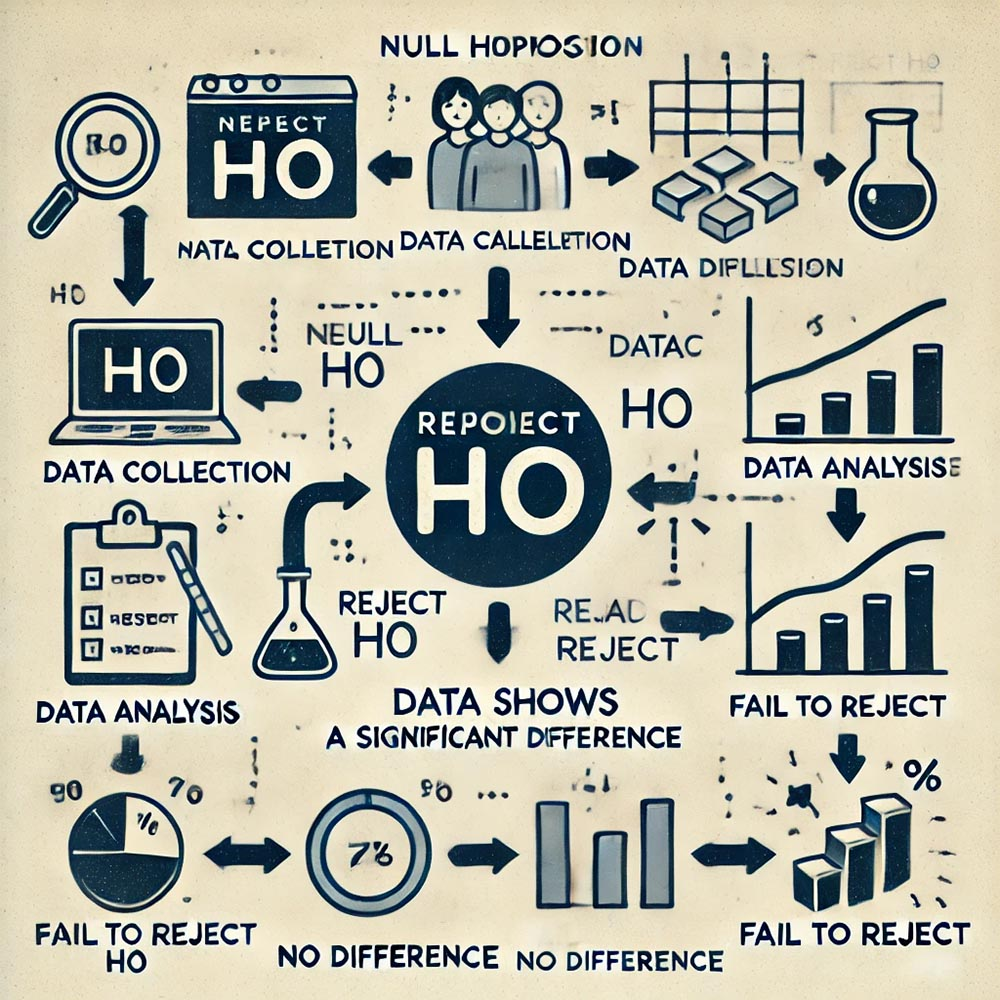{width="100%"}

*Figure 016. A flowchart showing the process of hypothesis testing, beginning with the null hypothesis (H0) and moving through data collection, analysis, and the decision to either reject or fail to reject the null hypothesis. The chart could include simple examples at each stage, such as "Data shows no difference" leading to "Fail to reject H0" or "Data shows a significant difference" leading to "Reject H0." This visual would help students understand the logical sequence of hypothesis testing.*

In contrast to the null hypothesis, the **alternative hypothesis (H1)** is a statement that proposes a potential effect or relationship between variables. It directly opposes the null hypothesis and suggests that there is indeed a difference or relationship to be observed. Continuing with the previous example, the alternative hypothesis might state, "Individuals who consume a high amount of media have different political attitudes than those who consume a low amount." This hypothesis suggests that media consumption does influence political attitudes, and your research will aim to determine if this is the case.

The alternative hypothesis is where you articulate the specific effect or relationship you are interested in exploring. It represents the hypothesis you are testing for and is the focus of your research. The goal of your study is to gather enough evidence to support or refute this hypothesis. If the data contradicts the null hypothesis, you may have grounds to accept the alternative hypothesis, indicating that the variables are indeed related.

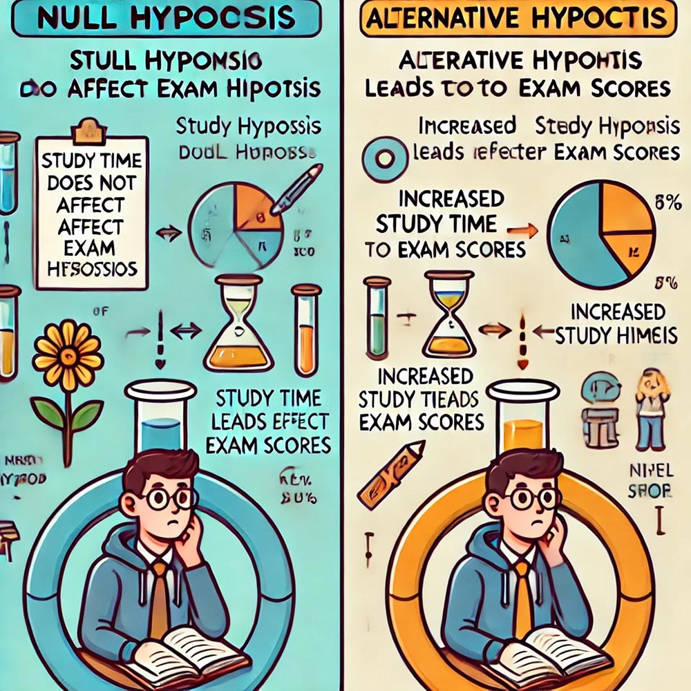{width="100%"}

*Figure 017. A side-by-side comparison of the null hypothesis and the alternative hypothesis. The image could use a simple example, such as the relationship between study time and exam scores. On one side, the null hypothesis might state, "Study time does not affect exam scores," while the alternative hypothesis might state, "Increased study time leads to higher exam scores." This visual would help students see the contrast between the two types of hypotheses and their roles in research.*

At the heart of hypothesis construction is the **research question**—the specific query that your study aims to answer. A well-formulated research question is clear, focused, and directly related to the hypotheses you are testing. The research question guides the entire research process, from the design of your study to the analysis of your data. For example, your research question might be, "How does media consumption influence political attitudes among young adults?" This question is specific enough to guide your study and broad enough to allow for meaningful analysis.

Crafting a good research question is an essential skill for any researcher. It involves narrowing down broad topics into specific, researchable queries that can be addressed through empirical study. A well-defined research question helps ensure that your study remains focused and that your hypotheses are directly aligned with the goals of your research.

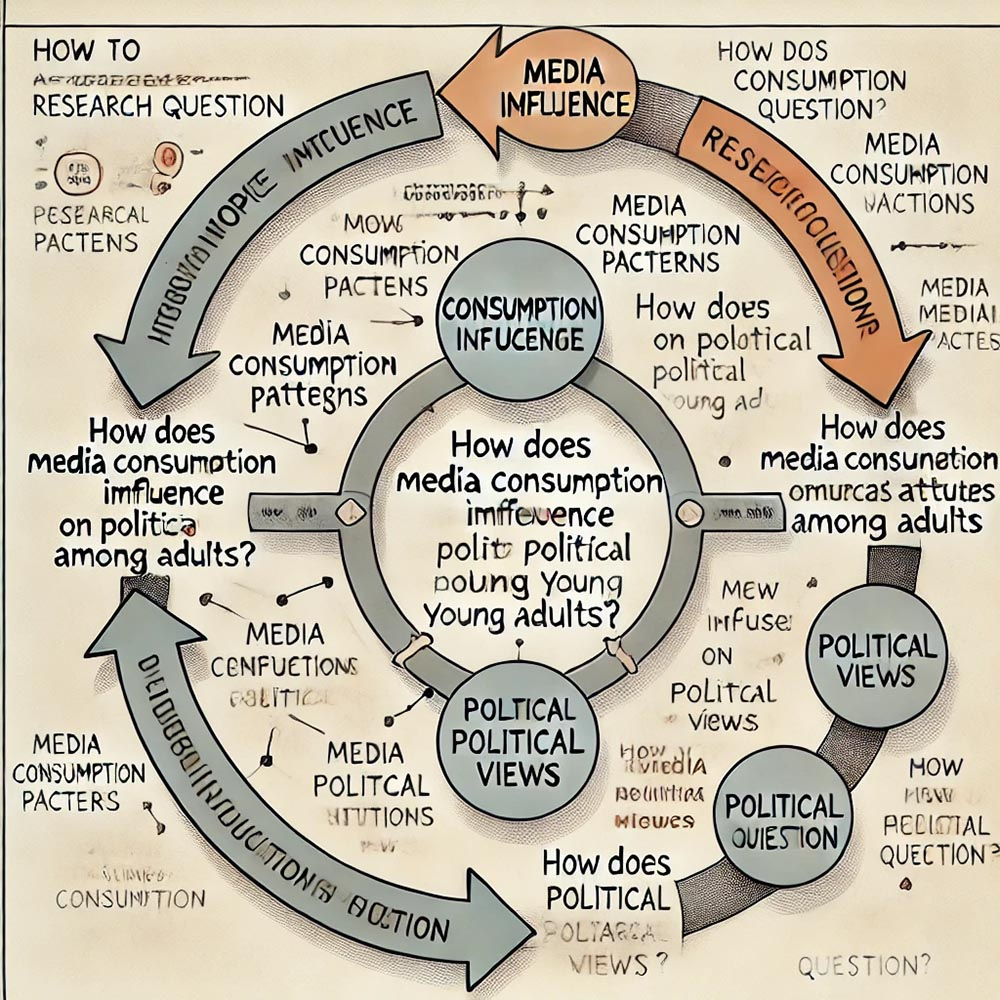{width="100%"}

*Figure 018. An example of a research question development process. The image could start with a broad topic, such as "Media Influence," and show how it is refined into a specific research question like "How does media consumption influence political attitudes among young adults?" Arrows could guide students through the steps of narrowing and focusing the question. This visual would help students understand the process of refining a research topic into a precise and manageable research question.*

In the classroom, we will introduce the concept of the null hypothesis using simple examples that are easy to grasp. For instance, we might start with a hypothesis like "There is no difference in media consumption between age groups," and then explore how this hypothesis can be tested in a research study. You will have the opportunity to write your own null hypotheses for hypothetical studies, helping you to practice formulating clear and testable statements.

We will also discuss the alternative hypothesis, emphasizing how it contrasts with the null hypothesis. By examining real-world research scenarios, you will see how researchers frame their alternative hypotheses to explore specific effects or relationships. In group activities, you will work with your peers to generate both null and alternative hypotheses based on different research questions. This collaborative approach will allow you to apply what you have learned and gain feedback from others.

Finally, we will focus on the research question, discussing the importance of clarity and focus in guiding your study. Through peer feedback sessions, you will refine broad topics into specific research questions that are directly tied to your hypotheses. By the end of this section, you will have the skills to construct well-defined hypotheses and research questions that will guide your studies and contribute to meaningful and impactful research.

## Measurement and Variables

### Levels of Measurement

Understanding the different levels of measurement is fundamental to conducting effective research. The level of measurement of your data determines the types of statistical analyses you can perform and how you can interpret your results. There are four primary levels of measurement: nominal, ordinal, interval, and ratio. Each level provides a different way of categorizing and quantifying data, and recognizing these distinctions will enhance your ability to design studies and analyze data accurately.

The **nominal level** of measurement involves classifying data into distinct categories that do not have a specific order. At this level, data points are simply grouped based on shared characteristics, and these categories are mutually exclusive—each data point fits into one and only one category. For example, in media studies, you might categorize types of media content, such as TV shows, into genres like drama, comedy, and documentary. Each genre represents a nominal category, and while these categories help you organize the data, they do not imply any ranking or order among them.

Nominal data is particularly useful when your goal is to count the frequency of occurrences in each category or when you need to distinguish between different types of entities. However, because nominal data lacks an inherent order, you cannot perform mathematical operations like addition or subtraction on it. Understanding the limitations and appropriate uses of nominal data is crucial for ensuring the accuracy of your analyses.

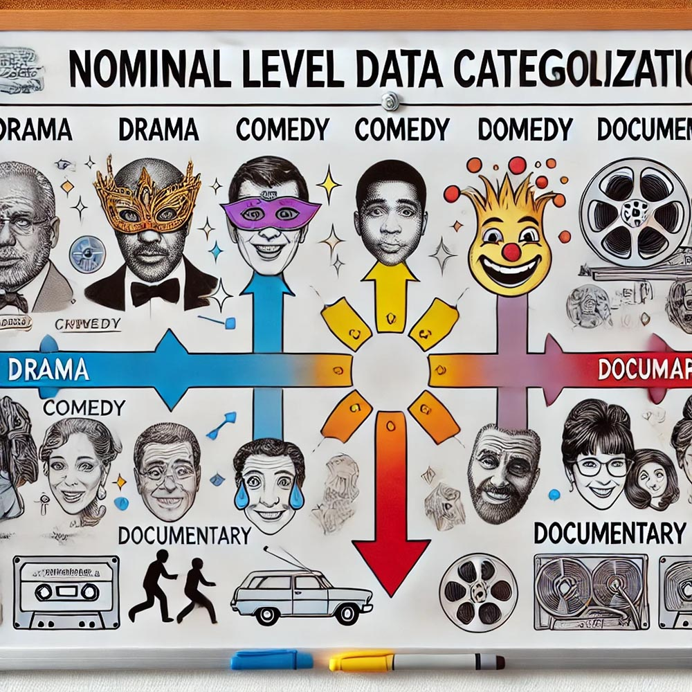{width="100%"}

*Figure 019. A chart illustrating nominal level data categorization. The image could display different TV show genres (e.g., drama, comedy, documentary) with visual icons representing each genre. Arrows could show how individual TV shows are categorized into these genres. This visual would help students grasp the concept of nominal categorization and its application in media studies.*

The **ordinal level** of measurement takes categorization a step further by introducing a meaningful order among the categories. At this level, data is ranked or ordered in a way that reflects a relative position or degree, but the intervals between the ranks are not necessarily consistent. For example, consider a survey that asks participants to rank their favorite media channels from most to least preferred. The resulting data shows the order of preference, but it does not indicate how much more one channel is preferred over another.

Ordinal data is often used in research to assess relative standings or preferences. However, because the distances between the ranks are not equal or known, you cannot assume that the difference between two ranks is the same as the difference between two other ranks. This limitation affects the types of statistical analyses that can be performed, making it important to choose the right level of measurement for your research question.

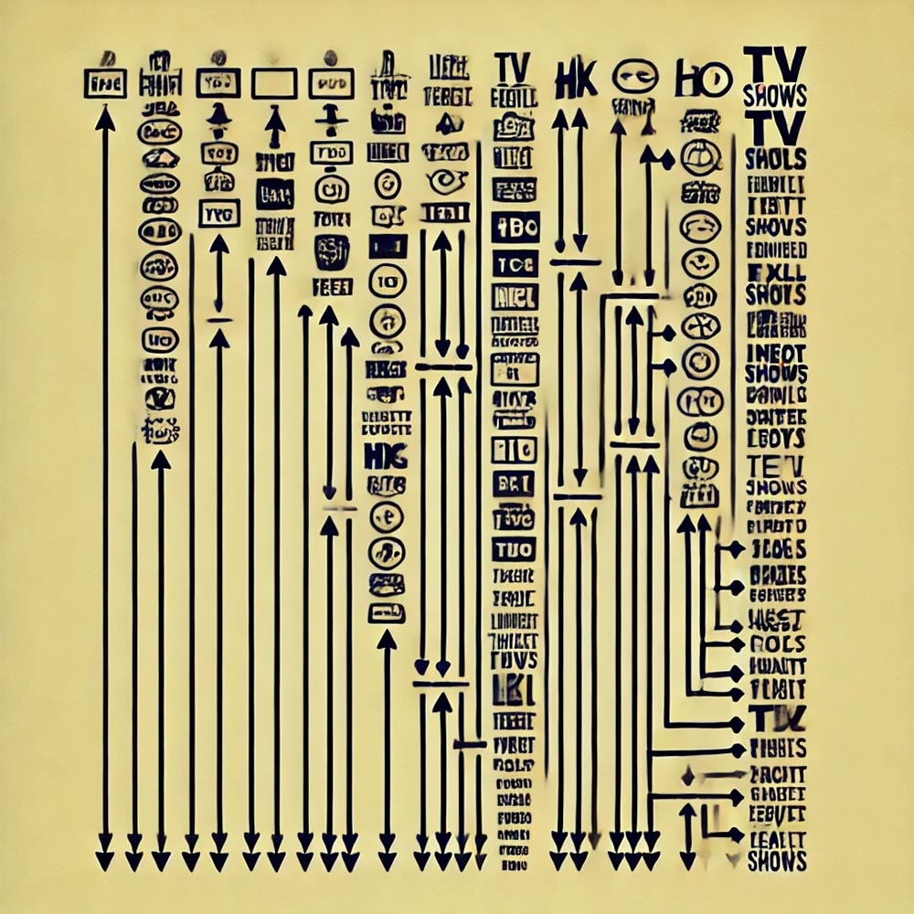{width="100%"}

*Figure 020. An example of ordinal data representation. The image could show a ranking of favorite TV shows, with each show placed in a specific order but without equal spacing between the ranks. A visual representation of the rankings, such as a list with arrows indicating the order, would help students understand how ordinal data is structured and interpreted.*

Moving beyond ordinal data, the **interval level** of measurement involves numerical data where the intervals between values are consistent, but there is no true zero point. This means that while you can measure the distance between data points, the lack of a true zero means that you cannot make meaningful statements about the absolute quantity or ratio of the data. A common example of interval data in media research is the Likert scale, often used in surveys to assess attitudes or opinions. On a Likert scale, participants might rate their agreement with a statement on a scale from 1 to 5, where each interval between numbers is equal.

Interval data allows for a wider range of statistical analyses than nominal or ordinal data, as you can calculate means and standard deviations. However, because interval data lacks a true zero point, certain operations, like calculating ratios, are not meaningful. For instance, saying that a score of 4 on a Likert scale is "twice as positive" as a score of 2 is not valid, as the scale does not represent an absolute quantity.

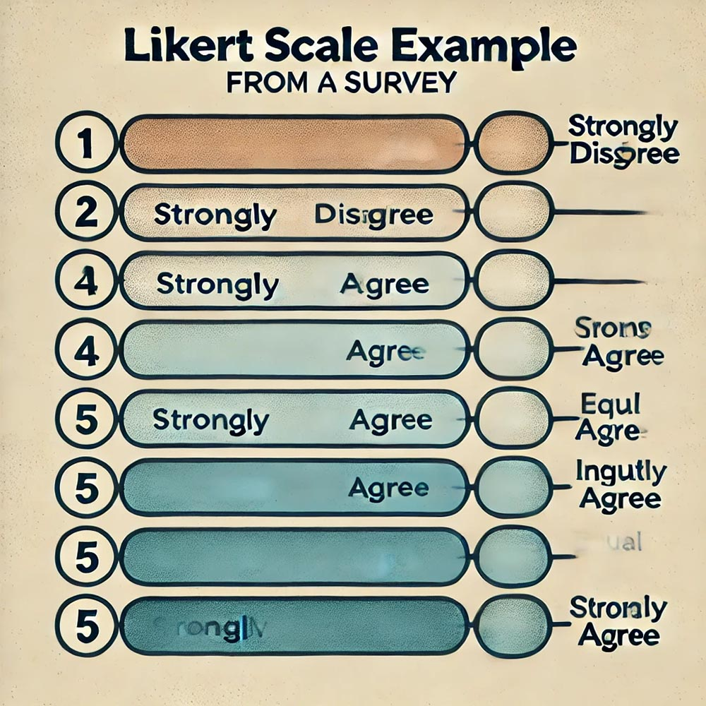{width="100%"}

*Figure 021. A Likert scale example from a survey, showing a range from 1 (Strongly Disagree) to 5 (Strongly Agree). Each point on the scale should be evenly spaced to emphasize the equal intervals between them. This visual would clarify how interval data is structured and why the equal spacing is important for analysis.*

Finally, the **ratio level** of measurement is the most informative level, as it includes all the properties of the interval level but also has a true zero point. This means that not only can you measure the distance between data points, but you can also make meaningful statements about the absolute quantities and ratios of the data. An example of ratio data in media research could be the number of hours individuals spend watching TV per week. Since there is a true zero point (zero hours means no TV watched), you can say that someone who watches 10 hours of TV per week watches twice as much as someone who watches 5 hours.

Ratio data provides the greatest flexibility for statistical analysis, allowing you to use all mathematical operations, including calculating means, variances, and ratios. Understanding and correctly identifying ratio data is crucial for conducting accurate and meaningful research, as it allows for the most precise and comprehensive analysis.

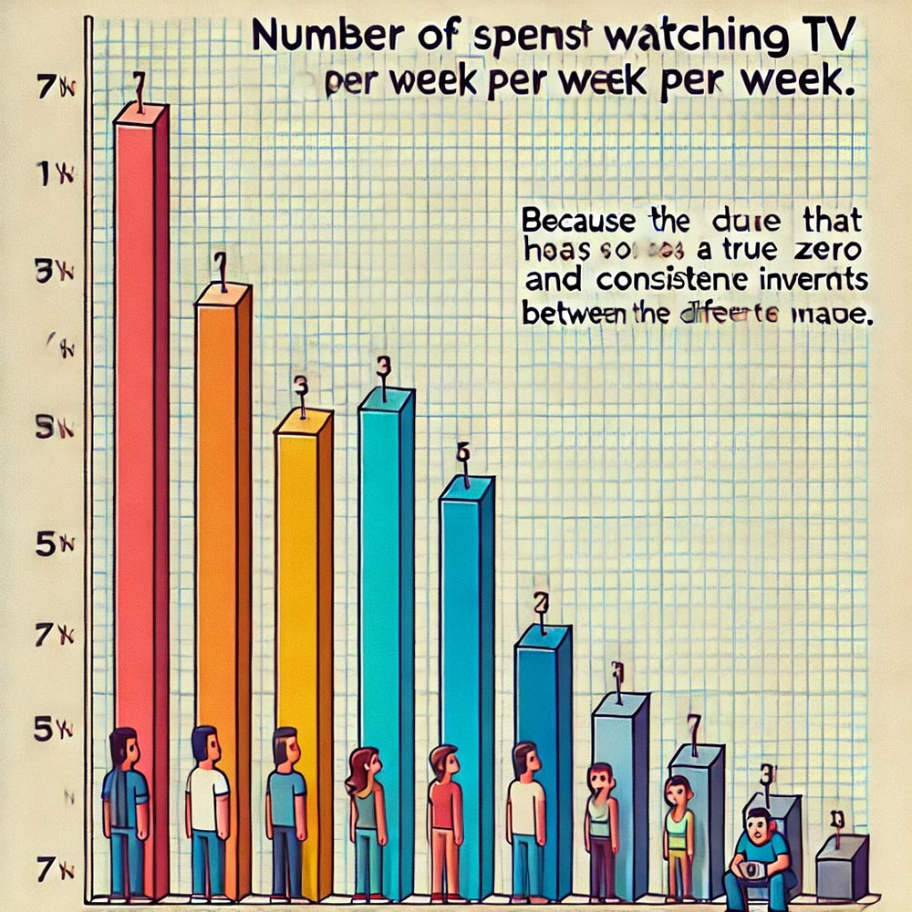{width="100%"}

*Figure 022. A bar graph showing the number of hours spent watching TV per week by different individuals. The graph could highlight that the data has a true zero point and uses consistent intervals, showing how this allows for meaningful comparisons between different values. This visual would help students understand the concept of ratio data and its application in research.*

In the classroom, we will explore these levels of measurement through interactive exercises. For instance, you might classify different types of media content into nominal categories or arrange survey data in an ordinal manner to see how the order affects interpretation. Additionally, we will engage in activities where you design surveys using interval-level measures and identify ratio-level variables in research articles. These hands-on experiences will reinforce your understanding of the different levels of measurement and their implications for data analysis.

By mastering these concepts, you will be equipped to choose the appropriate level of measurement for your research questions and apply the correct statistical techniques to analyze your data. This foundational knowledge is essential for conducting rigorous and reliable research in the field of mass media.

### Identifying Independent and Dependent Variables

In research, understanding the roles of independent and dependent variables is essential for designing experiments and interpreting results. These variables help researchers establish cause-and-effect relationships by manipulating one factor and observing the impact on another. Grasping these concepts will enable you to clearly define your research questions and hypotheses and to structure your studies in a way that yields meaningful data.

The **independent variable (IV)** is the variable that the researcher manipulates or categorizes to observe its effect on another variable. It is considered the "cause" in a cause-and-effect relationship. For instance, in a study exploring the impact of different types of media content on audience engagement, the type of media content (e.g., news, entertainment, educational) would be the independent variable. The researcher changes or selects different categories of media content to see how these variations influence the outcome, which is the dependent variable.

To help you better understand independent variables, consider an experiment where you want to study how different advertising formats affect consumer behavior. The independent variable could be the format of the advertisement—such as a video, a banner ad, or a social media post. By manipulating the format, you can observe how these changes influence consumer behavior, such as click-through rates or purchasing decisions.

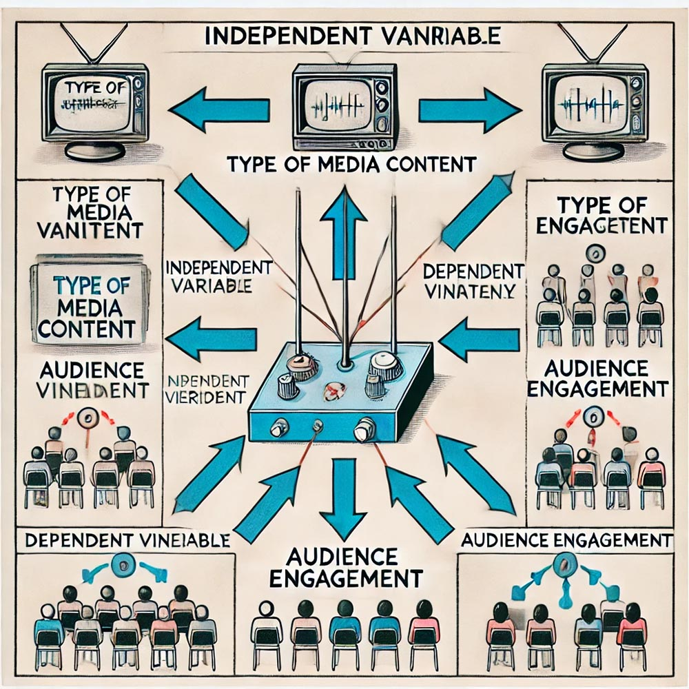{width="100%"}

*Figure 023. A diagram showing an experiment where the independent variable (e.g., "Type of Media Content") is manipulated to observe its effect on the dependent variable (e.g., "Audience Engagement"). The diagram could use arrows to indicate the direction of influence from the independent variable to the dependent variable. This visual would help students see the relationship between these variables in a research context.*

On the other hand, the **dependent variable (DV)** is the variable that is measured and is expected to be influenced by changes in the independent variable. It is considered the "effect" in the cause-and-effect relationship. Continuing with the previous example of media content, the dependent variable might be audience engagement, which could be measured in various ways, such as the number of comments, likes, shares, or time spent viewing the content. The key here is that the dependent variable is what you observe and record as data to determine if and how it changes in response to the independent variable.

To illustrate the role of dependent variables, imagine a study where you are investigating how different headlines affect readers' perceptions of news credibility. The dependent variable could be the credibility score that readers assign to each article after reading it. By measuring this score, you can assess whether changes in the headline (the independent variable) have an impact on readers' perceptions of credibility (the dependent variable).

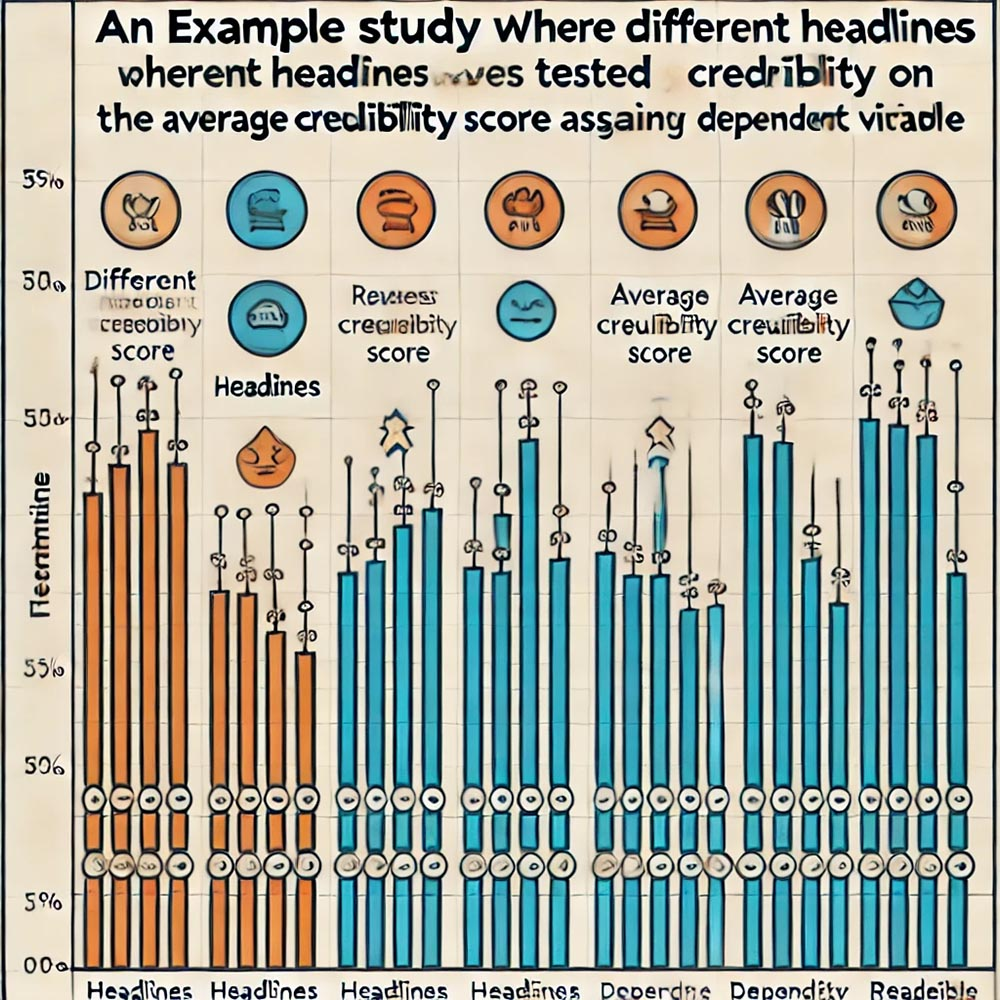{width="100%"}

*Figure 024. A chart displaying an example study where different headlines (independent variable) are tested against readers' credibility scores (dependent variable). The chart could show varying scores based on different headlines, visually representing the effect of the independent variable on the dependent variable. This image would help students understand how changes in the independent variable can influence the dependent variable.*

In the classroom, we will explore these concepts by examining case studies where the independent and dependent variables are clearly identified. For example, we might look at a research study that examines the effect of social media usage on academic performance. In this case, social media usage would be the independent variable, while academic performance, measured through grades or test scores, would be the dependent variable. By analyzing these case studies, you will learn how to distinguish between the variables and understand their roles in research.

To reinforce your understanding, you will also engage in activities where you map out research scenarios and clearly define the independent and dependent variables. For instance, you might be tasked with designing a study to investigate how different levels of advertising exposure (independent variable) influence brand recall (dependent variable). By defining these variables, you will gain practical experience in structuring research questions and experiments.

{width="100%"}

*Figure 025. A worksheet or template where students can practice identifying and defining independent and dependent variables in various research scenarios. The worksheet could include prompts like "Research Question: ", "Independent Variable: __", and "Dependent Variable: ___". This interactive element would provide a hands-on tool for students to apply what they have learned.*

By the end of this section, you should be confident in your ability to identify independent and dependent variables in a wide range of research contexts. This foundational knowledge will be crucial as you move forward in your studies, allowing you to design experiments that effectively test your hypotheses and contribute to the broader understanding of mass media effects. Understanding these variables will also enable you to critically evaluate existing research, helping you discern the validity of the studies you encounter in academic literature.

### Issues in Measurement

When conducting research, particularly in the social sciences and media studies, accurate and consistent measurement is crucial. However, various challenges can arise in the measurement process, leading to potential errors and inaccuracies. Understanding these issues, such as **measurement error**, **validity**, and **reliability**, is essential for ensuring that your research findings are both accurate and meaningful.

**Measurement error** refers to the difference between the observed value and the true value of what is being measured. It can occur for a variety of reasons, and even small errors can significantly impact the validity of your research results. Common sources of measurement error include respondent misunderstanding, data entry mistakes, and inconsistencies in how data is collected. For instance, if participants in a survey misinterpret a question, their responses may not accurately reflect their true attitudes or behaviors, leading to measurement error. Similarly, if data is entered incorrectly into a database, the resulting analysis could be skewed.

Understanding and identifying sources of measurement error is key to minimizing its impact on your research. For example, consider a study measuring the effectiveness of a new media literacy program. If participants misunderstand a survey question about their media consumption habits, the resulting data might inaccurately represent their actual media use. This could lead to incorrect conclusions about the program’s effectiveness.

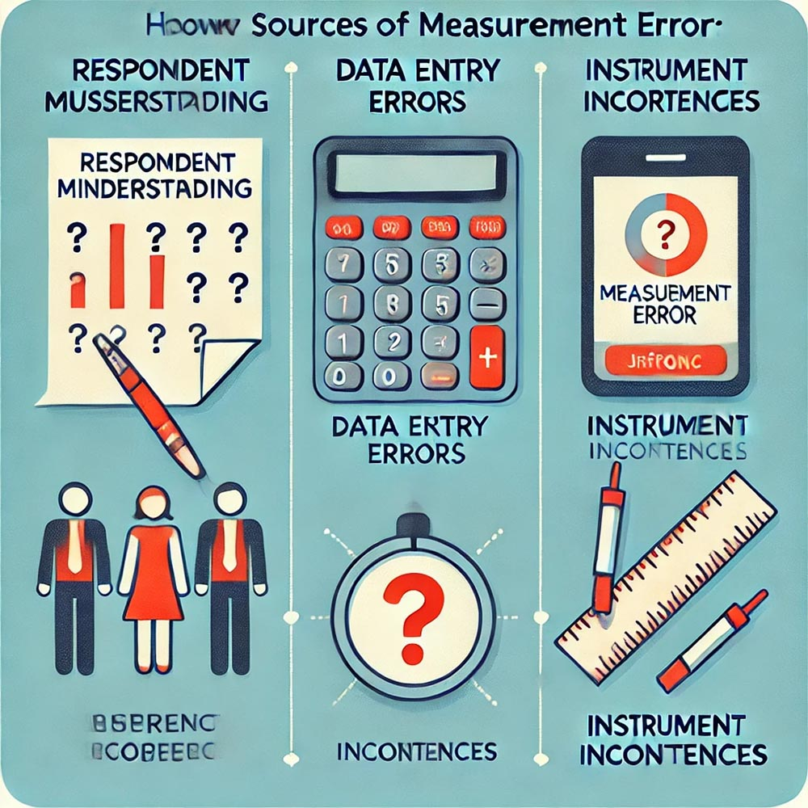{width="100%"}

*Figure 026. An infographic showing different sources of measurement error. The image could include icons representing respondent misunderstanding (e.g., a question mark over a survey response), data entry errors (e.g., a keyboard with a typo), and instrument inconsistencies (e.g., a broken ruler). This visual would help students recognize various types of measurement error and their potential impact on research outcomes.*

To help you grasp the concept of measurement error, we will discuss practical examples of how such errors can affect research outcomes. We will explore case studies where measurement error led to misleading results and analyze how these errors could have been avoided. Additionally, we will conduct a class exercise where you will be asked to identify potential sources of measurement error in a given study. This hands-on activity will help you develop the skills to recognize and address measurement error in your own research.

**Validity** is another critical issue in measurement. It refers to the extent to which a measurement tool accurately measures what it is intended to measure. If a tool lacks validity, the data it produces may not truly reflect the concept under study, leading to faulty conclusions. There are different types of validity, but one of the most important in social sciences research is **construct validity**. Construct validity ensures that the test or measurement tool effectively measures the concept it’s intended to measure.

For example, in media studies, psychological scales are often used to measure abstract concepts like media literacy or audience engagement. To assess the construct validity of such a scale, you would need to determine whether the scale truly captures the essence of the concept it aims to measure. If the scale includes irrelevant items or fails to address key aspects of the concept, its validity would be compromised.

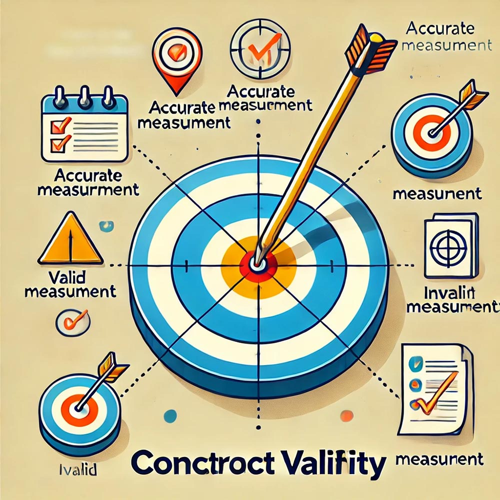{width="100%"}

*Figure 027. A diagram illustrating the concept of construct validity. The image could show a target with an arrow hitting the center, labeled "Accurate Measurement," to symbolize valid measurement. Surrounding the target, there could be examples of both valid and invalid measures, helping students visualize the importance of hitting the "target" with their measurement tools.*

In our discussions, we will use examples from existing psychological scales used in media studies to explore how validity is assessed. You will have the opportunity to evaluate the validity of research tools by considering whether they effectively measure the intended concepts. This exercise will deepen your understanding of how to ensure that your own measurement tools are valid, leading to more accurate and credible research findings.

Finally, we must consider **reliability**, which refers to the consistency of a measurement tool in producing the same results under the same conditions. If a tool is reliable, it should yield similar results each time it is used in the same situation. For example, a standardized test that consistently produces the same scores for a student across different administrations would be considered reliable.

Reliability is crucial because it ensures that your measurements are stable and repeatable. Without reliability, even valid measurements can be rendered meaningless, as inconsistent results can obscure the true relationships between variables. For instance, if a survey instrument designed to measure audience engagement produces wildly different results each time it is administered, it would be difficult to draw any reliable conclusions about audience behavior.

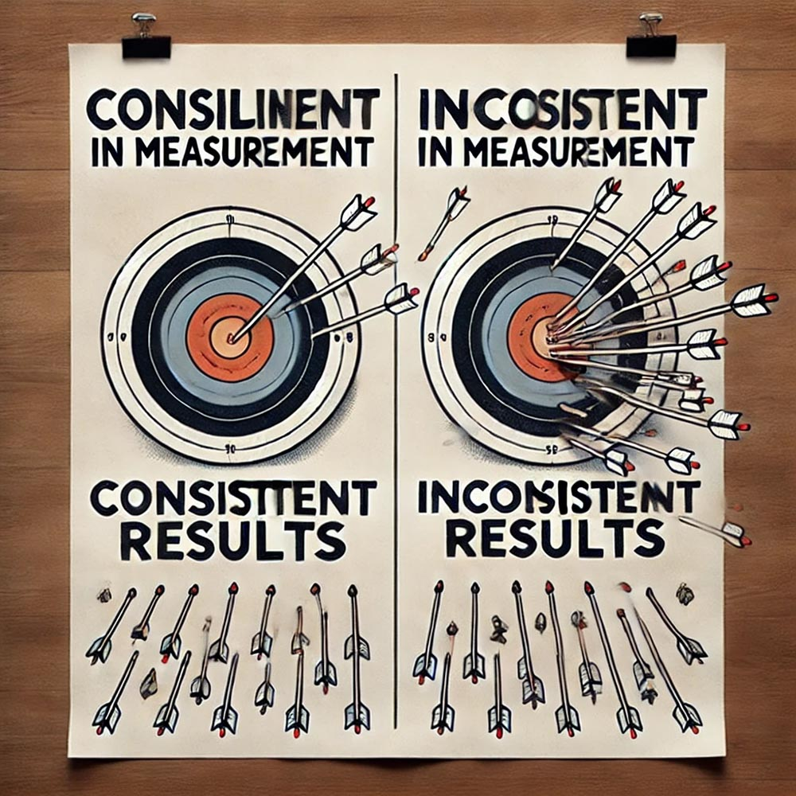{width="100%"}

*Figure 028. A visual representation of reliability in measurement. The image could depict multiple arrows consistently hitting the same spot on a target, labeled "Consistent Results." Alongside this, another target could show arrows scattered all over, labeled "Inconsistent Results," to illustrate unreliable measurement. This visual would help students understand the concept of reliability and its importance in research.*

To reinforce the concept of reliability, we will engage in an exercise where you will test the reliability of a simple survey instrument over repeated trials. By analyzing the consistency of the results, you will gain a practical understanding of how to assess and improve the reliability of your own measurement tools.

Throughout this section, you will learn to recognize and address the key issues in measurement that can impact the accuracy and credibility of your research. By understanding and applying the concepts of measurement error, validity, and reliability, you will be better equipped to design studies that produce meaningful and trustworthy results.

