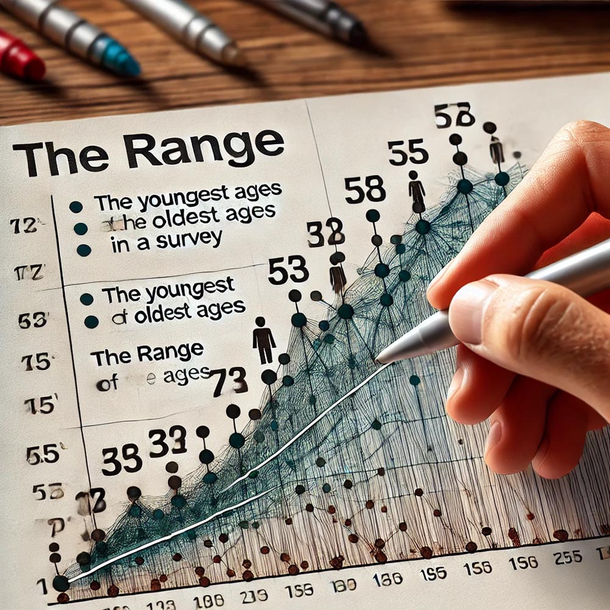

# Data Analysis and Statistical Techniques

## Descriptive Statistics

### Measures of Central Tendency

When analyzing data, it is essential to summarize the data set in a way that provides meaningful insights into the overall trends. Measures of central tendency—mean, median, and mode—are statistical tools that help us identify the central point around which the data tends to cluster. These measures offer different perspectives on what might be considered "typical" or "average" in a data set, and understanding how and when to use each one is crucial for effective data analysis.

The **mean** is one of the most commonly used measures of central tendency. It is calculated by adding together all the values in a data set and then dividing the sum by the number of values. The mean provides a straightforward and useful way to determine the average value in a data set. For example, if you wanted to calculate the average time spent on social media per day by a group of participants, you would sum up the total number of hours reported by all participants and then divide that sum by the number of participants. The result would give you the mean, or average, time spent on social media.

However, while the mean is useful, it is important to recognize its limitations. The mean is sensitive to outliers—values that are significantly higher or lower than the rest of the data. For instance, if most participants report spending 2 to 3 hours on social media daily, but one participant reports spending 12 hours, the mean will be skewed higher, potentially misrepresenting the typical social media usage for the group. In such cases, the mean might not accurately reflect the central tendency of the data.

{width="100%"}

*Figure 046. A bar graph depicting the daily social media usage of a group of participants, with the mean highlighted by a horizontal line across the graph. The graph could include an outlier bar that significantly deviates from the others, visually illustrating how outliers can affect the mean. This image would help students understand the calculation and interpretation of the mean, especially in the presence of outliers.*

To further your understanding, we will use real-world examples to demonstrate how the mean is calculated and interpreted in various contexts. You will participate in a class exercise where you calculate the mean from a given dataset and then discuss situations where the mean may not be the best measure of central tendency, particularly when the data includes outliers.

The **median** is another measure of central tendency, representing the middle value in a data set when the values are arranged in ascending or descending order. If there is an even number of values, the median is calculated by averaging the two middle numbers. The median is particularly useful in skewed distributions, where the mean might be distorted by outliers. For example, if you wanted to find the median income of households in a particular city, you would list all household incomes in order and identify the middle value. The median provides a better representation of central tendency in cases where the data is not symmetrically distributed.

Unlike the mean, the median is not affected by outliers. In a skewed distribution, where a few extremely high or low values could distort the mean, the median offers a more accurate reflection of the typical value in the data set. For instance, in a city where a few households have exceptionally high incomes, the median income will give you a better sense of what the "middle" income is, rather than the mean, which could be inflated by the high-income outliers.

{width="100%"}

*Figure 047. A line plot or dot plot showing a series of income values arranged in order, with the median highlighted. The plot could show a few extreme values (outliers) at the higher end, demonstrating how the median remains unaffected by these outliers. This image would help students visualize how the median is calculated and why it is sometimes a better measure than the mean in skewed distributions.*

In class, we will explore examples of how the median can serve as a better measure of central tendency than the mean, especially in data sets with skewed distributions. You will calculate the median from a dataset provided and discuss its significance compared to the mean, considering when it might be more appropriate to use the median in your analyses.

The **mode** is the measure of central tendency that identifies the most frequently occurring value in a data set. Unlike the mean and median, which are based on mathematical calculations, the mode is simply the value that appears most often. For example, if you were to survey a group of people about their favorite news source and the most common response was "CNN," then "CNN" would be the mode of that data set.

The mode is particularly useful when dealing with categorical data, where the data points are divided into distinct categories. It helps identify the most popular or common category in the data. For instance, in a survey asking participants to choose their preferred social media platform, the mode would reveal the platform that the majority of respondents prefer.

{width="100%"}

*Figure 048. A pie chart or bar chart showing the distribution of responses to a survey question about preferred social media platforms, with the mode (the most frequently chosen platform) clearly highlighted. This visual would help students understand how the mode is determined and why it is useful for analyzing categorical data.*

We will discuss the usefulness of the mode in understanding the most popular categories in a dataset, particularly in situations where you want to identify the most common value or category. You will engage in an activity where you identify the mode from various datasets, followed by a discussion on when it is appropriate to use the mode as a measure of central tendency.

Understanding the mean, median, and mode, and knowing when to use each measure, is crucial for accurately summarizing and interpreting data. Each measure offers a different perspective on the data, and choosing the right one depends on the characteristics of your data set and the specific research questions you are addressing. By mastering these measures of central tendency, you will be better equipped to analyze data in a way that accurately reflects the patterns and trends within your research.

### Measures of Dispersion

Measures of dispersion are statistical tools that provide insight into the spread or variability of data within a dataset. While measures of central tendency, such as the mean, median, and mode, offer information about the central point of the data, measures of dispersion help us understand how spread out the data points are around this central point. Understanding these measures—range, standard deviation, and variance—enables you to gain a fuller picture of your data, particularly in terms of how much variation exists within the dataset.

The **range** is the simplest measure of dispersion and is calculated as the difference between the highest and lowest values in a dataset. It provides a quick snapshot of the spread of the data. For example, if you were to survey a group of participants about their ages in a study on media consumption habits, and the youngest participant was 18 years old while the oldest was 60, the range would be 42 years. This tells you that there is a 42-year span between the youngest and oldest participants in your study.

The range is easy to calculate and gives a basic indication of variability. However, it has significant limitations, particularly its sensitivity to outliers—extremely high or low values that can skew the range. For instance, if most participants in the media consumption study are between 20 and 30 years old, but one participant is 60, the range would still be 42, which might not accurately reflect the overall age distribution of the group. Therefore, while the range can be informative, it should be used with caution and in conjunction with other measures of dispersion.

{width="100%"}

*Figure 049. A line graph or number line displaying the range of ages in a survey, with the youngest and oldest ages marked and the range highlighted. The visual could include an outlier to show how it affects the range. This image would help students visualize how the range is calculated and why it might not always be the best measure of dispersion when outliers are present.*

In our lessons, we will explore how the range provides a simple measure of variability. You will participate in an activity where you calculate the range for different datasets, including those with outliers, and discuss how these outliers can affect the range. This exercise will help you understand both the utility and the limitations of using range as a measure of dispersion.

The **standard deviation** is a more sophisticated measure of dispersion that indicates the amount of variation or spread in a set of values. Specifically, it tells you how much individual data points differ from the mean of the dataset. For example, if you were studying the daily time spent on social media among teenagers, calculating the standard deviation would help you understand whether most teenagers spend a similar amount of time on social media each day or whether there is a wide variation in their usage patterns.

The standard deviation is calculated by taking the square root of the variance (which we will discuss shortly). It provides a clear sense of the spread of the data around the mean: a low standard deviation indicates that the data points are close to the mean, while a high standard deviation suggests that the data points are spread out over a wider range of values. Understanding standard deviation is crucial because it allows you to assess the reliability and consistency of your data. In many research scenarios, particularly those involving large datasets, standard deviation is a key indicator of how much individual values deviate from the average.

{width="100%"}

*Figure 050. A bell curve (normal distribution) with the mean marked in the center and standard deviations shown on either side of the mean (e.g., ±1, ±2 standard deviations). The visual could illustrate how data points are distributed around the mean and how standard deviation captures the spread of these data points. This image would help students grasp the concept of standard deviation and its significance in measuring data dispersion.*

To further your understanding, we will break down the formula for standard deviation and use visual aids to illustrate how it measures spread around the mean. You will be assigned an exercise where you calculate the standard deviation for a given dataset and interpret what it reveals about the dataset. This hands-on practice will deepen your understanding of standard deviation and its application in real-world research.

**Variance** is another important measure of dispersion, representing the average of the squared differences from the mean. Essentially, variance is the square of the standard deviation. While the standard deviation provides a measure of spread in the same units as the data itself, variance is expressed in squared units, making it less intuitive but very useful in statistical modeling and analysis.

Variance helps you understand the overall variability within your data and is particularly important in contexts where you need to compare the spread of different datasets or analyze data that is used in predictive models, such as regression analysis. For example, if you were examining the variance in viewer ratings for a TV show across different demographics, calculating the variance would give you insight into how consistent or varied these ratings are within each demographic group.

Although variance can sometimes seem abstract because it is expressed in squared units, it is fundamental to many statistical methods and models. It provides a foundation for understanding how data points are distributed and helps in making inferences about the broader population from which your sample is drawn.

{width="100%"}

*Figure 051. A graphical representation of a dataset showing the mean, individual data points, and the squared differences from the mean. The visual could include the calculation steps for variance, illustrating how each squared difference contributes to the overall variance. This image would help students see how variance is calculated and why it is a crucial measure in statistical analysis.*

In our lessons, we will explore the relationship between variance and standard deviation and discuss why variance is often used in statistical models. You will calculate the variance for different datasets and compare it to the standard deviation to see how these measures of dispersion complement each other. This exercise will help you appreciate the role of variance in understanding data variability and its application in more advanced statistical analyses.

By mastering the concepts of range, standard deviation, and variance, you will be equipped to analyze the variability within your data, providing a more comprehensive understanding of your research findings. Each of these measures offers unique insights into the spread of data, and knowing when and how to use them is essential for conducting rigorous and meaningful research.

## Inferential Statistics

### Hypothesis Testing

Hypothesis testing is a fundamental process in statistical analysis, allowing researchers to make inferences about a population based on sample data. The process involves making a hypothesis—a statement about a population parameter—and then using statistical methods to determine whether the data supports or contradicts this hypothesis. Understanding the components of hypothesis testing, such as p-values, Type I and Type II errors, and the distinction between one-tailed and two-tailed tests, is crucial for conducting rigorous and reliable research.

The **p-value** is a key concept in hypothesis testing. It represents the probability that the observed results are due to chance, assuming that the null hypothesis is true. In other words, the p-value helps you determine whether the evidence against the null hypothesis is strong enough to reject it. For example, if you were testing the difference in political views between two groups exposed to different news sources, the p-value would indicate the likelihood that any observed difference is simply due to random variation rather than a real effect of the news source on political views.

A low p-value (typically less than 0.05) suggests that the observed results are unlikely to have occurred by chance, leading researchers to reject the null hypothesis in favor of the alternative hypothesis. Conversely, a high p-value indicates that the data does not provide sufficient evidence to reject the null hypothesis, meaning any observed difference could be due to chance. Understanding p-values is crucial for interpreting the results of hypothesis tests accurately and making informed decisions about the validity of your research findings.

{width="100%"}

*Figure 052. A diagram illustrating the concept of p-values in hypothesis testing. The diagram could show a bell curve (normal distribution) with areas under the curve shaded to represent different p-value ranges (e.g., p < 0.05). The visual could also include an example scenario where p-values are calculated for a difference in means, helping students understand how p-values are derived and interpreted in the context of hypothesis testing.*

In our lessons, we will use real-life scenarios to explain what the p-value represents and how it is used in hypothesis testing. You will calculate p-values from sample data and interpret the results in the context of rejecting or failing to reject the null hypothesis. This hands-on approach will help you understand the role of p-values in making evidence-based decisions in research.

A **Type I error** occurs when a true null hypothesis is incorrectly rejected, also known as a false positive. This means that the researcher concludes there is an effect or difference when, in reality, there is none. For example, if a study concludes that a new social media feature increases user engagement when it actually does not, the researcher has made a Type I error. The consequences of Type I errors can be significant, leading to false conclusions and potentially misleading further research or practical applications based on those findings.

Minimizing Type I errors is important, especially in fields where false positives could lead to wasted resources or incorrect policy decisions. In hypothesis testing, the significance level (usually denoted as alpha, α) is set to control the likelihood of making a Type I error. A common alpha level is 0.05, meaning there is a 5% chance of rejecting a true null hypothesis. However, this is a balance, as setting a very low alpha level to reduce Type I errors increases the risk of making Type II errors.

{width="100%"}

*Figure 053. A flowchart showing the decision-making process in hypothesis testing, highlighting where Type I errors occur. The chart could start with the null hypothesis, moving through the steps of calculating the test statistic and comparing it to the significance level, ending with either rejecting or failing to reject the null hypothesis. Annotations could point out the possibility of Type I errors when rejecting a true null hypothesis. This visual would help students understand how Type I errors arise and the importance of significance levels in controlling them.*

We will explore the consequences of Type I errors with examples from research and discuss strategies to minimize this error. You will engage in exercises where you identify potential Type I errors in hypothetical research scenarios, enhancing your ability to recognize and avoid these errors in your own research.

A **Type II error** occurs when a false null hypothesis is not rejected, also known as a false negative. This means that the researcher concludes there is no effect or difference when there actually is one. For example, if a study fails to detect that a change in advertising strategy actually improves sales, the researcher has made a Type II error. The implications of Type II errors can be equally significant, as they may lead to missed opportunities for effective interventions or incorrect assumptions that a treatment or strategy is ineffective.

The risk of Type II errors is related to the power of the statistical test, which is the probability of correctly rejecting a false null hypothesis. Factors such as sample size, effect size, and significance level all influence the power of a test. Researchers must balance the risk of Type I and Type II errors by choosing an appropriate significance level and ensuring their study is adequately powered to detect meaningful effects.

{width="100%"}

*Figure 054. A graph showing the relationship between Type I and Type II errors, with overlapping distributions representing the null and alternative hypotheses. The graph could include shaded areas to indicate where Type I and Type II errors occur, helping students visualize the trade-offs involved in hypothesis testing. This visual would aid in understanding how changes in significance level and sample size affect the likelihood of these errors.*

In class, we will discuss the trade-off between Type I and Type II errors and their implications in research. You will be assigned tasks where you calculate and interpret the potential for Type II errors in different experimental setups. This exercise will help you appreciate the importance of balancing these errors in your research design.

In hypothesis testing, the choice between a **one-tailed** and a **two-tailed** test depends on the nature of the research question. A one-tailed test is used when the research hypothesis specifies a direction of the effect (e.g., testing whether one group has a higher score than another). For example, if you are testing whether a new educational program increases test scores, you would use a one-tailed test because you are only interested in whether the program leads to higher scores, not lower scores.

A two-tailed test, on the other hand, is used when the research hypothesis does not specify a direction and simply tests for any difference, regardless of direction. For instance, if you are testing whether a new educational program affects test scores in any way (either increasing or decreasing them), a two-tailed test would be appropriate. The choice between one-tailed and two-tailed tests has implications for the significance level and the interpretation of results, as a one-tailed test focuses on one end of the distribution while a two-tailed test considers both ends.

{width="100%"}

*Figure 055. A diagram comparing one-tailed and two-tailed tests, with bell curves showing the critical regions for each test. The one-tailed test could have a shaded area at one end of the distribution, while the two-tailed test could have shaded areas at both ends. This visual would help students understand the difference between the two types of tests and when to use each one based on their research question.*

We will use examples to illustrate when to use one-tailed versus two-tailed tests, and you will conduct an exercise where you choose between one-tailed and two-tailed tests based on specific research questions and justify your choice. This hands-on practice will help you develop the skills to select the appropriate test for your research and interpret the results accurately.

By mastering the concepts of p-values, Type I and Type II errors, and the distinction between one-tailed and two-tailed tests, you will be well-equipped to conduct hypothesis testing that is both rigorous and meaningful. These tools are essential for making informed decisions in research, allowing you to draw valid conclusions from your data and contribute to the advancement of knowledge in your field.

### Comparing Groups

In research, comparing groups is a fundamental process that allows us to explore differences and draw meaningful conclusions about the relationships between variables. Various statistical tests are designed for this purpose, each suited to different types of data and research questions. Understanding how and when to use these tests—such as the t-test, ANOVA, Chi-Square Test, and ANCOVA—is essential for accurately interpreting data and making informed decisions based on research findings.

The **t-test** is one of the most commonly used statistical tests, particularly when the goal is to compare the means of two groups to determine if they are significantly different from each other. This test is especially useful in situations where you want to see if there is a difference between two distinct groups on some continuous outcome. For instance, if you are comparing the average time spent on social media between males and females, the t-test can help you determine whether the observed difference in means is statistically significant or if it might have occurred by chance.

The t-test operates by calculating the difference between the group means and determining whether this difference is large enough to be considered statistically significant, given the variability in the data and the sample sizes. The result is a t-statistic, which is then compared to a critical value from the t-distribution to determine the significance of the result.

{width="100%"}

*Figure 056. A graph showing the distributions of two groups (e.g., males and females) with their respective means marked, alongside the calculation of the t-statistic. The image could include a depiction of the overlap between the two distributions, helping students visualize how the t-test assesses whether the means are significantly different. This visual would aid in understanding the concept of the t-test and its application to comparing group means.*

In our lessons, we will explain the concept of the t-test with concrete examples and walk you through the calculation process step by step. You will have the opportunity to perform t-tests using sample data, interpret the results, and discuss potential sources of error, such as unequal variances or small sample sizes, that could affect the reliability of your conclusions.

When research involves comparing the means of three or more groups, the **Analysis of Variance (ANOVA)** becomes the appropriate statistical test. ANOVA extends the logic of the t-test to multiple groups, allowing you to determine whether at least one group mean is different from the others. For example, if you were interested in comparing average TV viewing times across different age groups—say, teenagers, adults, and seniors—ANOVA would help you assess whether the observed differences in viewing times are statistically significant.

The ANOVA process involves calculating the variance within each group and the variance between groups to produce an F-ratio. This ratio is then compared to a critical value from the F-distribution to determine whether the group means differ significantly. If the ANOVA indicates significant differences, post-hoc tests are often conducted to pinpoint which specific groups differ from each other.

{width="100%"}

*Figure 057. A diagram showing the concept of variance within groups and between groups, leading to the calculation of the F-ratio. The visual could include a simple example with three groups and their means, illustrating how ANOVA partitions the total variance to assess group differences. This image would help students grasp the concept of ANOVA and its application to comparing multiple group means.*

We will break down the ANOVA process, explaining how it extends the t-test to more than two groups. You will conduct an ANOVA on a dataset and discuss the interpretation of F-ratios and the results of post-hoc tests, which are critical for identifying specific group differences after finding a significant overall effect.

The **Chi-Square Test** is another valuable statistical tool, particularly when dealing with categorical data. This test is used to examine the association between categorical variables, helping researchers understand whether the distribution of one variable differs significantly across the levels of another variable. For instance, if you wanted to analyze the relationship between gender and preferred news source, the Chi-Square Test would allow you to determine whether the distribution of news source preferences differs significantly between males and females.

The Chi-Square Test works by comparing the observed frequencies of each category combination with the frequencies that would be expected if there were no association between the variables. The result is a chi-square statistic, which is then compared to a critical value from the chi-square distribution to assess the significance of the association.

{width="100%"}

*Figure 058. A contingency table showing the observed frequencies of gender by preferred news source, alongside the expected frequencies if there were no association. The visual could include the calculation of the chi-square statistic, helping students understand how the test compares observed and expected frequencies. This image would help clarify how the Chi-Square Test assesses associations between categorical variables.*

We will explain the Chi-Square Test using contingency tables and real-life examples, helping you understand how to conduct and interpret the test in your own research. You will practice conducting chi-square tests and interpreting the results, focusing on the implications of significant associations for your research questions.

Finally, the **Analysis of Covariance (ANCOVA)** combines the principles of ANOVA with regression to compare group means while adjusting for the effects of covariates. This makes ANCOVA particularly useful when you need to control for potential confounding variables that might influence the outcome of interest. For example, if you were comparing the effectiveness of different advertising strategies across various media while controlling for viewer income levels, ANCOVA would allow you to adjust the group means for income differences before making comparisons.

ANCOVA operates by first using regression to remove the influence of the covariate on the dependent variable, then performing an ANOVA on the adjusted means. This allows for a more accurate comparison of group effects, accounting for the variance explained by the covariate.

{width="100%"}

*Figure 059. A diagram illustrating the steps of ANCOVA, showing how the covariate is used to adjust group means before conducting ANOVA. The visual could include a simple example with a covariate (e.g., income) and its effect on the outcome (e.g., advertising effectiveness), helping students understand the process of adjusting for covariates in group comparisons. This image would aid in understanding how ANCOVA controls for confounding variables and allows for more accurate group comparisons.*

We will introduce ANCOVA by discussing how it adjusts for potential confounding variables and when it is appropriate to use this test. You will analyze a dataset using ANCOVA and interpret the adjusted group means, deepening your understanding of how to control for confounds in research.

By mastering these statistical tests—t-test, ANOVA, Chi-Square Test, and ANCOVA—you will be well-equipped to compare groups in your research and draw valid, meaningful conclusions. Each test serves a specific purpose and is essential for analyzing different types of data, allowing you to explore relationships and differences with precision and confidence.

### Correlation and Regression

Understanding the relationship between variables is central to conducting research and making informed predictions. Two key statistical tools used for this purpose are correlation and regression. These methods allow researchers to explore and quantify the relationships between variables, assess the strength and direction of these relationships, and make predictions based on observed data.

**Correlation** is a statistical measure that describes the strength and direction of a relationship between two variables. It helps you understand whether and how strongly pairs of variables are related. The most commonly used correlation measure is **Pearson’s r**, which ranges from -1 to 1. A Pearson’s r value of 1 indicates a perfect positive linear relationship, meaning that as one variable increases, the other also increases proportionally. A value of -1 indicates a perfect negative linear relationship, where an increase in one variable corresponds to a decrease in the other. A value of 0, on the other hand, indicates no linear relationship between the variables.

For instance, if you wanted to examine the relationship between time spent on social media and self-reported stress levels, you might calculate the Pearson’s r correlation coefficient. A positive correlation would suggest that as time on social media increases, stress levels also increase, while a negative correlation would indicate the opposite. No significant correlation would imply that time on social media and stress levels are not linearly related.

{width="100%"}

*Figure 060. A scatter plot showing the relationship between two variables, such as time spent on social media and stress levels, with a line of best fit indicating the direction of the correlation. The plot could include examples of different correlation strengths (e.g., strong positive, strong negative, and no correlation) to help students visually understand what Pearson’s r values represent. This image would clarify how correlation coefficients reflect the strength and direction of relationships between variables.*

In our lessons, we will use scatter plots to visually explain correlation and introduce Pearson’s r. You will calculate correlation coefficients for different datasets and discuss what the values indicate about the relationships. This hands-on practice will help you understand how correlation is used to explore relationships between variables and the limitations of this method, such as its inability to imply causation.

**Regression** is another powerful statistical tool used to predict the value of a dependent variable based on one or more independent variables. While correlation measures the strength and direction of a relationship, regression goes further by modeling this relationship mathematically. **Linear regression** is the simplest form of regression, where the relationship between the dependent and independent variables is modeled as a straight line (y = mx + b). The coefficients in this equation (m and b) represent the slope of the line and the y-intercept, respectively, providing insights into how changes in the independent variable(s) affect the dependent variable.

For example, if you wanted to predict the likelihood of someone sharing news articles based on their social media habits, you might use logistic regression, which is a form of regression used when the dependent variable is binary (e.g., yes/no, success/failure). Logistic regression would allow you to model the probability that a given individual will share news articles based on factors like time spent on social media, frequency of news consumption, and other relevant variables.

{width="100%"}

*Figure 061. A diagram illustrating the concept of linear regression, showing a scatter plot with a regression line (line of best fit) and the equation of the line. The visual could also include examples of how changing the slope and intercept affects the predictions. This image would help students understand the basics of linear regression and how it is used to make predictions based on data.*

In class, we will explain the basics of linear regression, including the interpretation of coefficients and how these coefficients reflect the relationship between variables. You will conduct simple and multiple regression analyses and interpret the results in terms of prediction and variance explained. This will give you a strong foundation in using regression analysis to make informed predictions in your research.

An important concept related to regression is **regression toward the mean**. This phenomenon occurs when an extreme value on one measurement tends to be closer to the average on a subsequent measurement. For example, students who score very high or very low on an initial test are likely to score closer to the mean on a retest. This can happen due to the natural variability in data and the influence of random factors that are less likely to recur on a second measurement.

Understanding regression toward the mean is crucial because it can affect the interpretation of research findings, especially in longitudinal studies where the same individuals are measured multiple times. If not accounted for, this phenomenon can lead researchers to incorrectly attribute changes to an intervention or treatment when they are simply due to natural variability.

{width="100%"}

*Figure 062. A graph showing a set of initial scores and subsequent scores, with a regression line indicating the movement of extreme scores toward the mean on the retest. The visual could highlight how scores that were initially high or low tend to be closer to the average on the second measurement. This image would help students visualize the concept of regression toward the mean and understand its implications in research.*

We will discuss regression toward the mean with visual examples, such as tracking performance over time, to help you recognize this phenomenon in your research. You will engage in identifying scenarios where regression toward the mean might affect research findings and learn strategies to account for it in your analyses.

By mastering the concepts of correlation, regression, and regression toward the mean, you will be well-equipped to explore relationships between variables, make accurate predictions, and avoid common pitfalls in data analysis. These tools are essential for conducting robust and insightful research, allowing you to draw meaningful conclusions from your data.

## Advanced Statistical Techniques

### Multivariate Analysis

In research, particularly when dealing with complex datasets, it’s often necessary to analyze multiple dependent variables simultaneously or to simplify large sets of variables into more manageable components. This is where multivariate analysis techniques like MANOVA (Multivariate Analysis of Variance) and factor analysis become invaluable. These methods allow researchers to gain deeper insights into their data by examining relationships between multiple variables and by reducing the dimensionality of complex data sets.

**MANOVA**, or Multivariate Analysis of Variance, is an extension of the ANOVA technique. While ANOVA compares means across groups for a single dependent variable, MANOVA allows researchers to compare means across multiple dependent variables simultaneously. This method is particularly useful when you are interested in understanding how different groups differ across several related outcomes. For instance, if you wanted to examine how different media consumption habits affect both political knowledge and civic engagement, MANOVA would enable you to analyze these two outcomes together rather than separately.

One of the key advantages of MANOVA over conducting multiple ANOVAs is that it accounts for the potential correlations between dependent variables. This reduces the likelihood of committing a Type I error (false positive) that can occur when multiple tests are run independently. By considering the combined variance in the dependent variables, MANOVA provides a more comprehensive understanding of group differences.

{width="100%"} 

*Figure 063. A flowchart illustrating the MANOVA process, starting with the identification of multiple dependent variables and moving through to the comparison of means across groups. The chart could also highlight how MANOVA handles correlations between dependent variables, offering a visual explanation of why this method is preferred over multiple independent ANOVAs. This image would help students grasp the concept of MANOVA and understand its application in research.*

In our lessons, we will introduce MANOVA by explaining its advantages over multiple ANOVAs. You will conduct a MANOVA on a dataset and interpret the multivariate test results, focusing on what these results mean for your research findings. This hands-on experience will help you appreciate the power of MANOVA in analyzing complex data and making nuanced comparisons across multiple outcomes.

**Factor analysis** is another powerful tool used in multivariate analysis. This technique is designed to reduce a large number of variables into a smaller set of underlying factors. These factors represent the shared variance among the variables, effectively identifying patterns or dimensions within the data. For example, if you conducted a survey with multiple questions aimed at measuring audience engagement, factor analysis could help you identify key dimensions of engagement, such as attention, interaction, and satisfaction, by grouping related questions together.

There are two main types of factor analysis: exploratory and confirmatory. **Exploratory factor analysis (EFA)** is used when you want to uncover the underlying structure of your data without prior hypotheses about how the variables are related. It is a data-driven approach that helps you identify possible factors that explain the observed correlations among variables. **Confirmatory factor analysis (CFA)**, on the other hand, is used when you have specific hypotheses about the factor structure and want to test how well your data fits this predefined model.

{width="100%"}

*Figure 064. A diagram showing the process of factor analysis, from the initial data with many variables to the extraction of a few key factors. The visual could include a matrix of variable correlations and the resulting factors that group related variables together. This image would help students understand how factor analysis simplifies complex data by identifying underlying relationships between variables.*

We will explain the concepts of exploratory and confirmatory factor analysis using visual aids to show how factors are extracted from a dataset. You will perform a factor analysis on a dataset, interpreting the resulting factors and discussing how these can be used to simplify complex data. This exercise will provide you with practical experience in reducing data complexity and uncovering the hidden structure within your data.

By mastering MANOVA and factor analysis, you will gain the ability to handle complex datasets with multiple dependent variables or large numbers of variables that need to be distilled into core dimensions. These multivariate analysis techniques are essential for conducting sophisticated research that can reveal deeper insights and more nuanced understandings of the phenomena you study.

## Controlling for Confounds

When conducting research, one of the most critical tasks is ensuring that the relationships you observe between variables are valid and not influenced by other, unaccounted-for factors. These unaccounted-for factors, known as confounds, can lead to incorrect conclusions if not properly managed. Understanding how to identify and control for confounds is essential for any researcher aiming to produce accurate and reliable results.

**Confounds** are variables that might influence the dependent variable in your study but are not the primary focus of your research. For instance, if you are studying the effect of media exposure on anxiety levels, a potential confound could be the participants’ baseline anxiety levels before the media exposure. If these baseline levels vary significantly across participants and are not accounted for, they could skew your results, leading you to incorrectly attribute changes in anxiety to media exposure rather than to the pre-existing differences in anxiety.

To illustrate how confounds can distort research findings, consider a hypothetical study where you measure anxiety levels before and after participants watch a news broadcast. If some participants have high baseline anxiety levels due to unrelated factors (such as personal stressors), these levels could increase after watching the broadcast, not necessarily because of the broadcast itself but because of their pre-existing condition. If you don’t account for this confound, you might wrongly conclude that the news broadcast has a greater effect on anxiety than it actually does.

{width="100%"}

*Figure 065. A flowchart depicting the research process with and without controlling for confounds. The flowchart could show a simple research design where a confound influences the dependent variable, leading to incorrect conclusions, alongside a design where the confound is identified and controlled, resulting in a more accurate interpretation of the results. This visual would help students understand the importance of identifying and managing confounds in their research.*

To address this issue, researchers use various strategies to identify potential confounds during the study design phase and apply methods to control for them during analysis. For example, in the design phase, you might use random assignment to ensure that potential confounds are evenly distributed across experimental groups. Alternatively, during the analysis phase, you can apply **statistical control** techniques to hold constant the effects of confounding variables while examining the relationship between your independent and dependent variables.

**Statistical control** involves using techniques like ANCOVA (Analysis of Covariance) or regression to adjust for the influence of confounding variables. For instance, if you are comparing media consumption habits across different income groups but suspect that age might be a confounding factor, you could use ANCOVA to control for age. This technique would adjust the group means for age differences before comparing them, allowing you to isolate the effect of income on media consumption more accurately.

By controlling for confounds, you reduce the likelihood that your results are influenced by extraneous variables, thereby increasing the internal validity of your study. This process is critical in ensuring that the relationships you observe truly reflect the influence of the independent variable on the dependent variable rather than the impact of confounding factors.

{width="100%"}

*Figure 066. A diagram showing the process of statistical control using ANCOVA, with an example dataset where age is controlled while comparing media consumption across income groups. The diagram could include before-and-after visuals, showing the comparison of group means without control and with ANCOVA applied. This image would help students understand how statistical control works and why it’s important in research.*

In our lessons, we will discuss the concept of statistical control and how it can be implemented using methods like ANCOVA or regression. You will be assigned to design a study where you apply statistical control techniques and interpret the adjusted results. This hands-on experience will help you appreciate the importance of controlling for confounds in producing accurate and reliable research findings.

Another important concept to understand when analyzing the effects of variables is **interaction**. An interaction occurs when the effect of one independent variable on the dependent variable differs depending on the level of another independent variable. For example, consider a study examining how media literacy training affects the ability to identify fake news. The effect of the training might differ based on the participants’ education level; in other words, the effectiveness of the training could be greater for those with higher education levels compared to those with lower education levels. This is an example of an interaction effect, where the impact of media literacy training is not uniform across all participants but varies depending on another factor (education level).

Understanding interactions is crucial because they reveal the complexity of relationships between variables. Without considering interaction effects, you might miss important nuances in your data and draw incomplete or misleading conclusions.

{width="100%"}

*Figure 067. A graph showing an interaction effect, with two lines representing the impact of media literacy training on identifying fake news at different education levels. The graph could show how the lines diverge, indicating that the effect of the training varies depending on education. This visual would help students grasp the concept of interaction effects and how they reveal complex relationships between variables.*

We will use examples to demonstrate how interactions are tested and interpreted in statistical analyses. You will engage in performing interaction analyses using regression or ANOVA, and discuss the implications of significant interactions in your research findings. This exercise will deepen your understanding of how variables interact in complex ways and how to account for these interactions in your analyses.

By mastering the concepts of confounds, statistical control, and interaction, you will be better equipped to design rigorous studies and analyze data in a way that yields accurate and meaningful results. These skills are essential for any researcher committed to producing high-quality research that can withstand critical scrutiny.

