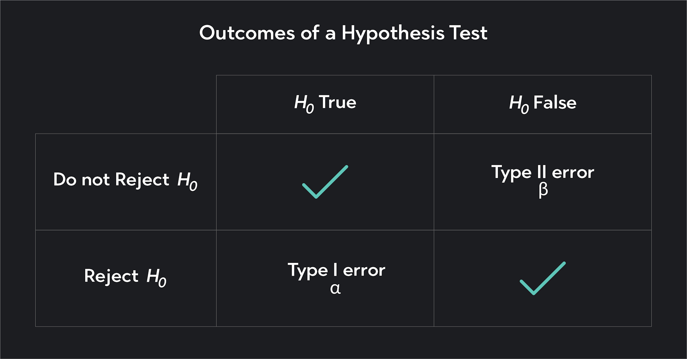

# Developing Research Questions and Hypotheses

## Conceptual Definitions and Operationalization

In mass media research, defining and measuring abstract concepts is essential for creating a clear and structured approach to studying communication phenomena. Two critical processes forming this approach's foundation are **conceptual definition** and **operationalization**. Understanding these processes allows researchers to build a solid framework for their inquiries, ensuring they accurately capture and analyze the complex elements of media-related phenomena.

### Conceptual Definitions {.unnumbered}

A **concept** is a broad, abstract idea that encapsulates a specific phenomenon researchers want to explore. Concepts act as the foundational building blocks of research, helping scholars focus on particular aspects of media and communication. In mass media research, common concepts include "media influence," "public opinion," and "audience engagement." Each of these concepts represents a broad idea that requires further refinement before it can be effectively studied.

{width="100%"}

For example, take the concept of "media influence." It represents a wide range of possible effects that media could have on individuals or society. These effects might include shaping public opinion, influencing behavior, or reinforcing cultural values. The broad nature of such a concept necessitates clear definition. Researchers need to specify which aspect of media influence they are focusing on to conduct meaningful analysis.

In another example, consider "audience engagement." This concept could refer to various behaviors, such as how audiences consume, interact with, and share media content. Before conducting research on audience engagement, a scholar must define what they mean by the term. Does it refer to passive consumption, like viewing time, or active participation, such as comments and shares on social media? These distinctions are critical because they affect how the concept will be examined and understood.

By narrowing down these broad concepts into specific, clearly defined terms, researchers can target their investigations more effectively. A well-defined concept is crucial for both focusing the scope of a study and ensuring that findings are relevant and actionable.

### Operationalization {.unnumbered}

Once a concept has been clearly defined, the next step is **operationalization**, which involves transforming abstract concepts into measurable variables. Operationalization bridges the gap between theoretical ideas and empirical research, allowing researchers to gather observable, quantifiable data.

For example, after defining "audience engagement," a researcher must determine how to measure it. Operationalization involves selecting appropriate indicators that accurately reflect the concept. In the case of audience engagement, possible indicators might include metrics like the number of likes, comments, and shares a piece of media content receives. These indicators provide tangible data that can be used to measure audience interaction.

Similarly, if a study focuses on "media influence," operationalization might involve measuring changes in public opinion before and after exposure to a particular media campaign. This could be done through surveys or experiments designed to capture shifts in attitudes or beliefs, allowing researchers to quantify the concept of media influence meaningfully.

Choosing appropriate indicators is crucial to operationalization, as the selected measures must accurately reflect the concept being studied. Poor operationalization can lead to unreliable or invalid results, undermining the overall integrity of the research.

### The Importance of Conceptual Definitions and Operationalization {.unnumbered}

Defining and operationalizing concepts are vital because they form the backbone of any empirical study. Without clear definitions, researchers risk ambiguity, making it difficult to draw valid conclusions from their findings. Similarly, without precise operationalization, measuring abstract ideas in a way that produces reliable and valid data becomes impossible.

Given the complex and often intangible nature of the phenomena studied, these processes are particularly important in mass media research. Concepts like media influence, audience engagement, and public opinion are multifaceted and require careful conceptualization and measurement. By clearly defining their concepts and developing sound operational definitions, researchers ensure their studies are rigorous and meaningful, contributing to a deeper understanding of media processes and effects.

This knowledge is essential for conducting reliable research in mass media, as it ensures that the abstract ideas central to media studies can be systematically examined and understood. Through conceptual definition and operationalization, researchers can turn theoretical ideas into concrete, measurable realities, paving the way for studies that yield insightful and actionable findings.

## Identifying Independent and Dependent Variables

Understanding independent and dependent variables is fundamental in structuring research, particularly when studying cause-and-effect relationships. These variables are the backbone of empirical research, allowing researchers to manipulate one factor to observe its influence on another. In mass media research, identifying and distinguishing between independent and dependent variables is crucial for defining clear research questions, testing hypotheses, and producing meaningful findings.

### Independent Variables {.unnumbered}

The **independent variable (IV)** is the factor that the researcher manipulates or categorizes to examine its effect on another variable. It represents the "cause" in a cause-and-effect relationship. In mass media research, the independent variable is often a media-related factor or characteristic that the researcher changes to observe its impact. For example, in a study exploring the effect of media content on audience engagement, the type of media content---such as news, entertainment, or educational programs---would be the independent variable. The researcher manipulates the content type to examine how it influences the outcome, which is the dependent variable.

To clarify, imagine a study investigating how different advertising formats influence consumer behavior. In this case, the independent variable could be the advertisement format---whether it is a video, banner ad, or social media post. By altering the format, the researcher can observe how these changes affect consumer behavior, such as click-through rates or purchasing decisions. The independent variable is the element you control or modify to determine its impact on the dependent variable.

{width="100%"}

### Dependent Variables {.unnumbered}

The **dependent variable (DV)** is the outcome measured in response to changes in the independent variable. It represents the "effect" in the cause-and-effect relationship. The dependent variable is what the researcher observes and records, indicating how the independent variable influences the phenomenon under study.

In mass media research, the dependent variable could be audience behavior, perceptions, or attitudes. For example, in a study measuring the impact of media content on engagement, the dependent variable might be audience engagement. This could be quantified by metrics such as the number of comments, likes, shares, or the time spent viewing the content. The researcher examines these metrics to see if and how they are influenced by changes in the independent variable, such as the type or style of media content presented.

Consider another example: a study exploring the effect of headline styles on readers' perceptions of news credibility. The dependent variable could be the credibility score that participants assign to each article after reading it. By measuring this score, the researcher can assess whether variations in the headline (the independent variable) have a measurable impact on how credible readers perceive the news to be.

### Cause-and-Effect {.unnumbered}

The relationship between independent and dependent variables is essential for understanding how different aspects of media influence behavior, attitudes, or perceptions. For example, if you are studying the effect of social media usage on academic performance, social media usage would be the independent variable. In contrast, academic performance, measured through test scores or grades, would be the dependent variable. In this case, the researcher is investigating whether the amount of time spent on social media influences academic outcomes.

Understanding this relationship allows researchers to test specific hypotheses about media effects. For instance, if you hypothesize that "increased exposure to political ads leads to higher voter turnout," the independent variable is the exposure to political ads, and the dependent variable is voter turnout. By manipulating the independent variable---changing the level of exposure to political ads---you can measure its effect on the dependent variable, voter turnout.

### The Role of Variables in Experimental Design {.unnumbered}

Correctly identifying independent and dependent variables is crucial for designing experiments and interpreting results in mass media research. Independent variables allow researchers to explore different media formats, messages, or platforms, while dependent variables help measure the outcomes of those explorations. This structured approach provides insights into the effects of media on individuals and society.

For instance, a researcher investigating how different frequencies of advertisement exposure affect brand recall must clearly define the independent variable (frequency of advertisement exposure) and the dependent variable (brand recall). Understanding these variables enables the researcher to design an experiment that tests specific hypotheses, yielding actionable insights about advertising strategies and their effectiveness.

By mastering the identification of independent and dependent variables, you can design robust studies that accurately test your hypotheses, contribute to mass media research, and offer meaningful conclusions. This knowledge is critical for conducting your research and evaluating the work of others, allowing you to critically assess the validity and reliability of existing studies in the academic literature.

## Formulating Research Questions

A well-formulated research question is the foundation of any successful research study. In mass media research, the research question defines the focus and scope of your study, guiding both the theoretical framework and methodological approach. It sets the stage for hypothesis development, data collection, and analysis, ensuring the study remains focused and relevant.

Research questions serve as the guiding force behind your inquiry. They narrow broad topics into specific areas that can be explored systematically, allowing you to investigate particular aspects of media, communication, or social phenomena. Crafting a strong research question is an essential skill for any researcher, as it determines the direction and clarity of the entire study.

### What Makes a Good Research Question? {.unnumbered}

A **good research question** should be clear, focused, and researchable. It should be specific enough to guide your study but broad enough for comprehensive exploration. In mass media research, the question should focus on a particular media-related phenomenon, effect, or relationship that can be empirically investigated.

For example, consider a broad topic like "media influence." This is too vague to form a research question. However, by refining this idea, we can develop a more focused question: "How does exposure to political news on social media affect young adults' trust in traditional news outlets?" This question is specific, measurable, and directly related to a phenomenon that can be empirically tested.

A strong research question should also align with your research objectives. It should be framed in a way that reflects what you aim to discover or explain through your study. This helps ensure that your research remains coherent and that your findings are relevant to the broader field of mass media studies.

### Types of Research Questions {.unnumbered}

Several types of research questions can be used in mass media research, depending on the goals of your study:

1.  **Descriptive Questions**: These questions describe a particular phenomenon's characteristics or features. For instance, "What types of content do people engage with most on social media platforms?" is a descriptive question because it aims to outline patterns or trends without exploring underlying causes.

2.  **Comparative Questions**: These questions compare two or more groups, media forms, or phenomena. An example might be, "How do perceptions of news credibility differ between users of traditional news media and social media?"

3.  **Causal Questions**: These questions investigate the cause-and-effect relationships between variables. For example, "Does exposure to violent video games increase aggressive behavior among adolescents?" explores a potential causal relationship between media exposure and behavioral outcomes.

4.  **Correlational Questions**: These questions examine the relationships between variables without implying causation. An example would be, "Is there a correlation between social media usage and levels of political participation among young adults?"

5.  **Exploratory Questions**: These questions are used when a topic is relatively new or underexplored. For instance, "How do virtual influencers impact audience perceptions of authenticity in digital marketing?" explores a contemporary issue with less established research.

### The Process of Developing a Research Question {.unnumbered}

Developing a research question begins with identifying a broad area of interest within the field of mass media. From there, you narrow down your focus to a specific topic that is both relevant and researchable. The key is to strike a balance between being too broad, which can make your study unwieldy, and too narrow, which may limit the scope and significance of your findings.

Here's a step-by-step approach to developing a research question:

1.  **Identify a General Topic**: Start with a broad area of interest within mass media, such as "social media influence" or "news consumption patterns."

2.  **Conduct a Literature Review**: Review existing studies to understand what research has already been done on your topic. This will help you identify gaps in the literature that your study can address.

3.  **Refine the Topic**: Based on your literature review, narrow your focus to a specific aspect of the topic. For example, instead of studying "social media influence" broadly, you might focus on "the effects of social media on political engagement among young adults."

4.  **Formulate the Question**: Turn your refined topic into a clear, specific research question. For instance, "How does social media usage influence political engagement among young adults during election campaigns?"

5.  **Evaluate the Question**: Ensure your question is clear, focused, and feasible. Ask yourself if it can be answered through empirical research and if it aligns with your study's objectives.

### The Importance of Well-Defined Research Questions {.unnumbered}

A well-defined research question is crucial because it sets the parameters for your entire study. It informs the selection of your research methods, the design of your study, and the interpretation of your results. Without a clear question, research risks becoming unfocused, leading to ambiguous findings that may not contribute meaningfully to the field.

In mass media research, where the phenomena studied are often complex and multifaceted, a precise research question ensures that your study targets specific elements that can be measured and analyzed. For instance, a broad question like "How does media influence society?" is difficult to address due to its vagueness. In contrast, a specific question like "How does exposure to negative political advertisements affect voter turnout among first-time voters?" is focused and measurable, allowing for a more structured and insightful investigation.

By developing strong research questions, you enhance the clarity and focus of your study and contribute to the overall rigor of your research. A well-constructed research question leads to clear, actionable insights, ultimately advancing mass media research and deepening our understanding of the relationships between media, society, and communication.

Through carefully formulating research questions, you will be equipped to design studies that address key issues in media research, paving the way for hypotheses that can be systematically tested and analyzed.

## Constructing Hypotheses

In mass media research, constructing hypotheses is a critical step that allows researchers to test specific ideas and examine relationships between variables. Hypotheses structure your study, ensuring that the research is systematic and focused. When formulated correctly, hypotheses guide the collection and analysis of data, leading to sound, evidence-based conclusions.

Three key components are involved in hypothesis construction: the **null hypothesis (H0)**, the **alternative hypothesis (H1)**, and the **research question**. Each serves a unique function in the research process, helping to frame the study and focus the inquiry.

### Null Hypothesis (H0) {.unnumbered}

The **null hypothesis (H0)** posits that there is no effect or no relationship between the variables under investigation. It serves as a starting point for your research, functioning as a baseline that your study aims to test. The null hypothesis is essential because it provides a clear, falsifiable statement that can be supported or rejected based on empirical evidence.

For example, consider a study examining the impact of media consumption on political attitudes. The null hypothesis might be: "There is no difference in political attitudes between individuals who consume a high amount of media and those who consume a low amount." This hypothesis assumes that media consumption has no measurable effect on political attitudes. Your research aims to determine whether the data supports or refutes this assumption.

By beginning with the null hypothesis, researchers can remain objective in their approach. It creates a framework in which the data, rather than assumptions or biases, determines the outcome. If sufficient evidence is found to reject the null hypothesis, it suggests that a relationship or effect exists between the variables.

{width="100%"}

### Alternative Hypothesis (H1) {.unnumbered}

In contrast to the null hypothesis, the **alternative hypothesis (H1)** asserts that there is a relationship or effect between the variables being studied. The alternative hypothesis directly opposes the null hypothesis, proposing that some change, difference, or relationship is present.

Continuing with the previous example, the alternative hypothesis might state: "Individuals who consume a high amount of media have different political attitudes than those who consume a low amount." This hypothesis suggests that media consumption influences political attitudes. Your research will then gather evidence to support or refute this claim.

The alternative hypothesis is the hypothesis you are actively testing. It reflects your expectations about the relationship between variables and is usually derived from existing theory or literature. However, the evidence must show that the observed effects or relationships are statistically significant to accept the alternative hypothesis.

### The Role of Hypotheses in Research Design {.unnumbered}

Constructing hypotheses is a central part of research design because it determines what to test and how to measure the relationships between variables. Hypotheses provide structure, helping researchers clarify their focus and ensure that their studies are methodologically sound.

In mass media research, hypotheses often explore how different forms of media affect behavior, attitudes, or social outcomes. For instance, a study may hypothesize that exposure to violent video games increases aggressive behavior in teenagers, or that social media usage is positively correlated with levels of political engagement. These hypotheses help frame the research question to allow for measurable outcomes, ensuring that the study can produce actionable insights.

By the end of this section, you should understand how to construct clear, testable hypotheses and formulate research questions that effectively guide your study. Mastering this process will allow you to design rigorous research that contributes valuable knowledge to the field of mass media, helping to explore and clarify the complex relationships between media and society.

## Levels of Measurement in Mass Media Research

Understanding the different levels of measurement is critical to designing sound research and conducting accurate data analysis in mass media studies. The level of measurement determines how data can be categorized, compared, and analyzed, influencing the types of statistical techniques you can apply. There are four primary levels of measurement: **nominal**, **ordinal**, **interval**, and **ratio**. Each offers a unique approach to organizing and quantifying data, and recognizing these distinctions is essential for conducting effective and meaningful research.

### Nominal Level of Measurement {.unnumbered}

The **nominal level** involves classifying data into distinct categories that are mutually exclusive and lack any inherent order. Nominal data groups items based on shared characteristics, without implying any ranking or quantitative value. In mass media research, an example of nominal data could be classifying media content into genres, such as drama, comedy, or documentary. Each genre represents a category, but these categories cannot be ordered or ranked; they are simply different types.

Nominal data is useful for distinguishing between different media types or behaviors, allowing researchers to count occurrences and frequencies within each category. For example, you might count how many television shows fall into each genre. However, because nominal data does not involve any numerical value or rank, mathematical operations such as addition or subtraction are not applicable. Nominal data is foundational for classification purposes, but its limitations mean that more advanced analyses are often impossible at this level.

### Ordinal Level of Measurement {.unnumbered}

The **ordinal level** introduces an element of order or ranking among categories. Ordinal data allows researchers to rank data points based on relative positions, but the intervals between these ranks are not necessarily consistent or meaningful. For example, a survey asking respondents to rank their preferred social media platforms from most to least preferred produces ordinal data. While this data shows the order of preferences, it does not indicate how much more one platform is preferred over another.

Ordinal data is frequently used in media research to measure preferences, satisfaction, or perceptions. However, because the distances between rankings are unequal, you cannot assume that the difference between first and second place is the same as between second and third. This limitation affects the types of statistical analyses that can be applied, making it essential to use ordinal data appropriately, particularly in studies involving subjective rankings or preferences.

{width="100%"}

### Interval Level of Measurement {.unnumbered}

The **interval level** of measurement includes data with consistent intervals between values but lacks a true zero point. This means that while you can measure the differences between data points, the data does not allow for statements about absolute quantities. An example of interval data in media research is using a Likert scale, often employed in surveys to measure attitudes or opinions. On a scale from 1 to 5, where 1 represents strong disagreement, and 5 represents a strong agreement, the intervals between each point are equal, but there is no true zero---meaning that a score of 0 does not exist or represent "no attitude."

Interval data is particularly valuable in media studies when researchers aim to measure perceptions, attitudes, or responses with precision. Because the intervals between values are equal, you can calculate the mean or standard deviation of responses, which allows for more sophisticated statistical analysis than nominal or ordinal data. However, because interval data lacks a true zero point, it is important to avoid making statements about ratios or absolute quantities. For instance, you cannot say that a score of 4 on a Likert scale is "twice as positive" as a score of 2.

### Ratio Level of Measurement {.unnumbered}

The **ratio level** of measurement is the most informative and precise, combining all the properties of the interval level with the addition of a true zero point. A true zero indicates the absence of the phenomenon being measured, allowing for meaningful statements about both absolute quantities and ratios. In mass media research, an example of ratio data could be the number of hours spent watching television per week. Since zero hours represent the complete absence of TV viewing, you can make comparisons such as, "Person A watches twice as much TV as Person B."

Ratio data is the most versatile and allows for the broadest range of statistical analyses. Researchers can calculate means, medians, variances, and ratios, providing a comprehensive understanding of the data. Ratio data is essential for studies that require precise measurement and comparison of quantities, such as time spent on media platforms, number of social media interactions, or advertising expenditures.

## Issues in Measurement

Accurate and consistent measurement is critical to producing meaningful results in mass media research. However, several challenges can arise during the measurement process that can compromise the integrity of your findings. Among the most significant issues are **measurement error**, **validity**, and **reliability**. Understanding these concepts is essential for designing research that yields accurate and credible data.

### Measurement Error {.unnumbered}

**Measurement error** occurs when there is a discrepancy between the actual value of what is being measured and the observed value. This error can arise from various sources, and even minor inaccuracies can significantly affect a study's outcomes. Common sources of measurement error include respondent misinterpretations, data entry mistakes, and inconsistent data collection methods. For instance, if survey participants misunderstand a question, their answers may not accurately reflect their true thoughts or behaviors, leading to erroneous data. Likewise, the analysis may yield misleading conclusions if data is entered incorrectly into a database.

Consider a study examining the effectiveness of a media literacy program. If participants misunderstand a survey question about their media usage, their responses might not accurately reflect their true habits. This measurement error could skew the results, making it seem as though the media literacy program is more or less effective than it is. Recognizing and minimizing these errors is vital for ensuring the accuracy of research findings.

Minimizing measurement error begins with recognizing its potential sources. Clear, well-designed measurement tools can help reduce misunderstandings, while careful data entry and verification procedures can prevent errors during data processing. Ensuring consistent data collection methods across participants or conditions is equally important in reducing variability that might compromise the study's results.

### Validity {.unnumbered}

**Validity** refers to the extent to which a measurement tool accurately captures the intended concept. If a measurement lacks validity, it may not reflect the true nature of the concept under investigation, leading to incorrect conclusions. In social sciences and media research, **construct validity** is one of the most critical forms. Construct validity assesses whether the tool or scale genuinely measures the theoretical construct it aims to evaluate.

For example, imagine using a psychological scale in media studies to measure a concept like "audience engagement." To determine whether the scale has strong construct validity, you must evaluate whether the questions truly capture all aspects of audience engagement. If the scale focuses too much on one dimension of engagement---such as how often a user clicks "like" on social media posts---while ignoring other important behaviors like commenting or sharing content, its validity would be compromised.

To ensure high construct validity, it's important to design measurement tools based on established theoretical frameworks carefully and to test those tools through pilot studies or existing literature. This process helps researchers verify that their tools accurately measure the concepts they intend to study, leading to more accurate and actionable research findings.

{width="100%"}

### Reliability {.unnumbered}

**Reliability** refers to the consistency of a measurement tool---its ability to produce the same results under the same conditions. A reliable tool will yield similar outcomes each time it is used, assuming that the measured phenomenon remains unchanged. Without reliability, even a valid measurement tool can lead to inconsistent and, thus, untrustworthy results.

For example, if a survey is designed to measure levels of audience engagement but produces vastly different results each time it is administered to the same group under similar conditions, the tool lacks reliability. As a result, it becomes difficult to draw meaningful conclusions from the data because the inconsistency casts doubt on whether the measurements truly reflect audience engagement.

Reliability is critical in mass media research because it ensures that findings are not the product of random fluctuations in measurement but are stable reflections of the studied phenomena. Several methods exist to assess reliability, including test-retest reliability (which evaluates whether the tool yields consistent results over time) and internal consistency (which checks if different parts of the measurement tool produce similar results).

### The Relationship Between Validity and Reliability {.unnumbered}

Recognizing that validity and reliability are related but distinct concepts is important. A measurement tool must be reliable and valid, as inconsistent results undermine any attempt to measure a construct accurately. However, a reliable tool is not necessarily valid. For instance, a scale might consistently measure something but not the concept it is intended to measure---thus, it is reliable but not valid.

In mass media research, achieving high reliability and high validity is critical to ensuring that your findings accurately reflect your study phenomena. Reliable tools provide stable measurements, while valid tools ensure that you measure the right constructs. Both are essential for producing research that contributes meaningfully to our understanding of media effects, behaviors, and perceptions.
