# Data Management and Visualization

## RStudio

### Introduction to RStudio

RStudio is an integrated development environment (IDE) that makes working with the R programming language more user-friendly, providing a powerful platform for statistical computing and data analysis. Understanding how to code in R, import and export data, and handle errors effectively are fundamental skills that will enhance your ability to conduct sophisticated data analyses and produce reliable research findings.

**Coding in R** is the first step toward unlocking the full potential of this powerful tool. R is a programming language designed specifically for data manipulation, statistical analysis, and graphical representation. To get started, it’s essential to familiarize yourself with the basics of R syntax. This includes understanding how to assign variables, recognize different data types (such as numeric, character, and factor), and perform basic operations like arithmetic calculations and logical comparisons.

For example, you might write a simple R script to calculate summary statistics for a dataset. This script could include commands to calculate the mean, median, and standard deviation of a numeric variable. By learning how to write such scripts, you will be able to automate repetitive tasks and perform complex analyses with ease.

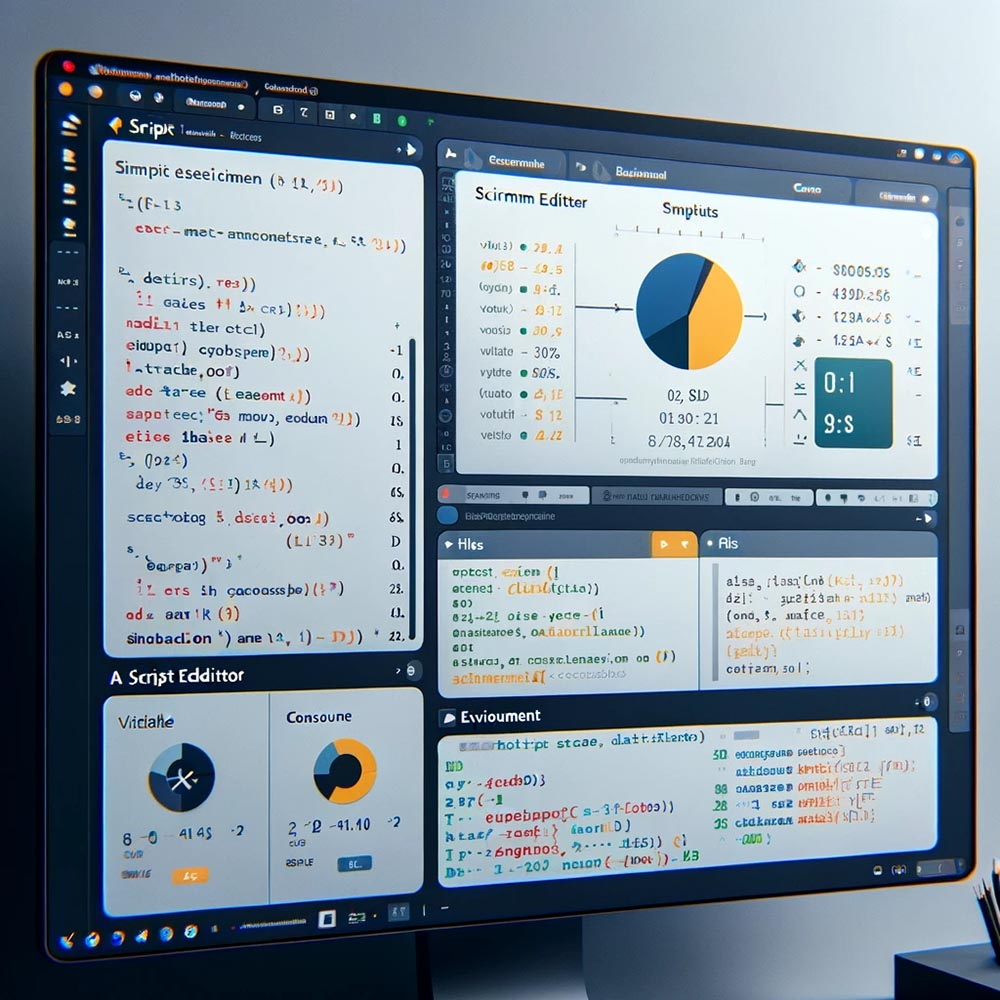{width="100%"}

*Figure 068. A screenshot of the RStudio interface with a basic R script visible in the script editor. The script might include simple commands for variable assignment, basic arithmetic operations, and the calculation of summary statistics. This image would help students visualize the coding environment and understand where to write and execute their code in RStudio.*

We will begin with the basics of R syntax, starting with variable assignment and data types, and then move on to basic operations. Hands-on exercises will allow you to write and execute simple R scripts in RStudio, helping you become comfortable with the coding environment. To support your learning, you will have access to resources like R cheat sheets or coding snippets for common tasks. These resources will be invaluable as you build your coding confidence and begin to tackle more complex analyses.

Once you are comfortable with basic coding, it’s crucial to learn how to **import and export data** in RStudio. In research, data often comes in various formats, such as CSV files, Excel spreadsheets, or even databases. RStudio allows you to import data from these sources using functions like `read.csv()` for CSV files or `read_excel()` for Excel files. Similarly, once you’ve completed your analysis, you may need to export your results for further use, which can be done with functions like `write.csv()`.

For instance, you might import a CSV file containing survey data into RStudio for analysis. After performing basic data manipulations, such as cleaning up missing values or transforming variables, you would then export the cleaned dataset to share with colleagues or use in further analyses.

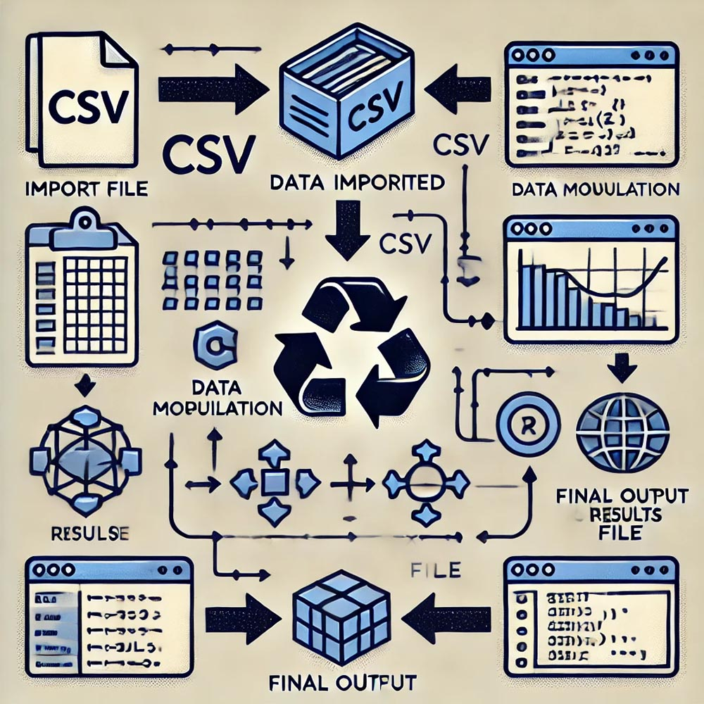{width="100%"}

*Figure 069. A flowchart showing the steps to import data into RStudio, perform data manipulation, and then export the results. The chart could include visual cues like CSV file icons, RStudio interface elements, and a final output file. This image would help students understand the workflow of data handling in RStudio, from import to export.*

We will demonstrate how to use the `read.csv()` function to import data and the `write.csv()` function to export results. You will be assigned an activity where you import a dataset, perform basic data manipulation, and then export the cleaned dataset. During this process, we will discuss common issues that arise during data import/export, such as dealing with missing values or formatting inconsistencies, and how to resolve them effectively.

Another important skill to develop when working with RStudio is **error handling**. In coding, errors are inevitable, but learning how to identify, diagnose, and correct them is a critical part of becoming proficient in R. Errors in R can range from syntax errors (e.g., forgetting a parenthesis) to logical errors (e.g., using the wrong formula for a calculation). Understanding how to interpret error messages and debug your code will save you time and frustration.

For example, you might encounter an error in your script due to incorrect data types—such as trying to perform arithmetic operations on character data. Debugging this issue would involve checking the data type of the variable and converting it to a numeric type if necessary.

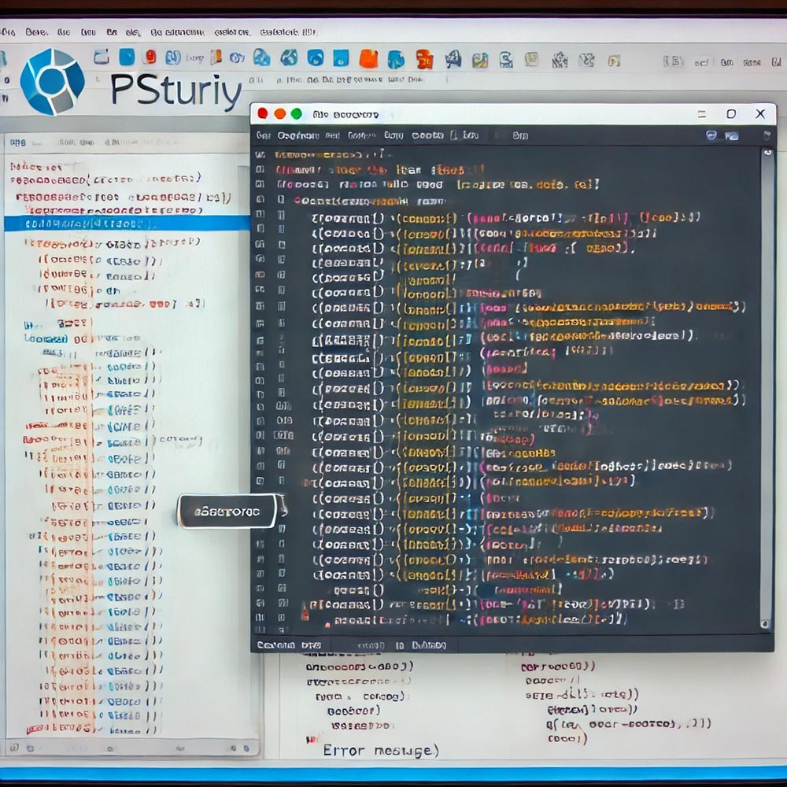{width="100%"}

*Figure 070. A screenshot of RStudio displaying an error message in the console, with the corresponding line of code highlighted in the script editor. The image could also include annotations explaining the error and the steps needed to correct it. This visual would help students understand how to troubleshoot errors and learn from the error messages provided by R.*

We will introduce you to common types of errors in R, such as syntax and logical errors, and teach you how to interpret the error messages generated by RStudio. You will engage in troubleshooting exercises where you debug pre-written scripts that contain intentional errors. These exercises will help you develop the skills needed to diagnose and fix issues in your own code. We will also discuss best practices for writing error-free code, such as using comments to document your code, keeping your code modular (breaking it down into small, manageable sections), and testing small sections of code before running larger scripts.

By mastering these fundamental aspects of using RStudio—coding in R, importing and exporting data, and handling errors—you will be well-equipped to perform sophisticated data analyses and contribute to high-quality research. These skills will serve as the foundation for more advanced topics in data science and statistical analysis, empowering you to explore and analyze data with confidence and precision.

### Data Management in R

Effective data management is crucial for ensuring the integrity and reliability of your analysis in R. Whether you are dealing with large datasets or small ones, the principles of data accuracy, coding of data, and understanding dataset variability are essential components of the research process. This section will guide you through the fundamental steps of managing data in R, helping you to ensure that your analyses are based on accurate, well-organized, and appropriately coded data.

**Data Accuracy** is the cornerstone of any reliable analysis. Before you can perform any meaningful statistical tests or draw conclusions from your data, you must ensure that the data itself is accurate and free from errors. This involves thoroughly checking the dataset for issues such as incorrect data entries, missing values, and outliers that could skew your results. For example, if you are working with survey responses, you might encounter data entry errors where a respondent’s age is listed as "150" instead of "15." Identifying and correcting such errors is essential to maintain the integrity of your analysis.

To assist in this process, R provides several functions that allow you to inspect and clean your dataset. The `summary()` function, for example, provides a quick overview of the dataset, showing the minimum, maximum, mean, and other statistics for each variable. Similarly, the `str()` function offers a detailed look at the structure of the dataset, including the type and class of each variable. By using these tools, you can identify potential inaccuracies in your data and take steps to correct them before proceeding with your analysis.

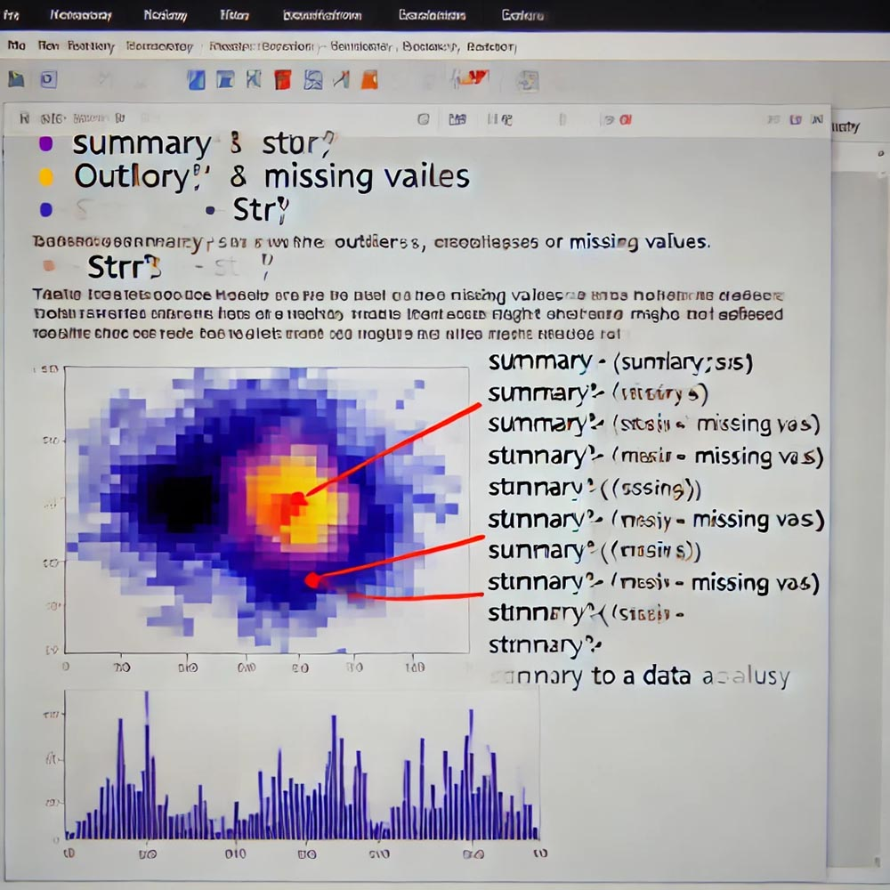{width="100%"}

*Figure 071. A screenshot of RStudio showing the output of the `summary()` and `str()` functions applied to a sample dataset. The image could highlight areas where data anomalies (such as outliers or missing values) are visible, with annotations explaining how these might affect analysis if not addressed. This visual would help students understand how to use these functions to assess and ensure data accuracy.*

We will start by teaching you how to use functions like `summary()` and `str()` to inspect datasets for accuracy. You will then be assigned tasks where you clean and verify the accuracy of a dataset by identifying and correcting errors such as duplicates, outliers, or missing values. This hands-on practice will help you develop the skills needed to maintain data accuracy in your own research.

After ensuring that your data is accurate, the next step is the **Coding of Data**. Coding involves categorizing and assigning numerical or categorical labels to your data, which is particularly important when dealing with qualitative data that needs to be converted into a format suitable for quantitative analysis. For instance, if your dataset includes open-ended survey responses where participants expressed their level of agreement with a statement, you might code these responses as numerical values (e.g., 1 = "Agree", 2 = "Disagree").

Accurate coding is essential because it directly affects the outcomes of your statistical analyses. Inconsistent or incorrect coding can lead to misleading results, so it’s important to approach this task with care. Consistency is key: each category should be clearly defined, and all data points should be coded according to these definitions. This ensures that your analyses are based on standardized data, which in turn leads to more reliable conclusions.

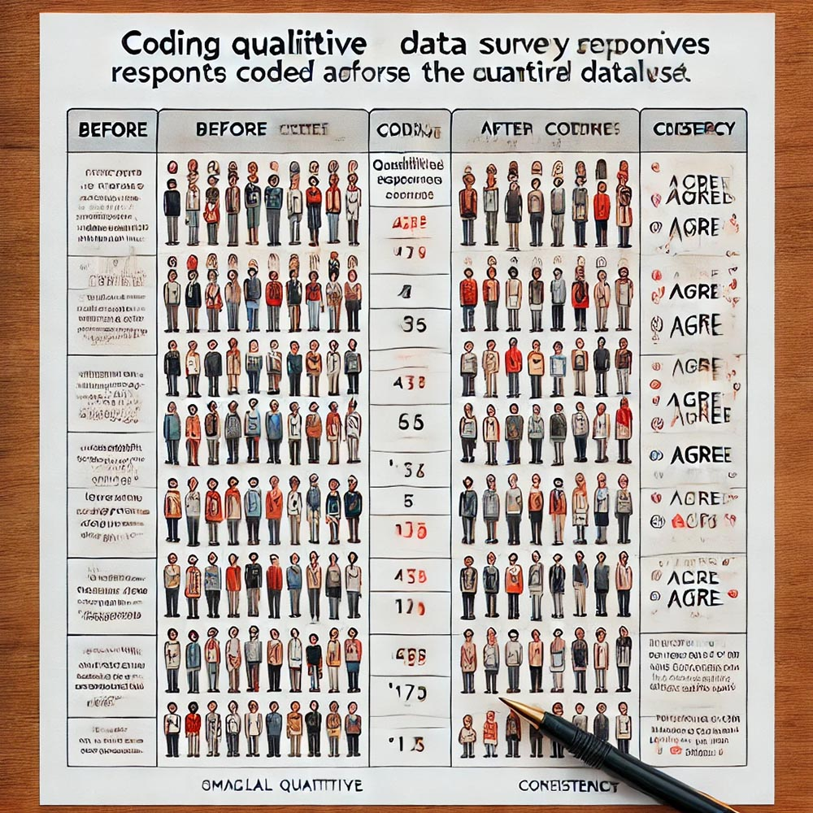{width="100%"}

*Figure 072. A table showing a small dataset of qualitative survey responses before and after coding. The image could include annotations that explain the coding process and highlight the importance of consistency in coding, such as ensuring all "Agree" responses are coded as "1" across the entire dataset. This visual would help students understand the practical aspects of coding qualitative data for quantitative analysis.*

We will provide examples of how to code qualitative data for quantitative analysis, and you will practice coding data by categorizing and labeling a small dataset. This exercise will be followed by a discussion on the importance of consistency and accuracy in coding, ensuring that you understand the impact of these practices on your overall research.

Finally, understanding **Dataset Variability** is crucial for interpreting your data and making informed conclusions. Variability refers to the spread or dispersion of data points within a dataset, and it provides insights into the consistency and reliability of the data. For example, if you are analyzing test scores among students from different schools, variability can tell you how much the scores differ within and between schools. High variability might indicate significant differences in performance, while low variability could suggest more uniform outcomes.

In R, variability can be measured using statistics like variance and standard deviation, which quantify the extent to which data points deviate from the mean. Additionally, visual tools like boxplots or histograms can help you to visualize variability, making it easier to interpret the data and identify any patterns or anomalies.

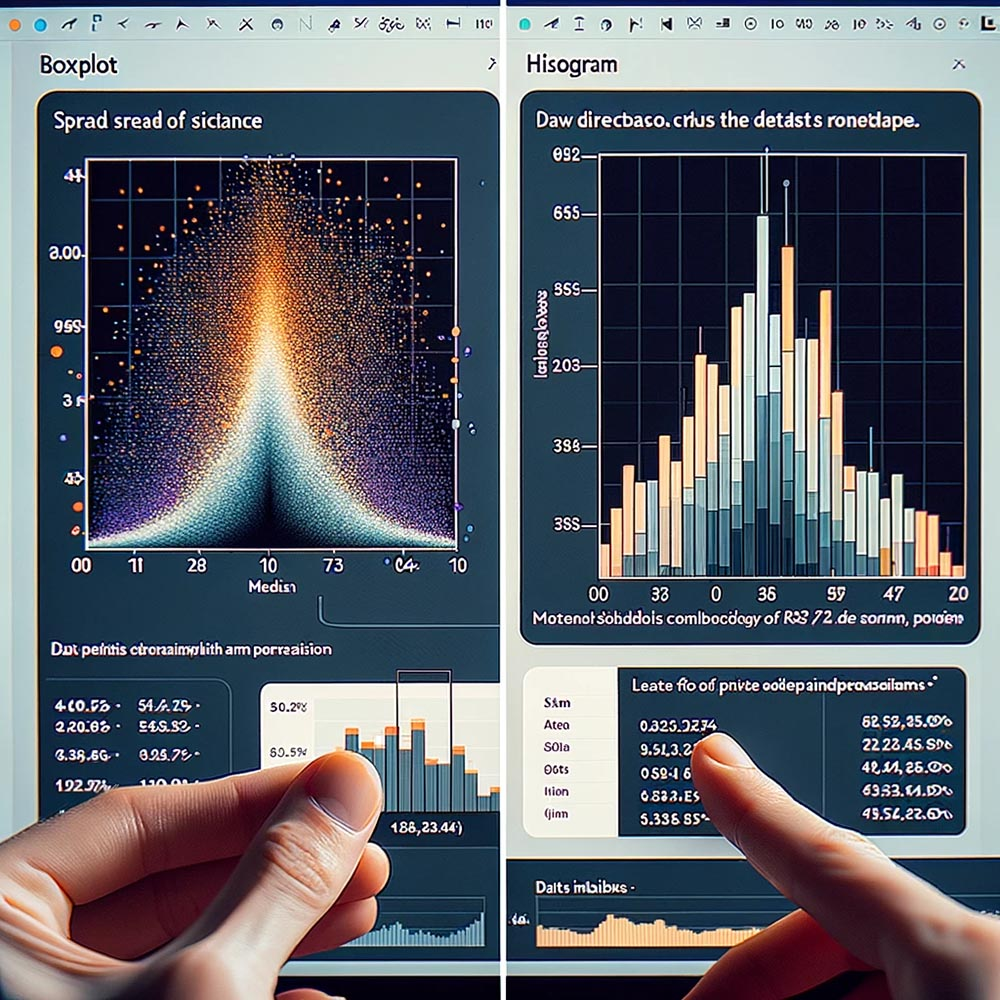{width="100%"}

*Figure 073. A side-by-side comparison of a boxplot and a histogram of a dataset in RStudio, showing the distribution of data points and highlighting the variability. The image could include annotations explaining how to interpret the spread of the data and what it suggests about the dataset's reliability. This visual would help students grasp the concept of variability and how to measure and interpret it using statistical and visual tools.*

We will explain the concept of variability and how it can be measured using statistics like variance and standard deviation. You will use visual tools like boxplots or histograms to help understand and interpret variability in datasets. Through exercises, you will calculate and analyze variability in different datasets, discussing the implications for your research and learning how to make informed decisions based on these insights.

By mastering data accuracy, coding of data, and understanding dataset variability, you will be well-prepared to manage your data effectively in R, laying the foundation for rigorous and reliable research. These skills are essential not only for conducting your analyses but also for ensuring that your findings are based on solid, well-managed data.

## Data Visualization

### Advanced Visualization Techniques

As you advance in your understanding of data visualization, it's essential to move beyond basic charts and graphs to more sophisticated tools that allow for greater customization and interactivity. This section introduces you to advanced visualization techniques, focusing on the use of `ggplot2` and interactive visualizations, which are powerful tools for creating more nuanced and user-engaging data displays.

**ggplot2** is a widely-used package in R that enables the creation of complex and customized visualizations. Unlike basic plotting functions, ggplot2 operates on the principle of "The Grammar of Graphics," which allows you to build plots layer by layer. This approach not only gives you more control over the visual aspects of your data but also makes it easier to create multi-faceted and detailed visualizations. For example, you can use ggplot2 to create a multi-layered scatter plot where different groups in your data are represented by various colors and shapes. This type of visualization is particularly useful when you need to highlight relationships or differences between multiple variables simultaneously.

To get started with ggplot2, you will be guided through a step-by-step process. We will begin with basic plots, such as simple scatter plots or bar charts, and gradually introduce more complex features like faceting, theming, and layering. Faceting allows you to create multiple plots based on a factor variable, while theming enables you to customize the overall appearance of your plots to match specific aesthetic requirements. This flexibility makes ggplot2 an indispensable tool for creating visualizations that are both informative and visually appealing.

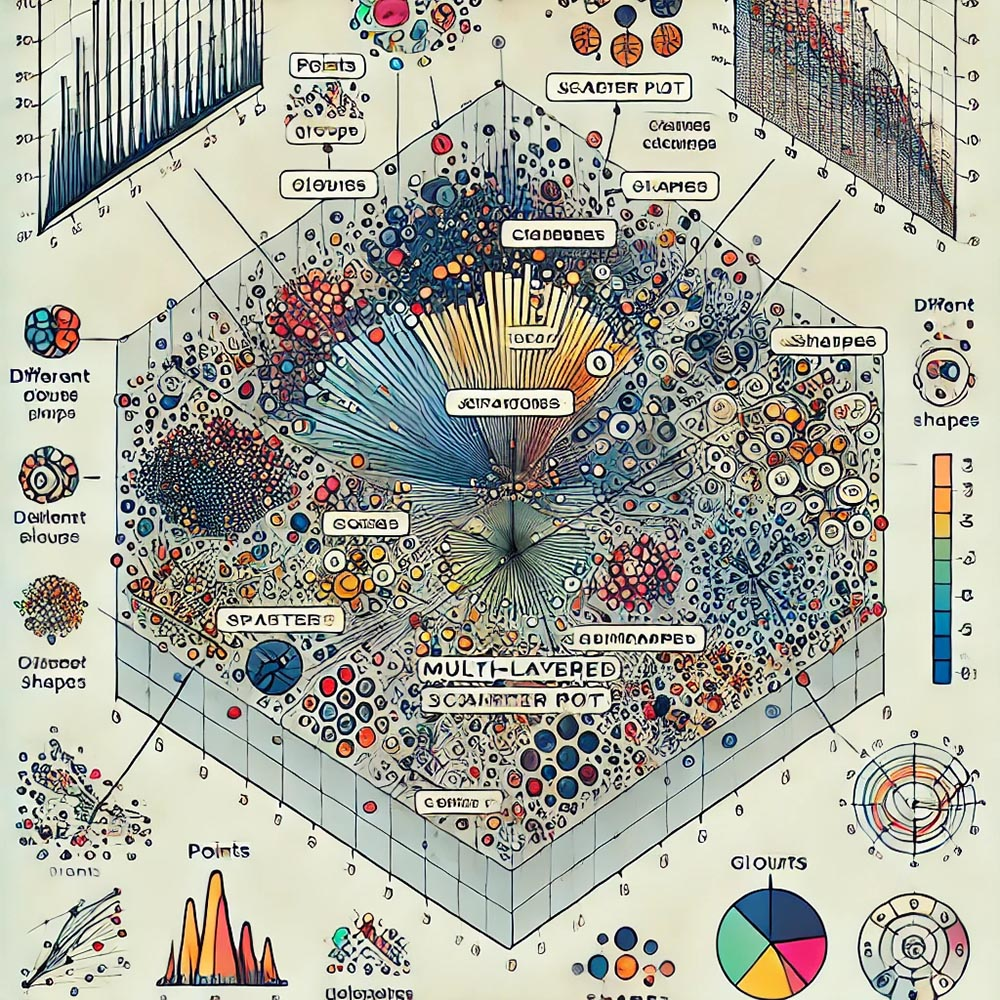{width="100%"}

*Figure 076. A multi-layered scatter plot created using ggplot2, with annotations highlighting the different layers (e.g., points, colors, shapes) and explaining how each layer contributes to the overall visualization. This visual will help students understand the modular approach of ggplot2 and how to build complex plots by adding layers.*

As part of your learning, you will be assigned a project to create a customized plot using ggplot2. This project will encourage you to incorporate multiple variables and aesthetic elements, allowing you to explore the full capabilities of ggplot2. We will also discuss how the grammar of graphics framework in ggplot2 facilitates the creation of flexible and sophisticated visualizations tailored to specific research needs.

Another critical aspect of advanced data visualization is the use of **Interactive Visualizations**. These visualizations go beyond static images, allowing users to engage with the data by interacting with the visual elements. For instance, you might create an interactive dashboard using R Shiny that enables users to filter and view data based on different criteria, such as selecting a specific time range or focusing on a particular subgroup within your dataset. This interactivity can be particularly valuable in exploratory data analysis, where the ability to explore data from multiple angles can lead to deeper insights.

We will introduce the concept of interactive visualizations by discussing their advantages, particularly in making data more accessible and engaging for your audience. Interactive visualizations allow users to explore data on their own terms, leading to a more personalized and impactful understanding of the information presented.

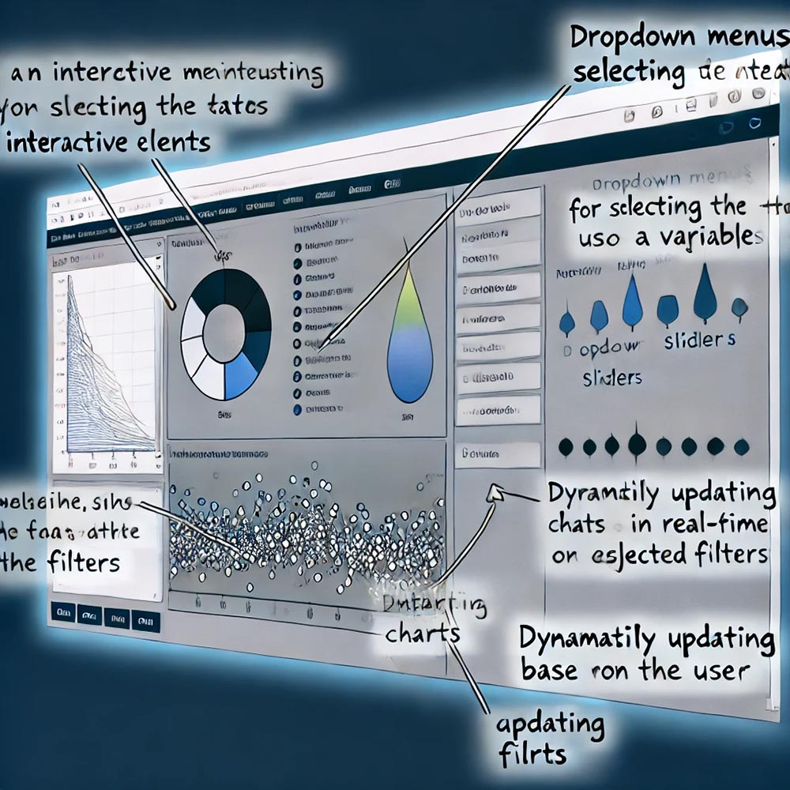{width="100%"}

*Figure 077. A screenshot of an interactive dashboard created in R Shiny, showing how users can filter data and update the visualizations in real-time. Annotations should explain the different interactive elements, such as dropdown menus, sliders, and dynamically updating charts, to illustrate the added value of interactivity in data exploration.*

To help you develop these skills, we will demonstrate how to create simple interactive plots using tools like `plotly` in R or the built-in interactive features in jamovi. You will then be assigned a task to develop an interactive visualization based on a dataset, focusing on both usability and the insights that users can gain through their interactions with the data. This exercise will challenge you to think critically about how to design interactive elements that enhance the user experience and effectively communicate your data's story.

By mastering these advanced visualization techniques, including the use of ggplot2 and interactive tools, you will be well-equipped to create data visualizations that not only convey complex information but also engage your audience in meaningful ways. These skills are essential for any researcher looking to present their data compellingly and accessibly.

### Creating Infographics

Infographics are a powerful tool for summarizing and presenting complex information in a way that is visually appealing and easy to understand. By combining data with visual design elements, infographics can quickly convey key messages, making them an essential skill for any researcher looking to communicate their findings effectively. In this section, we will explore the principles of designing effective infographics, customizing visualizations to match specific needs, and using tools like Adobe Express to bring your designs to life.

**Designing Infographics** is about more than just placing data on a page—it's about telling a story. When creating an infographic, your goal should be to distill complex information into a clear, concise, and engaging format. This involves making strategic decisions about what data to include, how to organize it, and how to visually represent it. For example, imagine you need to create an infographic that summarizes the key findings from a media consumption survey. The challenge is to present the data in a way that highlights the most important insights without overwhelming the viewer.

To achieve this, you should follow several principles of good infographic design. Clarity is paramount; your infographic should communicate its message at a glance. This means avoiding clutter, using simple language, and ensuring that your visual elements are easy to interpret. Simplicity is also crucial—select a clean, minimalistic layout that helps guide the viewer's eye through the information logically and intuitively. Additionally, the effective use of color and space can make a significant difference in how your infographic is perceived. Colors should not only make the infographic visually appealing but also help differentiate between different sections or data points. Similarly, strategic use of white space can help prevent the design from feeling crowded and can make the content easier to read.

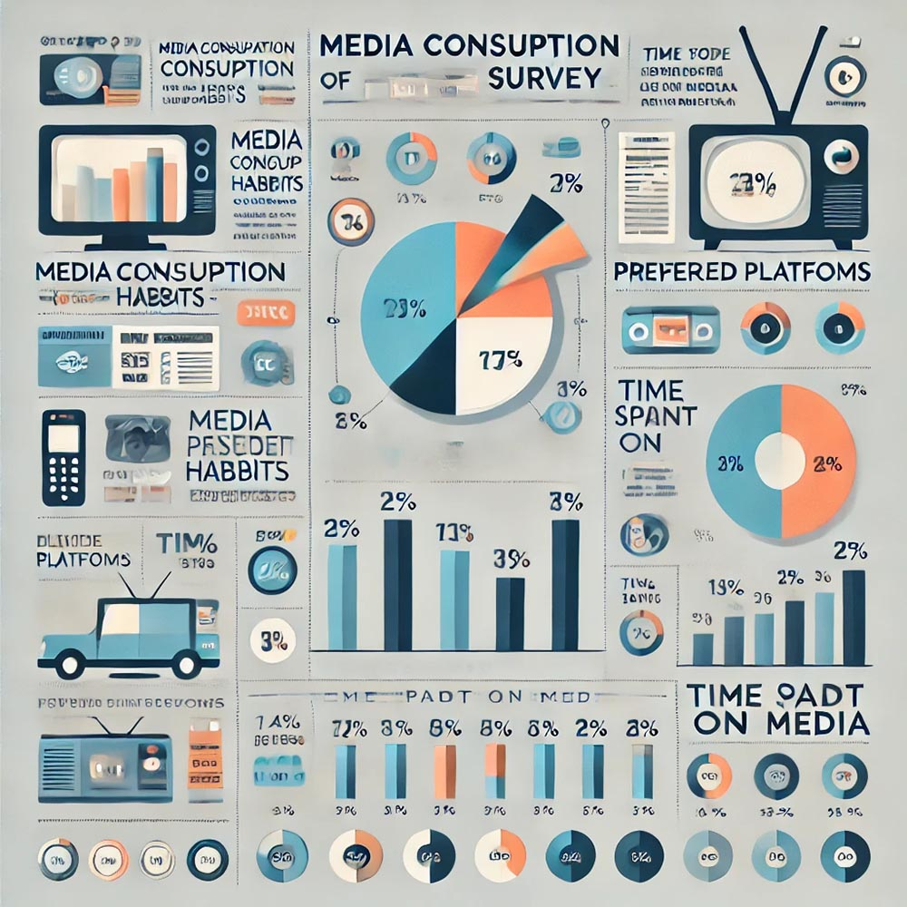{width="100%"}

*Figure 078. An example infographic that summarizes the results of a media consumption survey. The infographic should include clear headings, well-organized data points, simple icons or charts, and a consistent color scheme. Annotations can point out how clarity, simplicity, and effective use of color contribute to the overall effectiveness of the design.*

Once you understand these principles, tools like Adobe Express or Canva can be incredibly helpful in bringing your designs to life. These platforms provide pre-designed templates and user-friendly interfaces that allow you to focus on the content and design of your infographic without needing extensive graphic design skills. In class, we will demonstrate how to use these tools to create professional-looking infographics. You will then be assigned a project where you will design an infographic based on the results of a research project, emphasizing the importance of visual storytelling and the balance between text and visuals.

Customizing visualizations is another essential aspect of effective data communication. Customization involves tailoring the appearance and elements of a visualization to better match the data's message and the intended audience. For example, you might need to adjust the color schemes and fonts in a ggplot2 plot to align with a publication’s style guidelines or to make the visualization more accessible to a broader audience. Customization can significantly enhance the effectiveness of your data visualizations, helping to ensure that your message is clear and impactful.

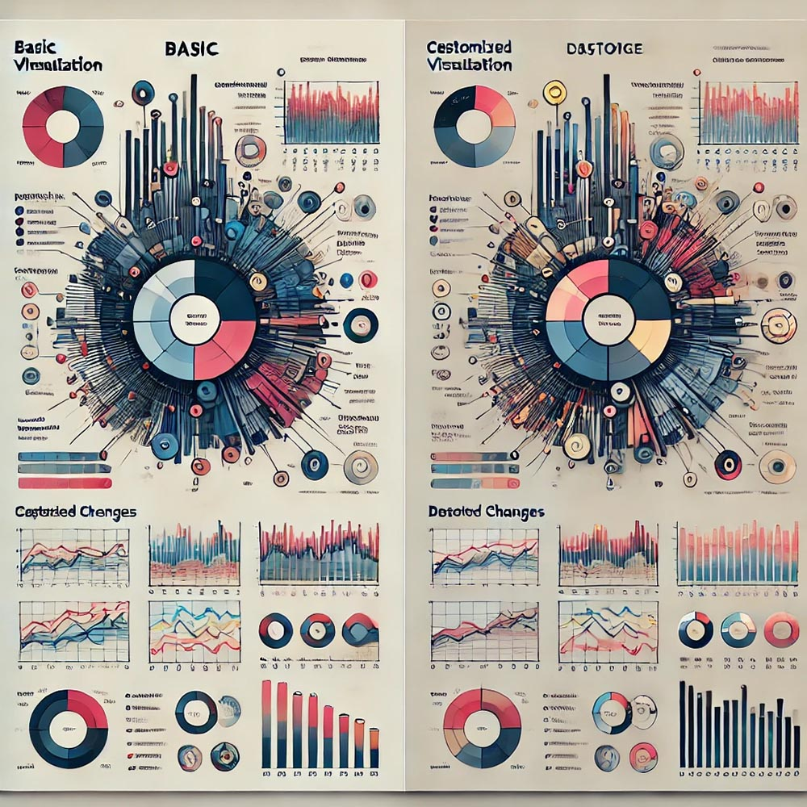{width="100%"}

*Figure 079. A side-by-side comparison of two visualizations of the same dataset—one basic and the other customized. The customized version should demonstrate improved clarity, aesthetic appeal, and alignment with the intended message. Annotations should explain the specific changes made, such as color adjustments, font changes, and layout refinements, and how they improve the visualization.*

In the classroom, we will explore examples of how customization can enhance the effectiveness of data visualizations. You will engage in exercises where you customize your plots using tools like ggplot2 or other visualization software. We will discuss how different design choices—such as color palettes, fonts, and layout—affect the interpretation of the data. Additionally, we will cover important considerations for accessibility, such as choosing colorblind-friendly palettes and ensuring clear labeling, which are crucial for making your visualizations inclusive and understandable to all viewers.

Finally, **Adobe Express** is introduced as a practical tool for creating infographics and other visual content. Adobe Express offers a range of pre-designed templates and easy customization options, making it accessible to non-designers. For instance, you might use Adobe Express to create an infographic that summarizes a study’s key findings. The platform's drag-and-drop interface allows you to experiment with different layouts, colors, and fonts, making it easier to design visually compelling infographics without the need for advanced design skills.

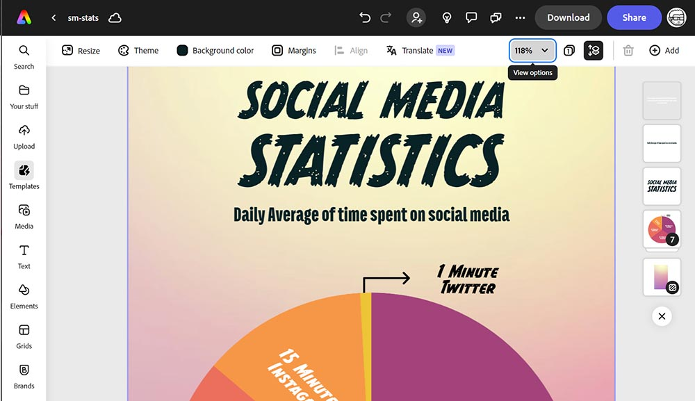{width="100%"}

*Figure 080. A screenshot of the Adobe Express interface, showing a user creating an infographic. The image should highlight the drag-and-drop functionality, template options, and customization tools available in Adobe Express. Annotations can explain how these features help streamline the design process for users of all skill levels.*

In class, we will walk through the features of Adobe Express, highlighting how it simplifies the design process. You will then be tasked with creating your own infographic using Adobe Express, experimenting with different templates and customization options. This exercise will not only help you develop your design skills but also reinforce the importance of visual hierarchy and aesthetics in enhancing the impact of your research findings.

By mastering the art of creating infographics and customizing visualizations, you will be equipped to present your research in a way that is both visually appealing and highly effective in communicating complex information. These skills are invaluable for any researcher aiming to engage and inform their audience through data.

