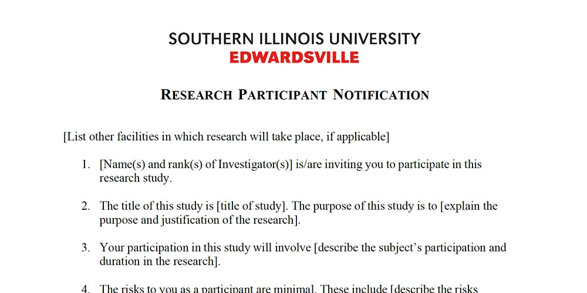

# Research Ethics and the IRB Process

## Ethics in Research

Ethics in research serve as the guiding principles that ensure the integrity, respect, and fairness of the research process, especially in fields like mass communications, where studies often directly involve human participants. Ethical considerations are not just regulatory requirements but the bedrock upon which credible and responsible research is built. Researchers have a profound responsibility to protect the rights, dignity, and well-being of their participants while also ensuring the validity and trustworthiness of their findings. This section delves deeper into the key ethical principles that every researcher must understand and uphold: informed consent, confidentiality, and anonymity.

### Informed Consent {.unnumbered}

**Informed consent** is a fundamental ethical principle that involves providing potential participants with all necessary information about a study before they agree to take part. The concept of informed consent is rooted in the respect for the autonomy and agency of individuals, allowing them to make voluntary and informed decisions about their participation in research. This principle not only safeguards the rights of participants but also strengthens the ethical foundation of the research.

The process of obtaining informed consent goes beyond merely securing a signature on a consent form. It involves an ongoing dialogue between the researcher and the participant, where the researcher must ensure that the participant fully understands the purpose of the study, the procedures involved, any potential risks or benefits, and their rights as a participant. This communication must be clear, transparent, and tailored to the participant's level of comprehension. In cases where participants may have limited literacy or where the study involves complex procedures, additional measures such as verbal explanations or visual aids may be necessary to facilitate understanding.

Informed consent is especially critical in studies involving vulnerable populations, such as children, individuals with cognitive impairments, or those who may be in coercive situations. In such cases, researchers must take extra precautions to ensure that consent is genuinely informed and voluntary. This may involve seeking consent from a legal guardian or employing independent advocates to confirm that the participant's rights are fully protected.

The ethical importance of informed consent cannot be overstated. It serves as the foundation of the trust relationship between the researcher and the participant. Any breach of this trust, such as misleading participants about the nature of the study or failing to disclose potential risks, can have serious ethical and legal implications. Researchers must also recognize that informed consent is not a one-time event but a continuous process. Participants should have the opportunity to ask questions, seek clarification, and withdraw from the study at any point without facing any consequences.

### Confidentiality {.unnumbered}

**Confidentiality** is another cornerstone of ethical research, referring to the obligation of the researcher to protect the private information of participants. When participants agree to share personal or sensitive information, they do so with the expectation that this information will be kept secure and will not be disclosed to unauthorized parties. Upholding confidentiality is essential for maintaining the trust between researchers and participants and for ensuring that participants do not suffer harm as a result of their involvement in the research.

Confidentiality involves several key practices. Researchers must take proactive steps to ensure that data is stored securely, whether in physical form (e.g., locked filing cabinets) or digital form (e.g., encrypted databases). Access to this data should be restricted to authorized personnel only, and any sharing of data should be done with the participant's explicit consent and in a manner that does not compromise their privacy.

In some research contexts, particularly those involving sensitive topics such as mental health, political beliefs, or illegal behaviors, the potential risks of breaching confidentiality are heightened. A breach of confidentiality could lead to serious consequences for participants, including social stigma, legal repercussions, or psychological distress. For example, if a participant's involvement in a study about drug use were disclosed without their consent, they could face legal action or social ostracization. As such, researchers must be vigilant in their efforts to protect participant confidentiality.

Moreover, confidentiality extends beyond the immediate research team. When presenting findings or publishing research, researchers must anonymize data to prevent the identification of individual participants. This may involve aggregating data, using pseudonyms, or omitting specific details that could lead to the identification of participants. Ethical research reporting also requires that researchers be transparent about the measures they have taken to protect confidentiality and to discuss any limitations that may affect participant anonymity.

### Anonymity {.unnumbered}

**Anonymity** is closely related to confidentiality but goes a step further by ensuring that participants cannot be identified based on the data they provide. In truly anonymous studies, not even the researcher can link data to specific participants, providing an additional layer of privacy protection. Anonymity is particularly important in research involving sensitive or stigmatized issues, where participants might be reluctant to share honest responses if they fear being identified.

Achieving anonymity can be challenging, especially in qualitative research or studies that collect detailed personal data. Researchers must carefully design their studies to protect participant anonymity, which might involve using anonymous surveys, stripping identifying information from datasets, or employing techniques such as data masking or aggregation to ensure that individual participants cannot be singled out.

However, anonymity is not always feasible or desirable, depending on the nature of the study. For example, in longitudinal research where the same participants are studied over time, maintaining anonymity while tracking changes in individual responses can be difficult. In such cases, researchers must balance the need for data continuity with the ethical obligation to protect participants' privacy. When anonymity cannot be guaranteed, researchers must be transparent with participants about the level of privacy they can expect and must take all possible steps to mitigate risks.

Ensuring anonymity also requires careful consideration in the dissemination of research findings. Researchers must avoid including any details in their reports or publications that could inadvertently reveal the identity of participants. This is particularly relevant in case studies or research involving small, easily identifiable populations. Even seemingly innocuous details, such as a participant's occupation or location, could potentially compromise anonymity if the sample size is small or the population is well-known.

### Ethical Challenges and Considerations {.unnumbered}

While the principles of informed consent, confidentiality, and anonymity are clear, their application in practice can be complex and fraught with challenges. Researchers must navigate these ethical considerations while also ensuring the scientific rigor and validity of their studies. For example, balancing the need for rich, detailed data with the obligation to protect participant anonymity can be particularly challenging in qualitative research.

Furthermore, ethical considerations extend beyond the immediate research process to include the dissemination and application of research findings. Researchers must consider the potential impact of their work on the participants, communities, and societies they study. This includes being mindful of how research findings might be interpreted, used, or misused, particularly in politically or socially sensitive contexts. Ethical research requires a commitment to minimizing harm and maximizing benefits not only for participants but for society as a whole.

Ethical dilemmas in research are often not black-and-white, and researchers may encounter situations where they must make difficult decisions about how best to uphold ethical principles. In such cases, consulting ethical guidelines, seeking advice from institutional review boards (IRBs), and engaging in ongoing ethical reflection are crucial steps in navigating these challenges.

## Navigating the IRB Process

Navigating the Institutional Review Board (IRB) process is a critical component of conducting ethical research involving human participants. The IRB is responsible for reviewing research proposals to ensure that they comply with ethical standards and protect the rights and welfare of participants. As a researcher, particularly within the context of Southern Illinois University Edwardsville (SIUE), understanding the intricacies of this process is essential for gaining approval and conducting your research responsibly. This section will thoroughly explore the key components of the IRB process at SIUE, including creating consent forms, debriefing participants, assessing potential harm, offering incentives, and understanding the submission protocols.

### Developing Consent Forms {.unnumbered}

**Consent forms** are a cornerstone of ethical research, providing participants with all the necessary information to make an informed decision about their involvement in the study. At SIUE, the creation of a consent form must align with the ethical guidelines and requirements stipulated by the IRB. The consent form must clearly outline the study’s purpose, procedures, potential risks, benefits, and the measures in place to ensure participant confidentiality.

Creating a consent form is more than just completing a document; it involves crafting a communication tool that genuinely informs participants. According to the SIUE guidelines, the language used in consent forms should be clear, concise, and devoid of technical jargon that might confuse participants (IRB Protocol Guidance, 2023). For example, when explaining complex procedures, it is crucial to break down the information into understandable segments, ensuring that participants fully comprehend what their participation entails.

Moreover, the consent form must explicitly state that participation is voluntary and that participants can withdraw from the study at any point without any negative consequences. This ensures that participants are not coerced or unduly influenced to continue their involvement against their will. The **2023 IRB Protocol Guidance** document from SIUE emphasizes that consent forms should include detailed information on how participants can withdraw and what steps will be taken to handle their data if they choose to do so (IRB Protocol Guidance, 2023).

### The Debriefing Process {.unnumbered}

**Debriefing** is another crucial aspect of the IRB process, particularly in studies where deception is used or where participants might not be fully aware of the study’s purpose during their involvement. Debriefing involves providing participants with a complete explanation of the study after their participation, ensuring they leave with a clear understanding of what the research was about and why certain methodologies, such as deception, were employed.

At SIUE, debriefing is especially important in research that involves sensitive topics or procedures that could cause distress. The debriefing process should be conducted in a manner that is sensitive to the participants' experiences during the study. It should include a thorough explanation of the study’s true purpose, an overview of the participant’s role, and an opportunity for participants to ask questions or express concerns. Additionally, researchers must provide contact information for follow-up questions and offer resources if the study touched on potentially distressing issues.

The **Research Participant Notification** document is a key tool in this process, as it provides participants with formal documentation about the study, their rights, and contact information for any follow-up questions (Research Participant Notification, 2023). Researchers must ensure that this document is provided and explained to participants during the debriefing session.

### Assessing and Minimizing Harm {.unnumbered}

**Assessing potential harm** to participants is a fundamental responsibility when navigating the IRB process. Harm can manifest in various forms, including physical discomfort, psychological distress, or social risks such as breaches of confidentiality. The IRB at SIUE requires that researchers conduct a thorough risk assessment as part of their protocol submission, outlining any potential risks and the measures that will be taken to mitigate them.

When assessing harm, researchers must consider both the likelihood and the severity of potential risks. For instance, a study involving interviews about traumatic experiences must account for the psychological impact of recalling such events on participants. The protocol must detail how these risks will be minimized, such as by providing access to counseling services or by designing interview questions that are sensitive to the participants' emotional state.

The **Protocols** document highlights the importance of a detailed risk-benefit analysis, where researchers must justify that the potential benefits of the research outweigh any identified risks (Protocols, 2024). This analysis is crucial for IRB approval, as the board will scrutinize whether the proposed protections are sufficient and appropriate given the nature of the study.

### Offering Incentives {.unnumbered}

**Incentives** can play a significant role in participant recruitment and retention, but they must be carefully managed to avoid coercion. The IRB at SIUE requires that any incentives offered to participants be proportional to the time and effort required and not so large that they unduly influence participation, especially in studies involving any level of risk.

Incentives should be described in the IRB protocol submission, with a clear justification of why the chosen incentive is appropriate. For example, offering a small gift card or a modest monetary payment is generally acceptable, but offering a large sum of money might be considered coercive, particularly in studies involving vulnerable populations. The **IRB Protocol Guidance** document advises researchers to carefully consider the ethical implications of incentives and to ensure that they do not overshadow the voluntary nature of participation (IRB Protocol Guidance, 2023).

The **Recruitment Document** provided by SIUE serves as a template for informing potential participants about the study and any incentives they might receive (IRB Recruitment Document, 2023). It is essential to update this document with specific details relevant to your study and ensure that the incentives are described transparently.

### Submission and Review Protocols {.unnumbered}

Navigating the IRB process at SIUE requires careful attention to detail in the submission and review stages. The IRB submission protocol involves several key steps, beginning with the completion of the IRB application in the Kuali system. Researchers must ensure that all sections of the protocol are thoroughly completed, including detailed descriptions of the research methods, participant recruitment strategies, and data management plans.

The **Protocols** document emphasizes the importance of thoroughly reading and responding to each question in the IRB submission, as incomplete or vague answers can lead to delays in the review process (Protocols, 2024). Researchers are encouraged to submit their protocols well in advance of the anticipated start date to allow sufficient time for review and any necessary revisions.

Additionally, all student-led research at SIUE requires a faculty advisor’s approval and signature, confirming that the student has a solid understanding of the ethical guidelines and that the study is methodologically sound (Faculty Advisor Signature, 2024). This step is crucial for ensuring that the research meets the university’s standards and adheres to all ethical requirements.

The IRB review can fall into different categories, such as exempt, expedited, or full board review, depending on the nature of the study. Each category has specific requirements and timelines, and researchers must select the appropriate category based on their study’s characteristics. The **IRB Protocol Guidance** document provides detailed instructions on how to determine the correct review category and what each entails (IRB Protocol Guidance, 2023).

## Ethical Considerations Specific to Mass Media Research

When conducting research in mass media, researchers must navigate unique ethical considerations that arise from the specific nature of this field. Unlike other disciplines, mass media research often involves observing and interacting with individuals in their natural environments, such as during their routine media consumption or within online communities. This approach brings forth specific challenges, particularly related to the **observer effect** and the role of the **observer-as-participant**. These concepts are crucial for understanding the potential influence a researcher can have on the subjects being studied and for ensuring the ethical integrity of the research process.

### The Observer Effect {.unnumbered}

The **observer effect** refers to the phenomenon where the mere presence of a researcher can alter the behavior of the individuals being observed. This effect is particularly significant in mass media research, where participants’ media consumption habits or online activities might change if they are aware of being monitored. For example, if individuals know that their social media activity is under observation, they may modify their behavior, perhaps by avoiding controversial content or engaging more carefully in discussions, leading to results that do not accurately reflect their typical behavior.

The observer effect presents a considerable challenge for researchers aiming to capture authentic data. If the participants alter their behavior due to the awareness of being observed, the data collected may be skewed, leading to conclusions that are not truly representative of the subject's usual actions. This can compromise the validity of the research, making it difficult to draw accurate conclusions about media consumption patterns, audience behavior, or the effects of media content.

To mitigate the observer effect, researchers can employ **unobtrusive measures**—techniques that allow data collection without directly interacting with or influencing the subjects. For instance, researchers might analyze publicly available online data where participants are unaware of the specific focus of the study. However, this approach must be balanced with ethical considerations, particularly regarding the privacy of individuals and the potential implications of observing people without their explicit consent. Even when using unobtrusive measures, researchers must remain vigilant about the ethical implications, especially when dealing with sensitive topics or vulnerable populations.

### The Observer-as-Participant Role {.unnumbered}

The **observer-as-participant** role is another critical concept in mass media research, where the researcher not only observes the subjects but also actively engages with them. This dual role can provide valuable insights by allowing the researcher to experience the environment from within, gaining a deeper understanding of the social dynamics, cultural norms, and interactions that influence media consumption and behavior.

For example, a researcher studying online communities might participate in discussions, share content, and interact with community members to better understand how these interactions shape media consumption patterns and influence group behavior. This approach can offer a rich, nuanced perspective that is difficult to achieve through observation alone.

However, the observer-as-participant role also introduces significant ethical challenges. The researcher’s involvement in the community can influence the very behavior they aim to study, potentially leading to biased results. Moreover, there is the risk of compromising objectivity, as the researcher becomes part of the social fabric they are studying. Transparency is crucial in this role; researchers must clearly disclose their identity and purpose to the subjects, ensuring that their interactions do not mislead or manipulate the community. Ethical dilemmas can arise if the researcher’s participation changes the dynamics of the group or if their influence leads to outcomes that would not have occurred naturally.

Maintaining a balance between active participation and objective observation is essential but challenging. Researchers must constantly reflect on their role and the potential impact of their actions, taking care not to distort the data or influence the subjects more than necessary. In some cases, researchers may need to withdraw from active participation to ensure that their presence does not overly affect the behavior of the subjects.

### Ethical Considerations and Strategies for Mitigation {.unnumbered}

Both the observer effect and the observer-as-participant role highlight the ethical complexities involved in mass media research. Researchers must carefully consider how their presence and actions might influence the subjects and the data being collected. To address these challenges, several strategies can be employed:

1.  **Transparency**: Being transparent with participants about the research objectives and the researcher’s role can help mitigate ethical concerns. This includes clear communication about the nature of the study, the role of the researcher, and the ways in which data will be collected and used.

2.  **Informed Consent**: When feasible, obtaining informed consent from participants is crucial, particularly when the research involves direct interaction or observation. This ensures that participants are aware of the study and have agreed to be part of it, which can help mitigate the observer effect.

3.  **Minimizing Interaction**: In cases where the observer effect might significantly alter participant behavior, researchers should consider minimizing their interaction with the subjects. This can be achieved through techniques such as passive observation, using anonymized data, or relying on existing data sets that do not involve real-time interaction.

4.  **Ethical Reflection**: Researchers must engage in continuous ethical reflection, considering the potential impacts of their research on the subjects and the community. This involves evaluating the risks and benefits of the research, seeking advice from ethical review boards, and being prepared to adjust the research approach if ethical concerns arise.

5.  **Balancing Roles**: When adopting the observer-as-participant role, researchers should carefully balance their involvement with the need to maintain objectivity. This might involve setting clear boundaries for participation and regularly reviewing the impact of their presence on the group dynamics.
