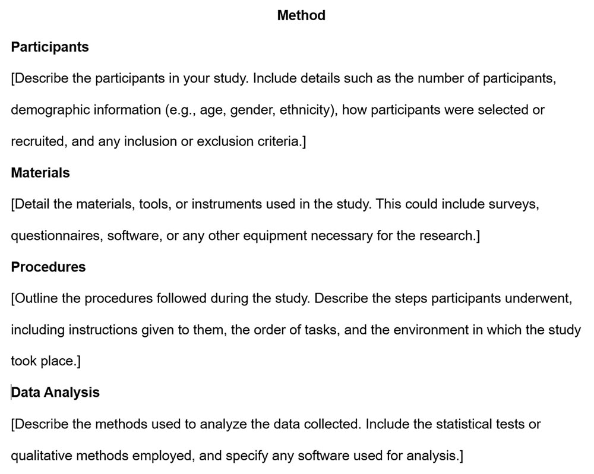
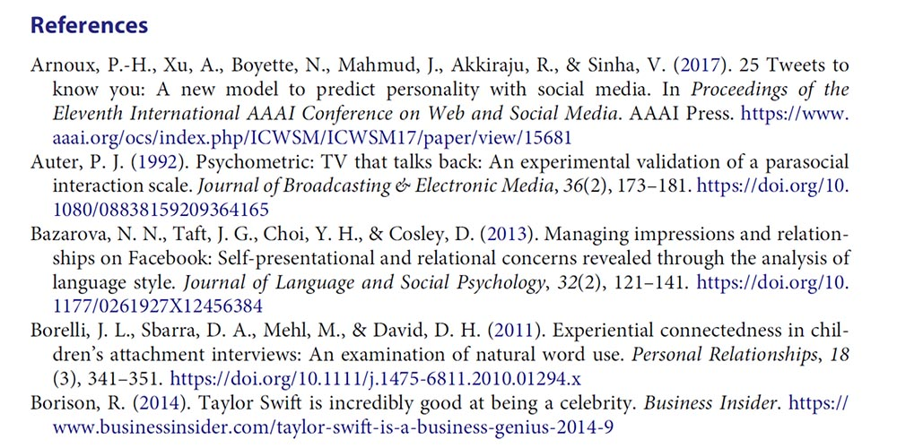
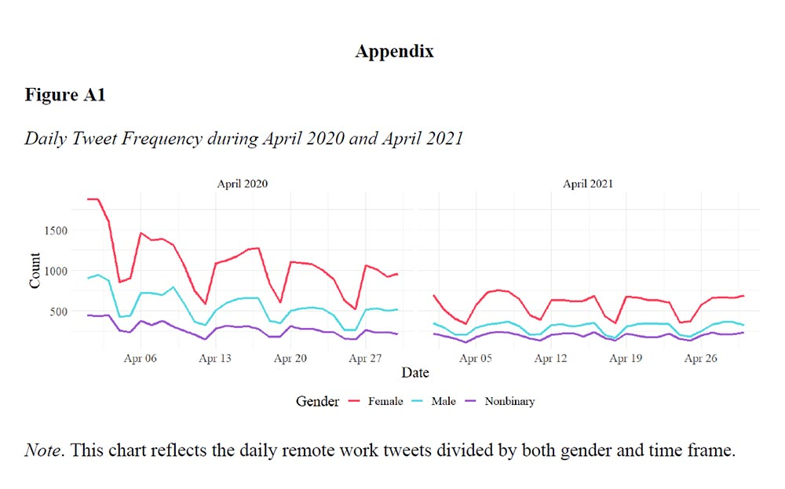

# Introduction to Research Papers

## What are Research Papers

Research papers, often referred to as scholarly articles, serve as vital conduits for disseminating original research findings, theoretical explorations, or critical analyses within the academic community. These documents are integral to the advancement of knowledge in various disciplines, providing a formalized medium through which researchers communicate their contributions to the broader academic and professional audience. Research papers are typically published in reputable academic journals, which are often associated with professional organizations or academic institutions. These journals serve as repositories of knowledge, where scholars can access and build upon the work of others, fostering the cumulative growth of knowledge in their respective fields.

### Originality {.unnumbered}

The process of preparing a research paper involves rigorous intellectual effort, beginning with the identification of a research question or problem that is both original and significant. This question drives the research process, guiding the methodology and analysis that follow. The research must offer new insights, whether through the collection and interpretation of empirical data or through the development of new theoretical perspectives. In doing so, research papers contribute to the existing body of knowledge, offering fresh perspectives or addressing gaps that have been identified in previous studies.

### Methodology {.unnumbered}

One of the defining characteristics of research papers is their adherence to a systematic methodology. The methodology section of a research paper is critical as it outlines the research design, the data collection procedures, and the analytical techniques employed. This transparency allows other scholars to evaluate the reliability and validity of the research, as well as to replicate or build upon the study in future research. The rigor of the methodology is a key factor in the credibility of the research findings.

### Evidence-Based {.unnumbered}

Research papers are fundamentally evidence-based, meaning that their conclusions and arguments are grounded in data and supported by empirical evidence or theoretical reasoning. The evidence presented in research papers is typically derived from a range of sources, including experiments, surveys, observations, or existing literature. Researchers must carefully analyze this evidence and present their findings in a clear and logical manner. The inclusion of data and results, along with proper citations, is essential for supporting the paper's claims and for situating the research within the broader academic discourse.

### Peer Review {.unnumbered}

Before a research paper can be published, it must undergo a process of peer review, which is a cornerstone of academic publishing. Peer review involves the evaluation of the research paper by other experts in the field, who assess the validity, originality, and significance of the work. This process is crucial in maintaining the quality and integrity of academic literature, as it helps to ensure that only research that meets high standards of scholarly excellence is published. The feedback from peer reviewers often leads to revisions that improve the clarity, robustness, and impact of the paper.

### Structure {.unnumbered}

The structure of a research paper is typically standardized, following a format that enhances the clarity and accessibility of the research. Common sections include an abstract, introduction, methodology, results, discussion, and references. The abstract provides a concise summary of the research, highlighting the main findings and their implications. The introduction sets the stage for the research, presenting the research question and its significance. The methodology details the research design and procedures, while the results section presents the findings. The discussion interprets the results, exploring their implications and how they contribute to the existing body of knowledge. Finally, the references section lists the sources cited in the paper, providing a framework for further reading and acknowledging the contributions of other scholars.

## How to Find Research Papers {#find}

There are many ways to find research papers, both paid and free. Here are a few popular methods:

### Use a specialized search engine. {.unnumbered}

Specialized search engines are designed to search for specific types of information, such as research articles. Here are some tips on how to use a specialized search engine to find research articles:

**Choose the right search engine.** There are many specialized search engines available, so it is important to choose one that is relevant to your topic. Some popular specialized search engines for research articles include:

-   Google Scholar

-   PubMed

-   Web of Science

-   Scopus

-   IEEE Xplore

-   ACM Digital Library

**Use keywords.** When you are searching for research articles, it is important to use keywords that are relevant to your topic. You can use the same keywords that you would use for a general search engine, but you may also need to use more specific keywords.

**Use advanced search features.** Most specialized search engines have advanced search features that allow you to narrow down your search results. For example, you can specify the publication date, the language, or the type of document.

**Read the results carefully.** Once you have found some research articles, take some time to read them carefully. This will help you identify the articles that are most relevant to your research.

**Evaluate the quality of the sources.** Not all sources are created equal. When you are evaluating the quality of a research article, consider the following factors:

-   The author's credentials

-   The publication date

-   The journal's reputation

-   The methodology used

-   The findings of the study

By following these tips, you can use a specialized search engine to find research articles that are relevant to your topic and of high quality.

Here are some additional tips for using a specialized search engine to find research articles:

**Use quotation marks to search for exact phrases.** For example, if you are looking for articles about the "impact of social media on mental health," you would search for "impact of social media on mental health."

**Use Boolean operators to combine keywords.** Boolean operators, such as AND, OR, and NOT, can be used to combine keywords and narrow down your search results. For example, if you are looking for articles about the "impact of social media on mental health" in the journal "Nature," you would search for "impact of social media AND mental health AND Nature."

**Use filters to narrow down your results.** Most specialized search engines allow you to filter your results by publication date, language, and other criteria. This can be helpful if you are looking for specific types of research articles.

**Use the search engine's help documentation.** Most specialized search engines have help documentation that can provide you with more information about how to use the search engine.

I hope these tips help you find the research articles you are looking for.

### Check your university library. {.unnumbered}

Your university library has a wealth of resources that you can use to find research articles. Here are some tips on how to use your university library to find research articles:

**Talk to a librarian.** Librarians are experts in finding information. They can help you choose the right databases and search strategies for your research.

**Use the library's online catalog.** The library's online catalog is a searchable database of all the books, journals, and other materials that the library owns.

**Use the library's databases.** The library subscribes to a variety of databases that contain research articles. These databases can be searched by keyword, author, or subject.

**Ask for help from a research assistant.** Many libraries have research assistants who can help you find research articles.

### Use social media. {.unnumbered}

You can use social media to find research articles in a few different ways:

**Follow researchers and research institutions.** Many researchers and research institutions use social media to share their work, including research articles. By following these accounts, you can stay up-to-date on the latest research in your field.

**Use relevant hashtags.** Hashtags are a great way to find research articles on social media. When you search for a relevant hashtag, you will see all the posts that have been tagged with that hashtag. This can be a great way to find research articles that you might not have otherwise found.

**Join research groups and communities.** There are many research groups and communities on social media where researchers can share their work and discuss research topics. By joining these groups, you can connect with other researchers and find research articles that are relevant to your interests.

**Attend online conferences and workshops.** Many conferences and workshops are now being held online, and these can be a great way to find research articles. Often, the presentations from these events are posted online, and you can also interact with the speakers and other attendees.

Here are some specific social media platforms that you can use to find research articles:

**Twitter:** Twitter is a great platform for following researchers and research institutions. You can also use Twitter to search for research articles using hashtags.

**LinkedIn:** LinkedIn is a professional networking platform that can be a great way to connect with researchers and find research articles.

**ResearchGate:** ResearchGate is a social networking platform for researchers. You can use ResearchGate to find research articles, collaborate with other researchers, and get feedback on your own work.

**Academia.edu:** Academia.edu is a social networking platform for academics. You can use Academia.edu to find research articles, connect with other academics, and share your own work.

**Facebook:** Facebook can also be a good platform for finding research articles, especially if you are part of a research group or community.

When using social media to find research articles, it is important to be critical of the sources you find. Not all research articles that are shared on social media are of high quality. It is important to evaluate the quality of the article before you cite it in your own research. If you are unsure about the quality of a research article, it is always best to consult with a librarian or another expert.

### Contact experts in your field. {.unnumbered}

There are a few ways to use experts in your field to find research articles:

**Talk to your professors or advisors.** Your professors and advisors are likely to be familiar with the latest research in your field. They can recommend research articles that you should read and can also help you to identify experts in your field.

**Attend conferences and workshops.** Attending conferences and workshops is a great way to meet experts in your field and to learn about the latest research. You can also ask experts for recommendations for research articles.

**Read research blogs and newsletters.** There are many research blogs and newsletters that are written by experts in various fields. These can be a great way to stay up-to-date on the latest research and to find research articles that are relevant to your interests.

**Use social media.** As mentioned earlier, you can use social media to connect with experts in your field and to find research articles. You can follow researchers and research institutions on Twitter, LinkedIn, and other social media platforms. You can also join research groups and communities on social media.

Here are some specific things you can do to find experts in your field:

**Search for experts by name or by topic.** There are many online directories that list experts in various fields. You can search for experts by name or by topic.

**Look for experts who have published research articles in your field.** You can use a specialized search engine, such as Google Scholar, to find research articles that have been published in your field. The authors of these articles are likely to be experts in your field.

**Look for experts who have given presentations at conferences or workshops in your field.** You can find information about conferences and workshops on the websites of professional organizations.

**Look for experts who are active on social media.** As mentioned earlier, you can use social media to connect with experts in your field. You can follow researchers and research institutions on Twitter, LinkedIn, and other social media platforms. You can also join research groups and communities on social media.

When using experts in your field to find research articles, it is important to be respectful of their time. When you reach out to an expert, be sure to explain why you are interested in their research and what you are looking for. Be sure to also thank the expert for their time and consideration.

## How to Read Research Papers {#read}

There are many different approaches to reading a research paper, but these are some of the most effective ones.

### The three-pass approach. {.unnumbered}

The three-pass approach to reading a research paper is a method of reading a paper in three stages, each with a specific goal.

**The first pass**. This is a quick scan to capture a high-level view of the paper. You should read the title, abstract, and introduction carefully, and then skim the rest of the paper, paying attention to the headings and subheadings. The goal of this pass is to get a general understanding of what the paper is about, its main points, and its contributions to the field.

**The second pass**: This is a more detailed reading of the paper. You should read the introduction and conclusion carefully, and then read the rest of the paper in more detail, paying attention to the methods, results, and discussion. The goal of this pass is to understand the paper's arguments and evidence, and to assess its strengths and weaknesses.

**The third pass**: This is a critical reading of the paper. You should read the paper carefully, taking notes and challenging the author's assumptions and conclusions. The goal of this pass is to fully understand the paper and to be able to critically evaluate its claims.

### The question-based approach. {.unnumbered}

The question-based approach to reading a research paper is a method of reading a paper by asking questions about the paper as you read. This approach can help you to focus your reading and to ensure that you understand the key points of the paper.

Here are some questions that you can ask yourself as you read a research paper:

-   What is the purpose of the paper?

-   What are the main questions that the paper addresses?

-   What are the key findings of the paper?

-   How does the paper contribute to the existing body of knowledge?

-   What are the strengths and weaknesses of the paper?

-   How does the paper relate to my own research interests?

You can also ask more specific questions that are relevant to the specific paper that you are reading. For example, if you are reading a paper about a new medical treatment, you might ask questions about the safety and effectiveness of the treatment.

The question-based approach can be used in conjunction with the three-pass approach to reading a research paper. In the first pass, you can ask general questions about the paper to get a sense of what it is about. In the second pass, you can ask more specific questions to understand the paper in more detail. In the third pass, you can critically evaluate the paper by asking questions about its methods, findings, and conclusions.

The question-based approach is a flexible method that can be adapted to your own needs and preferences. By asking questions as you read, you can improve your understanding of research papers and your ability to critically evaluate their claims. The question-based approach is a valuable tool for reading and understanding research papers. By asking questions as you read, you can improve your comprehension and critical thinking skills.

### The active reading approach. {.unnumbered}

Active reading is a method of reading that involves engaging with the text in a thoughtful and critical way. It is different from passive reading, which is simply reading the text without thinking about it.

Active reading can be used to read any type of text, but it is especially important for reading research papers. Research papers are often dense and technical, so it is important to be actively engaged in order to understand them.

Here are some tips for active reading:

**Ask questions**: As you read, ask yourself questions about the text. What is the author's purpose? What are the main points? What evidence does the author provide to support their claims?

**Take notes**: Taking notes can help you to remember the key points of the text and to track your progress. You can take notes in the margins of the text, or you can use a separate notebook.

**Summarize**: After each section of the text, summarize the key points in your own words. This will help you to solidify your understanding of the text.

**Discuss the text with others**: Talking to others about a text can help you to gain new insights and perspectives.

**Annotate the text**: Annotating the text means making notes and comments in the margins. This can help you to highlight important passages, ask questions, and make connections between different parts of the text.

**Use a highlighter**: Highlighting important passages can help you to focus your attention and to remember the key points of the text.

**Take a break**: Don't try to read a research paper in one sitting. Take breaks to refresh your mind and to come back to the text with fresh eyes.

Active reading takes time and effort, but it is a valuable skill for anyone who wants to learn and grow. By actively reading research papers, you can improve your comprehension, critical thinking skills, and ability to learn new things.

### The collaborative reading approach. {.unnumbered}

This approach involves reading the paper with a partner or group of people. This can be helpful for getting different perspectives on the paper and for identifying areas where you need clarification.

No matter which approach you choose, it is important to take your time and read the paper carefully. Research papers can be dense and challenging, but they can also be very rewarding. By taking the time to read them carefully, you can learn a lot about your field and contribute to the advancement of knowledge. The question-based approach is a valuable tool for reading and understanding research papers. By asking questions as you read, you can improve your comprehension and critical thinking skills.

## How to Write Research Papers {#write}

### Sections of an Academic Paper {.unnumbered}

Writing a research report involves meticulously organizing your work to clearly communicate the purpose, methods, findings, and conclusions of your study. Each section of the report is crucial, serving a specific function in guiding the reader through your research journey. Understanding how to craft each part effectively will help you produce a coherent, credible, and impactful report.

#### Title {.unnumbered}

The title of your research report is more than just a label; it is the first impression that sets the stage for your entire study. A well-crafted title should be clear, concise, and informative, giving the reader a snapshot of the study’s focus while also piquing their interest. Typically, a title should not exceed 12 words, striking a balance between being descriptive and concise. It should accurately reflect the main topic of the paper, using specific language that gives the reader a clear idea of what to expect. For instance, rather than using vague terms, the title should include specific variables or populations being studied. The formatting of the title is also important. It should be bold, centered, and double-spaced on the title page. Only the first word of the title and any proper nouns should be capitalized, even when using a semi-colon, where the word following it is treated as a new first word. This attention to detail in the title not only adheres to academic conventions but also conveys a sense of professionalism and precision, setting the tone for the rest of the report.

#### Abstract {.unnumbered}

The abstract is one of the most critical components of a research report, serving as a concise summary that encapsulates the entire study. It typically ranges between 150 and 250 words and should be written in past tense. The abstract must efficiently convey the purpose of the study, the methods used, the main findings, and the conclusions drawn, providing readers with a clear overview of what the report entails. Since the abstract is often the first—and sometimes the only—part of the report that others will read, it needs to be clear and informative, free of jargon, and devoid of citations. Crafting a strong abstract involves striking a balance between brevity and completeness; it should cover the key aspects of the study without delving into unnecessary details. In learning to write effective abstracts, students will review examples from published research, which will highlight how successful abstracts succinctly summarize complex studies. Through writing exercises and peer reviews, students will develop the skill to distill their research into a compelling, accurate summary, while avoiding common pitfalls like vagueness or excessive detail that can obscure the main message.

{width="100%"}

#### Introduction {.unnumbered}

The introduction of your research report serves as the gateway to your study, providing the necessary background information and framing the research problem within a broader context. A well-written introduction should clearly state the research problem, explain its significance, and outline the research question or hypothesis. This section is crucial for engaging the reader, as it not only introduces the topic but also justifies why the study is important. A strong introduction links the research question to existing literature or ongoing debates in the field, setting the stage for the subsequent sections of the report. In crafting an introduction, it is essential to balance providing enough background to understand the research with keeping the reader's interest. Students will examine examples from academic journals to see how effective introductions establish context, articulate the research problem, and lead seamlessly into the study’s objectives. By practicing drafting introductions for hypothetical studies, students will learn to frame their research in a way that is both compelling and informative, ensuring that their readers are both engaged and well-informed from the outset.

{width="100%"}

#### Literature Review {.unnumbered}

The literature review is a foundational component of a research report, serving as a synthesis of existing research that situates your study within the broader academic discourse. It is not merely a summary of related studies but a critical evaluation that identifies gaps in the literature, justifies the relevance of your research, and demonstrates your understanding of the field. A well-crafted literature review connects various studies, highlighting how they relate to your research question and setting the stage for your contribution to the field. This section requires a thorough review of existing literature, with a focus on synthesizing findings rather than simply cataloging them. To aid in the construction of a literature review, students will be provided with guidelines that emphasize the importance of critical evaluation and thematic organization. Writing exercises will involve summarizing and synthesizing research on a given topic, identifying key themes, and discussing how these themes relate to the research question. Through these exercises, students will learn to craft a literature review that not only provides context but also establishes a strong foundation for their study, leading naturally to the formulation of their research question.

#### Methods {.unnumbered}

The methods section of a research report is where you detail how the research was conducted, providing a roadmap that allows others to replicate your study. This section should include a comprehensive description of the participants, materials, procedures, and methods of data analysis used in the study. Clarity and precision are crucial, as the goal is to provide enough detail for another researcher to replicate the study exactly. The methods section is typically written in the past tense, as it describes actions that have already been completed. To assist in writing this section, students will be provided with a template or checklist to ensure all necessary details are included. They will practice writing a method section based on a described experiment or survey, followed by class reviews to discuss completeness and clarity. These discussions will emphasize the importance of transparency in the methods section, as it underpins the study's scientific rigor and reliability. By mastering the methods section, students will be able to communicate the how of their research clearly and effectively, ensuring that their study can be trusted and potentially replicated by others in the field.

{width="100%"}

#### Results {.unnumbered}

The results section of a research report presents the findings of your study, providing the raw data and statistical analyses that support your conclusions. This section should be organized logically and clearly, with the data presented in a way that is easy to follow. Tables, graphs, and figures are often used to illustrate the data, making it more accessible to the reader. The results section should be objective and free of interpretation; its purpose is to present the facts as they are, allowing the data to speak for itself. In teaching how to write this section, students will learn to select the most appropriate methods for presenting their data, ensuring that it is both clear and comprehensive. Exercises will involve organizing data into tables and graphs and writing a results section based on these visual representations. By focusing on the clarity and objectivity required in the results section, students will develop the ability to present their findings in a manner that is both accurate and easy to interpret.

#### Discussion {.unnumbered}

The discussion section is where you interpret the results of your study, relating them back to the research question and the existing literature. This section should provide a thoughtful analysis of what the results mean, how they contribute to the field, and what their implications are for future research. It is also where you discuss the limitations of your study and suggest directions for future research. The discussion section should be written in the present tense, as it deals with the implications of your findings. To help students write an effective discussion, they will be guided through examples that show how to connect the results to the literature review and research question, offering a critical analysis that goes beyond the data itself. Writing exercises will focus on developing a narrative that ties the findings to broader theoretical and practical implications, while also acknowledging the study’s limitations. Through this process, students will learn to craft a discussion that is both insightful and grounded in the data, providing a clear interpretation of what their findings mean and why they matter.

#### References {.unnumbered}

The references section is where you list all the sources cited in your research report, providing full citations in the appropriate format (typically APA style). This section is essential for giving credit to the original authors and for allowing readers to locate the sources you used. Accurate and consistent referencing is crucial for maintaining the credibility of your research report. To familiarize students with APA formatting rules, they will be introduced to the APA Publication Manual and other online resources. A workshop will be conducted where students practice formatting references for various types of sources, such as books, journal articles, and websites. During this workshop, common citation errors will be discussed, along with strategies to avoid them. The emphasis will be on maintaining consistency and accuracy in references, as these are key to producing a credible and professional research report.

{width="100%"}

#### Appendix {.unnumbered}

The appendix is where you include supplementary materials that support your research but are not essential to the main text. These materials might include survey instruments, raw data, detailed tables, or consent forms. While not every research report will require an appendix, it can be a valuable addition when you need to provide additional context or transparency. To help students understand what to include in an appendix, examples from published research will be shown. These examples will illustrate the types of materials that are typically included and how they add value to the report without overwhelming the reader. Students will then be assigned to create an appendix for their research report, incorporating materials such as raw data, consent forms, or detailed descriptions of their methodology. The class will discuss how to reference the appendix in the main text, ensuring that it complements the report rather than detracts from it. This exercise will help students understand the role of the appendix in providing transparency and supporting the credibility of their research, while also ensuring that the main body of the report remains focused and concise.

{width="100%"}

### Information for Inclusion {.unnumbered}

#### Research Problem {.unnumbered}

The research problem is the foundation upon which your entire study is built. It is the issue, gap, or challenge that your research aims to address, and it guides the direction of your investigation. Clearly defining the research problem is crucial because it sets the focus for the study and informs the development of research questions, hypotheses, and methods. A well-defined research problem should be specific, measurable, and researchable, meaning that it should be narrow enough to allow for a thorough investigation but broad enough to be significant within the field. For undergraduate students, identifying a research problem involves reviewing existing literature, understanding the current state of knowledge in the field, and pinpointing areas where further exploration is needed. This step requires critical thinking and a deep understanding of the subject matter, as the problem must be both meaningful and feasible to study. The clarity and precision with which you articulate the research problem will determine the relevance and focus of your entire research report.

#### Relevant Theory + Literature {.unnumbered}

The relevant theory and literature section is where you contextualize your research within the broader academic landscape. This involves discussing existing theories that relate to your research problem and reviewing previous studies that have addressed similar or related issues. The purpose of this section is to demonstrate your understanding of the current state of knowledge in your field and to identify gaps that your research aims to fill. Theoretical frameworks provide the lens through which you will analyze your data, helping to explain and predict phenomena. A thorough literature review also allows you to build on existing knowledge, showing how your research contributes to ongoing academic discussions. For undergraduate students, this section is an opportunity to engage with the work of others critically, synthesizing different perspectives to justify the need for your study. This step requires extensive reading, analysis, and the ability to connect your research problem with broader theoretical and empirical discussions.

#### Research Questions/Hypotheses {.unnumbered}

Research questions and hypotheses are the specific inquiries or predictions that your study seeks to answer or test. These elements stem directly from your research problem and are critical to guiding your research design and methodology. Research questions are typically open-ended, focusing on exploring or understanding a phenomenon, while hypotheses are statements that predict a relationship between variables and are usually tested through empirical research. Clearly formulated research questions and hypotheses provide a clear direction for your study, helping you stay focused on your objectives throughout the research process. For undergraduate students, developing research questions and hypotheses requires a deep understanding of the research problem and the relevant literature. These elements must be precise, feasible, and aligned with the overall goals of the study. They also form the basis for your research design, influencing everything from the selection of variables to the choice of analytical methods.

#### Conceptual Definition of Variables {.unnumbered}

The conceptual definition of variables involves explaining what each variable represents in the context of your study. This definition is more abstract and theoretical, outlining the meaning and scope of each variable as it relates to your research problem and objectives. Conceptual definitions are important because they establish a common understanding of the variables among your readers and clarify how these variables are connected to the research questions or hypotheses. For undergraduate students, conceptualizing variables requires an understanding of the theoretical framework and how the variables function within that framework. For example, if your study examines "social media influence," you need to define what you mean by "influence" conceptually—whether it refers to changes in behavior, attitudes, or perceptions. A clear conceptual definition helps ensure that the variables are measured and analyzed consistently throughout the study.

#### Research Method {.unnumbered}

The research method section outlines the overall approach you will take to investigate your research problem. This could involve qualitative methods, quantitative methods, or a mixed-methods approach, depending on the nature of your research questions and the type of data you need to collect. The research method you choose will determine how you collect, analyze, and interpret data. For undergraduate students, selecting an appropriate research method involves considering the strengths and limitations of different approaches and how they align with your research objectives. A well-chosen method enhances the validity and reliability of your study, ensuring that your findings are credible and meaningful. This section should also explain why the chosen method is suitable for addressing your research problem, linking it back to the research questions and hypotheses.

#### Operational Definition of Variables {.unnumbered}

The operational definition of variables specifies how each variable will be measured or manipulated in your study. Unlike the conceptual definition, which is more abstract, the operational definition is concrete and practical, detailing the exact procedures or instruments you will use to collect data on each variable. For instance, if your conceptual variable is "academic performance," your operational definition might specify that it will be measured by students' grade point averages (GPAs). Operational definitions are crucial because they ensure that variables are measured consistently and accurately, allowing for precise data collection and analysis. For undergraduate students, defining variables operationally requires careful consideration of the tools and methods available for measurement, as well as ensuring that these measurements align with the study's conceptual framework. Clear operational definitions are key to the replicability of your research, as they provide a blueprint for how the study was conducted.

#### Chosen Population {.unnumbered}

The chosen population refers to the entire group of individuals or entities that your study seeks to understand or draw conclusions about. This population is defined based on the research problem and objectives, and it should be representative of the broader group that you wish to generalize your findings to. Identifying your chosen population involves specifying characteristics such as age, gender, geographic location, or other relevant factors. For undergraduate students, selecting the appropriate population is a critical step in ensuring the external validity of the study. The chosen population determines the scope of the research and influences decisions about sampling methods and data collection. Clearly defining the population helps to establish the relevance and applicability of your findings to the broader context of your research.

#### Sample Method {.unnumbered}

The sample method details how a subset of the chosen population will be selected for the study. Since it is often impractical to study an entire population, sampling allows researchers to make inferences about the larger group based on the analysis of a smaller, representative sample. There are various sampling methods, including random sampling, stratified sampling, and convenience sampling, each with its advantages and limitations. The sample method must align with the research design and objectives to ensure that the sample accurately represents the population. For undergraduate students, understanding the principles of sampling is essential for making informed decisions about how to select participants and how those selections might influence the study’s outcomes. The sample method also affects the study's internal and external validity, as it determines the extent to which the findings can be generalized to the broader population.

#### Data Collection Method {.unnumbered}

The data collection method describes how data will be gathered from the sample. This could involve surveys, interviews, observations, experiments, or the use of existing data sources. The choice of data collection method depends on the research questions, the nature of the variables, and the overall research design. Each method has its strengths and weaknesses, and it is important to choose one that will provide the most accurate and reliable data for your study. For undergraduate students, selecting a data collection method involves considering factors such as accessibility to the sample, the resources available, and the ethical implications of data collection. The data collection method is critical to the success of the research, as it directly impacts the quality and integrity of the data that will be analyzed and interpreted.

#### Data Cleaning Process {.unnumbered}

The data cleaning process is an essential step that occurs after data collection and before data analysis. It involves reviewing the collected data for errors, inconsistencies, or missing values that could skew the results. Data cleaning may involve correcting data entry errors, handling missing data, and ensuring that the dataset is accurate and complete. For undergraduate students, understanding the importance of data cleaning is crucial because it directly affects the validity and reliability of the research findings. A well-executed data cleaning process ensures that the data is ready for analysis, minimizing the risk of bias and inaccuracies. This step also involves making decisions about how to handle anomalies in the data, such as outliers or invalid responses, which could otherwise compromise the study’s conclusions.

#### Data Analysis Method {.unnumbered}

The data analysis method refers to the techniques and procedures you will use to examine the cleaned data and draw conclusions based on your research questions or hypotheses. This could involve statistical analysis, thematic analysis, content analysis, or other methods, depending on whether your research is qualitative, quantitative, or mixed-methods. The choice of data analysis method must align with the type of data collected and the overall research design. For undergraduate students, selecting an appropriate data analysis method involves understanding the different types of analysis and how they relate to the research objectives. The data analysis method is critical because it determines how the data will be interpreted, and it ultimately shapes the findings and conclusions of the study. A thorough understanding of data analysis techniques is necessary to ensure that the analysis is both rigorous and appropriate for the research questions being addressed.

#### Results of Analysis {.unnumbered}

The results of the analysis section presents the findings of your study based on the data analysis method used. This section should clearly and objectively summarize the outcomes of the analysis, including any statistical results, patterns, or themes identified in the data. The results should be presented in a logical order, often accompanied by tables, charts, or graphs that help to illustrate the findings. For undergraduate students, the results section is an opportunity to communicate what the data reveals without interpretation or bias. It is important to present the results transparently, ensuring that the findings are understandable and accessible to the reader. This section forms the foundation for the discussion, where the implications of these results will be explored in greater depth.

#### Discussion of Findings {.unnumbered}

The discussion of findings is where you interpret the results of your analysis, relating them back to the research questions, hypotheses, and the broader theoretical framework. This section should explore the significance of the findings, discussing how they contribute to the field, their implications for future research, and how they compare to existing literature. The discussion should also address any unexpected results and offer explanations for these outcomes. For undergraduate students, the discussion section is a chance to demonstrate critical thinking and to connect the results to the broader academic conversation. This section should be thoughtful and insightful, offering a deeper understanding of what the findings mean and why they are important. The discussion also provides an opportunity to reflect on the limitations of the study and suggest directions for future research, acknowledging that no study is without its constraints.

#### Drawn Conclusions {.unnumbered}

The drawn conclusions section is where you summarize the key takeaways from your study, based on the findings and the discussion. This section should reiterate the significance of the research problem, the contribution of the study to the field, and the practical or theoretical implications of the findings. Conclusions should be clear and concise, leaving the reader with a strong understanding of what has been learned and how it advances knowledge in the field. For undergraduate students, drawing conclusions involves synthesizing the information presented in the report, distilling the most important insights, and articulating the study's overall contribution. This section should also highlight any recommendations for practice or future research, providing a clear endpoint for the report that reinforces the study's value. The conclusions serve as the final word on your research, leaving a lasting impression on the reader about the significance and impact of your work.

### Examples of Formal Reports {.unnumbered}

#### Academic Examples {.unnumbered}

There are many different ways to report research in academia. Some of the most common methods include:

**Research papers**: Research papers are the most common way to report research in academia. They are typically published in academic journals and are written in a formal style.

**Conference papers**: Conference papers are presented at academic conferences. They are typically shorter than research papers and are written in a more informal style.

{width="100%"}

**Theses and dissertations**: Theses and dissertations are written by graduate students to complete their degree requirements. They are typically longer and more comprehensive than research papers.

**Books**: Books are another way to report research. They are typically written by experts in a particular field and can be a good way to communicate research to a wider audience.

**Reports**: Reports are written for a specific audience, such as a government agency or a business. They are typically shorter than research papers and focus on a specific topic.

**Presentations**: Presentations are a way to share research with a live audience. They can be given at conferences, workshops, or other events.

{width="100%"}

**Blogs and social media**: Blogs and social media can be used to share research with a wider audience. They are a good way to communicate research in a more informal way.

The best way to report research depends on the specific research project and the intended audience. However, all of these methods can be effective ways to communicate research findings and to contribute to the academic community.

{width="100%"}

#### Industry Examples {.unnumbered}

There are many different ways to report research in industry. Some of the most common methods include:

**White papers**: White papers are a type of report that is commonly used in industry to present research findings to a specific audience. They are typically written in a clear and concise style and focus on a specific topic.

{width="100%"}

**Executive summaries**: Executive summaries are a brief overview of a white paper or other research report. They are typically written for senior executives and other decision-makers.

**Presentations**: Presentations are a way to share research findings with a live audience. They can be given at company meetings, conferences, or other events.

**Blogs and social media**: Blogs and social media can be used to share research findings with a wider audience. They are a good way to communicate research in a more informal way.

**Press releases**: Press releases are a way to share research findings with the media. They are typically written in a clear and concise style and focus on the key findings of the research.

**Technical reports**: Technical reports are a detailed document that describes the research methods and findings. They are typically written for a technical audience.

The best way to report research in industry depends on the specific research project and the intended audience. However, all of these methods can be effective ways to communicate research findings and to contribute to the industry community.
