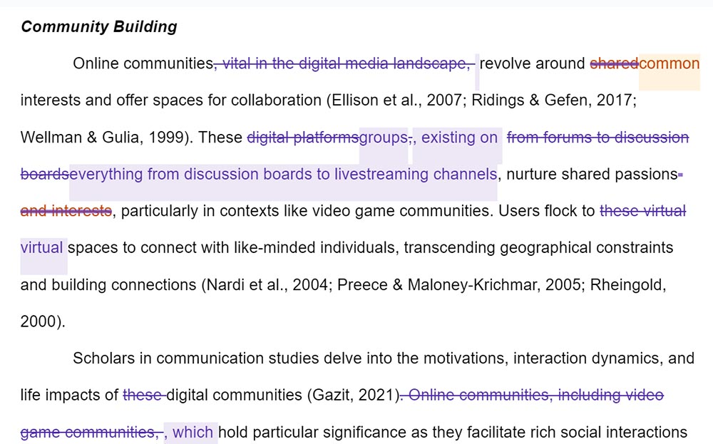
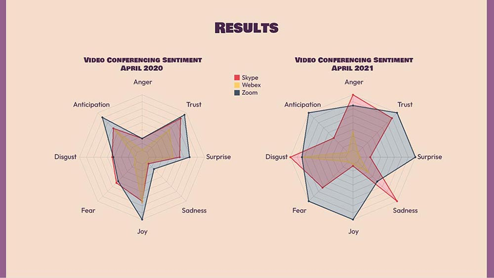

# Writing and Presenting Research

## Writing the Research Report

### Structure of a Research Report

When writing a research report, it is essential to structure your work in a way that clearly communicates your study's purpose, methods, findings, and conclusions. Each section of the report plays a specific role in this process, guiding the reader through your research journey. This chapter will help you understand how to craft each part of your research report effectively.

#### Abstract

The abstract is a concise summary of your entire research report, typically between 150-250 words. It should highlight the purpose of your study, the methods you used, the key findings, and the conclusions you drew. An abstract is often the first (and sometimes only) part of your report that others will read, so it must be clear and informative.

In teaching this section, you will start by reviewing well-written abstracts from published research. These examples will help you see the balance between brevity and completeness. Afterward, you will be asked to write an abstract based on a provided research report. This exercise will be followed by peer reviews, where you can learn from each other's strengths and identify areas for improvement. Common pitfalls to avoid include being too vague or overly detailed, both of which can detract from the abstract's purpose of providing a clear snapshot of the study.

{width="100%"}

*Figure 081. The good abstract is clear, concise, and relevant, providing key details about the study. The bad abstract is vague, lacks focus, and is overly general.*

#### Introduction

The introduction of your research report sets the context for your study. It explains the research problem, why it is significant, and what the study aims to achieve. A good introduction engages the reader by linking the research question to broader issues or debates in the field, setting the stage for the rest of the report.

To help you write an effective introduction, you will be shown examples from academic journals. These examples will demonstrate how introductions frame the research problem and justify the study’s relevance. You will then draft an introduction for a hypothetical study, focusing on clearly stating the research question and objectives. The exercise will emphasize the importance of capturing the reader's interest while providing enough background to understand the significance of your research.

{width="100%"}

*Figure 082. An annotated introduction from a published research article. Annotations should highlight key elements, such as the research question, the significance of the study, and the clear statement of objectives.*

#### Method Section

The method section details how the research was conducted. It should include descriptions of the participants, materials used, procedures followed, and methods of data analysis. The goal of this section is to provide enough detail so that another researcher could replicate the study.

To guide you in writing this section, a template or checklist will be provided, ensuring that all necessary details are included. You will write a method section based on a described experiment or survey, and then review it in class for completeness and clarity. The discussion will focus on the importance of transparency in the method section, as it allows others to replicate your study, a key aspect of scientific rigor.

{width="100%"}

*Figure 083. A sample method section template, with placeholders for participants, materials, procedures, and data analysis methods. Annotations should explain the purpose of each section and what information should be included.*

#### Results Section

The results section presents the findings of your study. This section typically includes tables, graphs, and statistical analyses to summarize the data. The results should be presented clearly and without bias, allowing the data to speak for itself.

### APA Formatting and Citation

Mastering APA formatting and citation is crucial for producing a polished and professional research report. This section will guide you through the key elements of APA style, including the literature review, reference list, and appendix. Each component plays a vital role in ensuring that your work is well-organized, properly cited, and adheres to academic standards.

#### Literature Review

The literature review is a critical component of your research report, serving as a synthesis of existing research on your topic. It identifies gaps in the literature, situates your study within the broader academic context, and justifies the need for your research. A well-crafted literature review not only demonstrates your understanding of the field but also lays the groundwork for your research question.

To help you conduct and structure a literature review effectively, you will be provided with guidelines that emphasize the importance of critically evaluating and synthesizing sources. The goal is not merely to summarize existing studies but to connect them in a way that highlights their relevance to your research. As part of your learning, you will write a literature review on a given topic, focusing on identifying key themes, gaps in the literature, and the relevance of each source to your study. This exercise will be followed by discussions on how to organize the literature review logically, ensuring that it leads naturally to the formulation of your research question.

{width="100%"}

*Figure 084. A flowchart showing the steps in conducting a literature review, from searching for sources to synthesizing findings and identifying research gaps. The flowchart should visually connect these steps, demonstrating how they leadto the formulation of a research question.*

#### Reference List

The reference list is where you provide full citations for all the sources cited in your research report, formatted according to APA style. This section is essential for giving credit to the original authors and for allowing readers to locate the sources you used.

To familiarize you with APA formatting rules, you will be introduced to the APA Publication Manual and other online resources. A workshop will be conducted where you will practice formatting references for various types of sources, such as books, journal articles, and websites. During this workshop, common citation errors will be discussed, along with strategies to avoid them. The emphasis will be on maintaining consistency and accuracy in your references, as these are key to producing a credible and professional research report.

{width="100%"}

*Figure 085. A sample reference list formatted according to APA style, with annotations pointing out key formatting details such as the order of elements, use of italics, and punctuation. This image should serve as a visual guide for students when formatting their references.*

#### Appendix

The appendix is where you include supplementary materials that support your research but are not essential to the main text. These materials might include survey instruments, raw data, detailed tables, or consent forms. While not every research report will require an appendix, it can be a valuable addition when you need to provide additional context or transparency.

To help you understand what to include in an appendix, examples from published research will be shown. These examples will illustrate the types of materials that are typically included and how they add value to the report without overwhelming the reader. You will then be assigned to create an appendix for your research report, incorporating materials such as raw data, consent forms, or detailed descriptions of your methodology. The class will discuss how to reference the appendix in the main text, ensuring that it complements the report rather than detracts from it.

{width="100%"}

*Figure 086. An annotated example of an appendix from a research report, showing different types of supplementary materials (e.g., survey questions, raw data tables) and how they are organized. Annotations should explain the purpose of each element and how it supports the main text.*

By mastering the elements of APA formatting and citation, you will be able to produce a research report that meets academic standards and clearly communicates your findings. Each section—the literature review, reference list, and appendix—plays a crucial role in supporting your research and enhancing its credibility. Through practice and feedback, you will develop the skills needed to apply APA style confidently in your academic work.

### Common Writing Challenges

Writing a clear, concise, and unbiased research report is essential for effectively communicating your findings to a wide audience. This section will address common writing challenges—clarity, conciseness, and avoiding bias—and provide strategies for overcoming them.

#### Clarity

Clarity in writing is about making your ideas easy to understand. This means avoiding jargon, using straightforward language, and structuring your sentences so that your meaning is immediately clear to the reader. When your writing is clear, you make your research accessible not only to experts in your field but also to a broader audience who may not be familiar with the technical details of your work.

To illustrate the impact of clarity on communication, you will be shown examples of both clear and unclear writing. These examples will demonstrate how unclear writing can obscure the meaning and lead to misunderstandings, while clear writing ensures that your message is conveyed effectively. Following this, a peer-review session will be conducted where you will critique each other’s writing for clarity. This exercise will involve providing constructive feedback on how to improve clarity, focusing on the use of simple language, short sentences, and active voice.

#### Conciseness

Conciseness involves expressing your ideas in as few words as necessary, without sacrificing meaning or important detail. In academic writing, being concise helps to keep your reader engaged and makes your arguments more persuasive. It also avoids overwhelming your audience with unnecessary information, allowing them to focus on the key points of your research.

You will explore the importance of conciseness in academic writing by examining examples of both verbose and concise writing. These examples will show how cutting unnecessary words and redundancy can strengthen your arguments and improve the overall flow of your writing. An exercise will be assigned where you will revise a passage to make it more concise. This activity will focus on eliminating filler words, redundant phrases, and irrelevant details, with a discussion to follow on how conciseness contributes to a more engaging and readable research report.

{width="100%"}

*Figure 087. A highlighted passage showing edits from a verbose version to a more concise version. Annotations should explain why certain words or phrases were removed, emphasizing the importance of brevity in academic writing.*

#### Avoiding Bias

Avoiding bias in your writing is critical to maintaining objectivity and credibility in your research. Bias can manifest in many forms, such as presenting data in a way that favors a particular outcome, using language that reflects personal opinions, or ignoring alternative perspectives. Writing objectively means presenting your findings and interpretations fairly and acknowledging different viewpoints.

To help you recognize and avoid bias in your writing, examples of biased and unbiased writing will be provided. These examples will illustrate the ethical implications of bias, such as how it can mislead readers and undermine the integrity of your research. You will then engage in an activity where you will rewrite biased statements to make them more objective. This exercise will focus on using neutral language, presenting evidence fairly, and acknowledging alternative interpretations. The class will also discuss the broader impact of bias on the credibility of research and the importance of striving for impartiality in your writing.

{width="100%"}

*Figure 088. A pair of sentences, one biased and the other unbiased, with annotations that highlight the differences in language and tone. The image should show how subtle changes in wording can shift the perception of the research and the importance of maintaining neutrality.*

By mastering these aspects of writing—clarity, conciseness, and objectivity—you will enhance the effectiveness of your research report and ensure that your findings are communicated clearly and fairly. Through practice, peer feedback, and revision, you will develop the skills needed to produce high-quality academic writing that stands up to scrutiny and contributes meaningfully to your field.

## Presenting Research Findings

### Creating Effective Presentations

When it comes to presenting your research, the way you convey your findings is just as important as the content itself. A well-crafted presentation not only communicates your ideas clearly but also keeps your audience engaged and helps them understand the significance of your work. This section will guide you through the process of creating effective presentations, focusing on the use of visual aids and the construction of a compelling narrative.

#### Visual Aids

Visual aids, such as slides, charts, and diagrams, are powerful tools that can enhance your presentation by making complex information easier to understand and more engaging for your audience. The key to effective visual aids is simplicity and clarity. When designing slides, you should aim to present information in a way that is easy to follow, avoiding clutter and focusing on the most important points.

For instance, when creating slides, use bullet points to break down information into manageable chunks and employ visuals like charts and graphs to illustrate data trends or comparisons. A well-designed slide should complement your spoken narrative without overwhelming your audience with too much text or too many images.

To help you develop these skills, you will be tasked with creating a presentation on a research topic of your choice. This exercise will focus on how effectively you use visual aids to support and enhance your narrative. Afterward, we will hold a critique session where you will present your work to the class and receive feedback on both your use of visuals and your overall presentation style.

{width="100%"}

*Figure 089. A comparison of two slides—one overly cluttered with text and images, and the other clean and well-organized. The image should highlight how the latter is more effective in conveying information clearly and maintaining audience focus.*

#### Narrative Construction

A well-constructed narrative is the backbone of any effective presentation. It involves organizing your content logically, guiding your audience through your research from the introduction to the conclusion. A clear narrative ensures that your audience understands the progression of your ideas and the significance of your findings.

Your presentation should have a clear beginning, middle, and end. Start by introducing your research question and explaining why it is important. Next, walk your audience through your methodology, highlighting the key steps you took in your research process. Present your findings clearly, using visual aids to help illustrate your points. Finally, conclude with a discussion of the implications of your research, tying it back to the original question and suggesting areas for future study.

To help you construct a compelling narrative, examples of well-structured presentations will be provided. These examples will demonstrate how a strong narrative can enhance the clarity and impact of a presentation. You will then be guided through the process of outlining your presentation, ensuring that your narrative is logical and flows smoothly from one section to the next. We will also discuss the importance of pacing and transitions, which are crucial for maintaining audience engagement and ensuring that your message is delivered effectively.

{width="100%"}

*Figure 090. A flowchart illustrating the structure of a well-organized presentation. The chart should show the progression from the introduction to the conclusion, with key points for each section and arrows indicating the flow of the narrative.*

By mastering the use of visual aids and constructing a clear narrative, you will be able to create presentations that not only communicate your research effectively but also captivate your audience and leave a lasting impression. Through practice and feedback, you will develop the skills necessary to present your work confidently and persuasively in any setting.

### Engaging Public Audiences

As researchers, it's important not only to conduct rigorous studies but also to effectively communicate findings to a broader audience. Engaging the public through accessible and relatable content can amplify the impact of your research, fostering greater understanding and appreciation of your work. This section will explore two powerful methods for reaching wider audiences: writing blog posts and developing social media strategies.

#### Blog Posts

Blog posts are an excellent way to present your research findings to a general audience. Unlike academic papers, which are typically dense and jargon-heavy, blog posts should be written in a clear and engaging manner, making complex ideas understandable to non-specialists. The goal is to distill your research into key messages that are both informative and accessible.

When writing a blog post, focus on clarity, relevance, and engagement. Start with a catchy headline and a strong opening paragraph that captures the reader's attention. Use simple language and avoid unnecessary jargon. To make your post more relatable, include real-world examples or stories that illustrate your points. Additionally, using visuals such as images, graphs, or videos can help break up the text and make your content more engaging.

For your assignment, you will write a blog post summarizing your research findings for a general audience. This exercise will help you practice translating complex academic content into a format that is engaging and accessible. We will also discuss strategies for maintaining reader interest, such as using storytelling techniques and multimedia elements.

{width="100%"}

*Figure 091. A screenshot of a well-designed blog post about a scientific topic, featuring a catchy headline, engaging images, and a clear, readable layout. The image should highlight effective use of visuals and concise writing to communicate complex ideas.*

#### Social Media Strategies

In today's digital age, social media platforms like Twitter, LinkedIn, and Instagram are essential tools for disseminating research and engaging with the public. A well-crafted social media strategy can help you reach diverse audiences, from fellow researchers to policy makers to the general public.

Social media posts should be concise and visually appealing. Use clear and engaging language, and include hashtags to make your content discoverable by a broader audience. For example, Twitter is ideal for sharing short, impactful statements or key findings from your research, accompanied by relevant hashtags. LinkedIn allows for more detailed discussions and networking with professionals in your field, while Instagram can be used to share visually-driven content, such as infographics or behind-the-scenes looks at your research process.

Your task will be to create a social media campaign for your research project. This will involve drafting posts for different platforms, selecting appropriate hashtags, and planning strategies for audience engagement. We will discuss best practices for ethical communication on social media, including the importance of respecting copyright, avoiding misinformation, and engaging in respectful dialogue.

{width="100%"}

*Figure 092. A collage of social media posts from different platforms (Twitter, LinkedIn, Instagram), showcasing how research findings can be communicated effectively through each medium. The collage should include examples of hashtags, visuals, and concise messaging tailored to each platform’s audience.*

By mastering the art of writing blog posts and creating effective social media strategies, you will be well-equipped to engage public audiences and ensure that your research reaches and resonates with those who can benefit from it the most. These skills will not only enhance your ability to communicate your findings but also help you build a broader impact for your research in the wider community.

### Final Project: Feature Article or Infographic

In the final project of this course, you will have the opportunity to synthesize everything you’ve learned about research and communication into a tangible piece of work that effectively conveys your findings. This project will not only test your understanding of research methods but also challenge your ability to communicate complex information in a way that is engaging and accessible to a broader audience. You will choose between creating a feature article or an infographic, each offering a different approach to presenting your research.

#### Application of Learned Concepts

The ability to translate research findings into a format that non-specialists can understand and appreciate is a crucial skill. Whether you choose to write a feature article or design an infographic, your goal will be to distill your research into a clear, engaging, and accurate representation of your work.

A feature article allows for a narrative approach, where you can explore your findings in depth, use storytelling techniques to engage the reader, and provide context for your research. Infographics, on the other hand, combine visual elements with concise text to convey key points quickly and effectively, making complex data accessible at a glance.

For this project, you will be assigned to either write a feature article or create an infographic based on your research project. In preparation, we will examine examples of well-crafted feature articles and infographics that have successfully communicated research findings to non-specialist audiences. These examples will serve as models for your work, showing how to balance detail with clarity and how to design content that resonates with a broader audience.

Peer-review sessions will be an integral part of this process. After completing your feature article or infographic, you will present it to your classmates, who will provide constructive feedback on the content, design, and overall effectiveness of your communication. This feedback will help you refine your work and ensure that it meets the highest standards of clarity and engagement.

#### Future Directions

After presenting your research findings, it is important to consider the broader implications of your work. Future directions are not just about what could be done next in terms of research; they also involve thinking critically about how your findings could be applied in practical contexts, how they might influence future studies, or how they could contribute to ongoing debates in your field.

Reflecting on future directions involves asking questions like: What new questions have emerged from your findings? How could your research be expanded or deepened? What are the potential real-world applications of your work? Addressing these questions will not only help you frame your research within a larger context but also demonstrate your ability to think strategically about the next steps in your academic or professional journey.

For this part of the project, you will be asked to write or present a reflection on the future directions of your research. This exercise will encourage you to think beyond the immediate findings and consider the broader impact and potential of your work. We will discuss strategies for framing future directions in a way that is both inspiring and grounded in the realities of your research.

{width="100%"}

*Figure 093. A flowchart or mind map illustrating possible future directions stemming from a research project. The image should include branches that represent new research questions, potential applications, and theoretical implications, visually demonstrating how research can evolve over time.*

By completing this final project, you will not only showcase your ability to conduct and communicate research but also position yourself to contribute meaningfully to your field, with a clear vision of how your work fits into the larger landscape of academic and practical inquiry.
