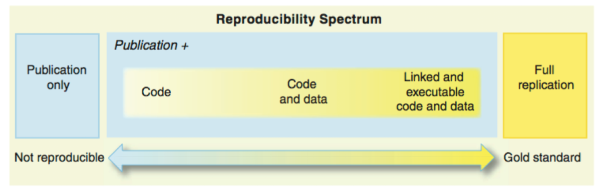
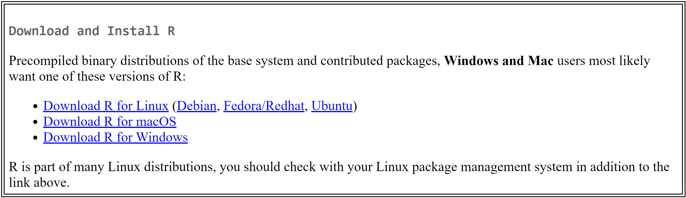
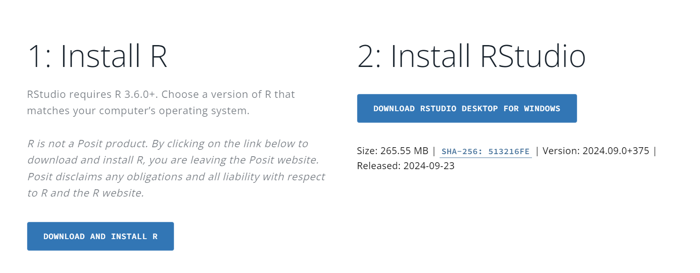
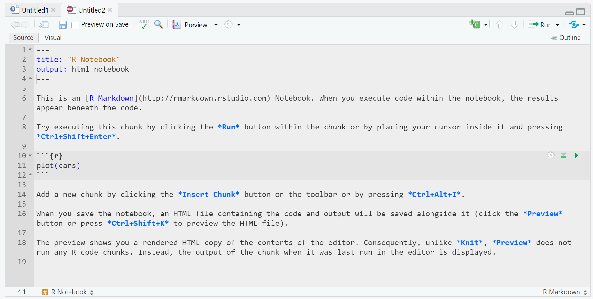
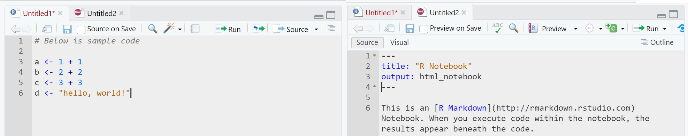

# Introduction to R and RStudio

[[Chunk Version]](_book/files/07-intro_R-chunks.Rmd)

## What is R and RStudio?

### What is R? {.unnumbered}

R is an open-source statistical programming language designed for data manipulation, analysis, and visualization. It provides researchers with a flexible framework for executing complex statistical models, handling large datasets, and creating sophisticated graphical representations. In the context of mass communication research, R allows for the rigorous analysis of quantitative data, such as survey results, social media metrics, and media content analysis, making it an indispensable tool for both academic and industry research.

Unlike traditional spreadsheet programs or point-and-click statistical software, R offers a command-line interface, where users write scripts to execute functions. This characteristic makes it highly adaptable to various research needs, whether analyzing audience engagement with news content or modeling the spread of information through social networks. Researchers can write custom scripts and share them, making research more transparent and reproducible.

The strength of R lies in its extensive package ecosystem, which covers nearly every imaginable statistical method. The packages extend the functionality of R, allowing researchers to handle everything from basic descriptive statistics to advanced machine learning techniques. With packages like `tidyverse` for data wrangling and `ggplot2` for visualization, R offers a comprehensive suite for mass communication research.

### What is RStudio? {.unnumbered}

RStudio is an integrated development environment (IDE) for R, designed to simplify the process of writing and executing R code. It combines a user-friendly interface with powerful tools that enhance productivity, making it easier for both beginners and experienced users to work efficiently. For students and researchers in mass communication, RStudio offers a practical way to interact with R without being overwhelmed by its command-line interface.

RStudio provides features such as syntax highlighting, auto-completion, and a visual interface for plots and data frames, making it accessible for users at all levels. It organizes R's functionality into easily navigable panels, including a script editor, a console, a workspace viewer, and a file browser. Additionally, it offers seamless integration with version control systems (e.g., Git), enabling researchers to track changes and collaborate more effectively on data analysis projects.

For mass communication researchers, who often handle large datasets from surveys or media content analysis, RStudio's tools streamline data wrangling and visualization. The IDE supports the generation of reproducible reports using R Markdown, which combines narrative text and R code to produce dynamic, interactive documents. This feature is especially useful when presenting research findings, as it allows researchers to include live code and results in their reports, ensuring accuracy and transparency in the research process.

## Why Use R and RStudio?

R and RStudio offer significant advantages for students and researchers in mass communication. The combination of these tools provides unparalleled access to robust statistical capabilities, cutting-edge data visualization, and a framework for reproducible and transparent research. Below are some key reasons why R and RStudio are essential for mass communication research.

### Open Source {.unnumbered}

One of the primary advantages of R is its open-source nature. Unlike many other statistical software packages that require expensive licenses, R is completely free to download and use. This accessibility ensures that anyone, regardless of institutional resources, can take advantage of its powerful features. Moreover, the open-source community behind R is continually developing and sharing new packages, which means researchers have access to cutting-edge tools without additional costs.

For mass communication researchers, this is particularly beneficial, as the field often requires interdisciplinary methods and techniques. The vast array of packages and tools available in R enables researchers to adapt their workflows to meet the specific needs of their projects---whether analyzing large datasets, scraping data from social media, or conducting sentiment analysis on user-generated content.

### Data Analysis and Visualization {.unnumbered}

R excels in data analysis and visualization, providing tools that go beyond the basics offered by many standard software packages. With R, users can perform complex statistical analyses, such as regression modeling, hypothesis testing, and machine learning, all within a single platform. Furthermore, packages like `ggplot2` allow users to create visually appealing and highly customizable graphs, which are essential for communicating research findings effectively.

For mass communication students and researchers, this means having the ability to explore data from surveys, media analytics, or content studies in a rigorous and visually compelling way. Visualizations such as bar charts, scatter plots, and network diagrams are critical for illustrating patterns in media consumption or audience behavior, helping researchers make their findings more accessible and impactful.

### Reproducible Research {.unnumbered}

A growing demand in academic research is the ability to reproduce and validate results. RStudio supports this through its integration with R Markdown, which allows researchers to create dynamic documents that combine text, code, and output (e.g., tables, charts) in a single report. This means that anyone reviewing the research can trace the exact steps taken, from data importation to analysis, and reproduce the results with accuracy.

[{width="100%"}](https://geohackweek.github.io/reproducible-research/01-reproducible/)

For mass communication researchers, this capability ensures transparency and integrity, which are particularly important when dealing with potentially sensitive or high-impact media data. Whether publishing a report on social media trends or presenting findings on audience demographics, R and RStudio help researchers document and share their work in a way that is fully traceable.

### Flexibility and Customization {.unnumbered}

R's flexibility is one of its standout features. Unlike other statistical software, which may be limited by pre-built functions or rigid workflows, R allows users to customize their analyses by writing their own scripts. This adaptability is crucial in mass communication research, where the types of data (e.g., textual data, video metrics, user interactions) can vary widely and often require bespoke approaches.

Additionally, R's package system allows for almost limitless customization. Users can download packages specific to their field of research or even create their own, making it easier to tailor the analysis to the exact needs of a project. For example, mass communication researchers studying digital engagement might use packages designed for sentiment analysis, network visualization, or web scraping, all of which are readily available in the R ecosystem.

## How to Install R and RStudio

R and RStudio are essential tools for data analysis, visualization, and reproducible research. This section will guide you through the steps to install both R and RStudio on your computer, ensuring you are ready to start coding and analyzing data efficiently.

### How to Install R {.unnumbered}

R can be downloaded from the Comprehensive R Archive Network (CRAN) at <https://cran.r-project.org/>. Follow the steps below to install R on your machine:

1.  **Visit the CRAN website**: Navigate to <https://cran.r-project.org/>.
2.  **Select your operating system**: Choose the appropriate option for your computer---Windows, Mac, or Linux.
    -   **Windows**: Click on "Download R for Windows," and then choose "base" to download the most recent version. Follow the installation prompts.
    -   **Mac**: Click on "Download R for macOS," and choose the version compatible with your operating system. Follow the installation prompts.
    -   **Linux**: Select "Download R for Linux" and follow the specific instructions for your Linux distribution (e.g., Ubuntu, Debian, Fedora).
3.  **Complete the installation**: Once the download is complete, open the installer and follow the on-screen instructions to complete the installation. After installation, R should be ready to use on your system.

[{width="100%"}](https://cran.r-project.org/)

### How to Install RStudio {.unnumbered}

After installing R, you need to install RStudio, a powerful Integrated Development Environment (IDE) that enhances your coding experience and workflow. Follow the steps below to install RStudio:

1.  **Visit the RStudio download page**: Go to <https://posit.co/download/rstudio-desktop/>.

[{width="100%"}](https://posit.co/download/rstudio-desktop/)

2.  **Choose the free version**: Select "RStudio Desktop -- Open Source License" to download the free version of RStudio.
3.  **Select your operating system**: Choose the installer for your operating system (Windows, Mac, or Linux) and download the appropriate file.
    -   **Windows**: Download the installer and run it. Follow the setup prompts to install RStudio.
    -   **Mac**: Download the installer for macOS, open the .dmg file, and drag RStudio into your Applications folder.
    -   **Linux**: Follow the instructions provided on the RStudio download page for your specific Linux distribution.
4.  **Launch RStudio**: After installation, open RStudio. You should see the RStudio interface with the console panel, ready for you to start writing and running R code.

## Getting Started with R and RStudio

### The RStudio Interface {.unnumbered}

RStudio enhances the R experience by providing a user-friendly interface that simplifies coding, analysis, and visualization. The workspace is divided into four main panels, each serving a distinct function:

-   **Script Panel:** The script panel is where you write and edit your R scripts. Scripts are collections of commands that can be saved and reused, which promotes reproducibility and efficiency in your research. By saving your code as scripts, you can run the same analysis on different datasets or share the exact steps with collaborators.

{width="100%"}

-   **Console Panel:** The console is the interactive component where R executes commands. You can type commands directly into the console or run them from a script. The console also displays output, including error messages and other system feedback. This real-time interaction is helpful for testing snippets of code before integrating them into your larger script.

{width="100%"}

-   **Environment Panel:** The environment panel displays all the objects---such as datasets, variables, and functions---currently stored in memory during your R session. It provides an overview of the data and variables you are working with, allowing you to inspect, remove, or modify them easily.

{width="100%"}

-   **Plots/Help/Files Panels:** This multifunctional area is where RStudio displays generated plots and visualizations. It also gives access to R's extensive help files and documentation, helping users troubleshoot or learn about specific functions. Additionally, the file browser in this panel lets you navigate your computer's files and directories, making it easy to locate and import data into R.

{width="100%"}

### Setting Up a New Project {.unnumbered}

RStudio's project management system helps keep your work organized, especially when handling multiple files or analyses. Setting up a project ensures that all related files, scripts, and outputs are in one place.

-   **Creating a Project:** To start a new project, go to `File > New Project...`. RStudio allows you to group all the scripts, data files, and visual outputs related to a specific research question or analysis into one project, making it easier to manage your workflow.

{width="100%"}

-   **Choosing a Location:** You can create a new directory for your project or associate it with an existing folder. Creating projects within dedicated directories is crucial for managing your work, as it ensures all related files are in one location and that relative file paths are maintained. This makes it easier to share your project with others or run it on a different machine without breaking file links.

-   **Version Control:** If you use version control tools like Git, RStudio seamlessly integrates with them. During the project setup, you can create or link a Git repository, allowing you to track changes and collaborate with others effectively. Version control ensures that every modification to your scripts is documented, which is especially useful when working in teams.

-   **Project Management:** RStudio projects save the state of your workspace, including open files, console history, and the working directory. When you reopen the project, RStudio restores this state, enabling you to continue where you left off without needing to reconfigure your environment.

### File Management {.unnumbered}

Effective file management is critical for maintaining an organized and efficient workflow in RStudio. Below are some guidelines for managing different types of files:

#### R Script vs. R Markdown {.unnumbered}

R scripts (`.R` files) are text files where you can write and run R commands. These are best used when the focus is purely on data analysis. On the other hand, R Markdown (`.Rmd` files) allows you to integrate narrative text, R code, and output (e.g., plots, tables) into a single document. R Markdown is useful for generating reproducible reports, making it ideal for assignments, papers, and presentations.

-   **When to use R Script**: Use an R script when you are solely focused on coding and analyzing data without needing additional explanation or documentation.
-   **When to use R Markdown**: Use R Markdown when you want to combine text, code, and results in a report format that can be converted into HTML, PDF, or Word documents.

{width="100%"}

#### CSV vs. Excel {.unnumbered}

For most data analysis tasks in R, **CSV** (Comma Separated Values) files are the preferred format due to their simplicity and compatibility with R's data manipulation functions. R also provides tools for reading **Excel** files (`.xlsx`), but Excel files often introduce complexities, such as multiple sheets or hidden formatting, which can complicate data analysis.

-   **Use CSV files** for straightforward, clean datasets that will be frequently used in your analysis.
-   **Use Excel files** when working with collaborators who require Excel formatting or when the dataset contains multiple sheets or more complex structure.

#### Subfolders {.unnumbered}

When working on large projects, use subfolders within your project directory to organize your files. Common subfolders might include: - `data/` for storing raw and processed datasets. - `scripts/` for organizing your R scripts. - `output/` for saving graphs, tables, and other generated outputs. - `reports/` for storing R Markdown files or other documents that summarize your findings.

This hierarchical organization makes it easier to locate files and ensures that your project remains structured as it grows in complexity.

#### Other Files {.unnumbered}

In addition to scripts and datasets, you may work with a variety of other file types, such as: - **Text files (`.txt`)** for plain text data. - **Image files (`.png`, `.jpeg`)** for embedding visualizations or outputs into reports. - **RData files (`.RData`)** for saving your R workspace so you can quickly reload objects in future sessions.

By keeping your files organized and labeled consistently, you can streamline your workflow and reduce the likelihood of errors when collaborating or revisiting older projects.

## Package Management

R's strength lies in its extensive ecosystem of packages, which extend its core functionality to support specific types of analysis, visualization, and data manipulation. Packages are collections of R functions, data, and documentation, tailored for different tasks. In mass communication research, several packages can aid in content analysis, media trend studies, and social network analysis.

### Installing Packages {.unnumbered}

To install a package in R, you need to use the `install.packages()` function. This only needs to be done once per package:

``` r
install.packages("ggplot2")
```

In RStudio, you can run this code in a code chunk or type it directly into the console. For example, to install a package in R Markdown, use the following code chunk:

``` r
install.packages("ggplot2")
```

After installation, load the package into your R session using the `library()` function:

``` r
library(ggplot2)
```

This makes the package's functions available for use during your R session.

### Commonly Used Packages {.unnumbered}

Some packages particularly useful for mass communication research include: - **`ggplot2`**: For creating high-quality data visualizations. - **`dplyr`**: For data manipulation and cleaning. - **`tm`**: For text mining and content analysis, useful for analyzing media content. - **`rtweet`**: For collecting and analyzing Twitter data, essential in social media research. - **`quanteda`**: For text analysis, commonly used for media content studies.

Once installed, packages can be updated periodically using the `update.packages()` function.

## Basics of R Programming

This section introduces basic R programming concepts relevant to mass communication research. We assume no prior knowledge of coding, so we'll start from scratch. The examples below are designed to be used in R Markdown, which allows you to combine code, text, and output into a single, reproducible document.

### Code Chunks in R Markdown {.unnumbered}

In R Markdown, code is written inside "chunks." These chunks execute code and display the output directly in the document. To insert a code chunk in R Markdown, use three backticks followed by `{r}` to indicate you are writing R code. For example:

``` r
# This is a code chunk
print("Hello, World!")
```

*Output: "Hello, World!"*

The code inside the chunk runs when you "knit" the document, and the output will appear in the resulting file.

### Manually Inputting Data {.unnumbered}

Data can be input directly into R, which is useful for small datasets or examples. Below is how you manually input data as a vector (a list of numbers or words):

``` r
# Inputting numerical data
age <- c(18, 23, 21, 30)

# Inputting character data
names <- c("Alice", "Bob", "Carol", "David")
```

## Commenting and Organizing Code

Clear, well-commented, and organized code is crucial for making your analysis reproducible and understandable, especially when sharing it with others or revisiting it later.

### Commenting Code {.unnumbered}

In R, comments are created using the `#` symbol. Anything written after `#` is ignored by R and is only meant for humans reading the code. Commenting is useful for explaining what each section of the code does or noting important details about the analysis:

``` r
# This is a comment
age <- c(18, 23, 21, 30)  # Vector of ages
```

Use comments to explain the purpose of code sections, especially when performing key analyses. For example:

``` r
# This code reads data from an online CSV file
billboard <- read.csv("https://raw.githubusercontent.com/rfordatascience/tidytuesday/refs/heads/master/data/2021/2021-09-14/billboard.csv")
```

### Organizing Code with Sections {.unnumbered}

To organize larger scripts, you can use headers or dividers to mark different sections. This makes it easier to navigate the code:

``` r
# ===========================
# Section: Data Preparation
# ===========================
```

In R Markdown, you can organize code sections using headings in markdown format:

## Data Preparation

``` r
# Code for preparing data goes here
```

### Keeping Code Tidy {.unnumbered}

Organized, readable code is essential, especially in collaborative research projects. Some tips for keeping your code tidy: - Use consistent indentation for better readability. - Break long lines of code into multiple lines. - Avoid excessive nesting of functions; instead, break them into separate steps.

By commenting effectively and organizing your code logically, you make it easier for others (and yourself) to understand your analysis, contributing to better research practices.

## Basic Operations in R

Understanding the basic operations in R is vital for embarking on more complex data analysis and programming tasks. These operations include arithmetic calculations, variable assignments, and function calls.

### Arithmetic Operations {.unnumbered}

#### Overview {.unnumbered}

Arithmetic operations form the basis of numerical calculations in R. These operations can be conducted directly in the R console and include addition, subtraction, multiplication, division, exponentiation, and other mathematical functions (Chambers, 2008).

#### Common Arithmetic Operators {.unnumbered}

-   **Addition (`+`)**: Adds two numbers.
-   **Subtraction (`-`)**: Subtracts the right-hand operand from the left-hand operand.
-   **Multiplication (`*`)**: Multiplies two numbers.
-   **Division (`/`)**: Divides the left-hand operand by the right-hand operand.
-   **Exponentiation (`^`)**: Raises the left-hand operand to the power of the right-hand operand.
-   **Modulus (`%%`)**: Gives the remainder of the division between two numbers.

#### Examples {.unnumbered}

You can execute these basic arithmetic operations directly in the R console.

***Addition***

``` r
5 + 3
```

*Output: 8*

***Subtraction***

``` r
5 - 3
```

*Output: 2*

***Multiplication***

``` r
5 * 3
```

*Output: 15*

***Division***

``` r
5 / 3
```

*Output: 1.666667*

***Exponentiation***

``` r
5 ^ 3
```

*Output: 125*

### Variables {.unnumbered}

#### What Are Variables? {.unnumbered}

Variables act as storage containers for data, including numbers, strings, vectors, and other complex data types. Variable assignment is a crucial aspect of programming and data management in R (Wickham, 2014).

#### Assignment Operators {.unnumbered}

-   **Leftward (`<-`)**: Assigns the value on the right to the variable on the left.
-   **Equal (`=`)**: Can also be used for assignment, though `<-` is traditionally preferred in R.

#### Examples {.unnumbered}

``` r
# Assigning a numerical value to a variable using <-
x <- 10
y <- 20

# Assigning a string value to a variable using =
text_variable = "Hello, World!"

# Printing variables
print(x)
print(text_variable)
```

*Output:10* *"Hello, World!"*

### Functions {.unnumbered}

#### Function Overview {.unnumbered}

Functions are predefined sets of operations that perform specific tasks. Functions in R can be either built-in, such as `sum()` or `mean()`, or user-defined for more customized operations (Chambers, 2008).

#### Built-in Functions {.unnumbered}

Examples of common built-in functions include: dz - **`sum()`**: Calculates the sum of all the values in a numeric vector. - **`mean()`**: Calculates the arithmetic mean of a numeric vector. - **`sqrt()`**: Calculates the square root of a number.

***Using sum function***

``` r
sum(1, 2, 3)
```

*Output: 6*

***Using mean function***

``` r
mean(c(1, 2, 3, 4))
```

*Output: 2.5*

***Using sqrt function***

``` r
sqrt(16)
```

*Output: 4*
