# Data Visualization in R

[[Chunk Version]](files/11-data_visualization-chunk.Rmd)

## Introduction to Data Visualization

Data visualization is essential to media and mass communication research, where vast amounts of data are often collected from surveys, social media, content analyses, and audience metrics. In this field, researchers seek not only to analyze complex patterns in media usage, audience behaviors, and communication flows but also to communicate these findings effectively to diverse stakeholders, including scholars, practitioners, and the general public. Through visual representation, data visualization facilitates the transformation of abstract or complex datasets into digestible, engaging, and informative visual narratives. By highlighting key patterns, trends, and outliers, visualization plays a critical role in clarifying the underlying relationships in media data and providing evidence-based insights into issues such as audience engagement, social trends, and the effectiveness of media content.

In mass communication and media studies, data visualization serves as a bridge between raw data and meaningful interpretation, enabling researchers to accomplish several critical objectives:

**Simplifies Complexity**

Visualization tools condense extensive and complex datasets into graphics that allow for quick comprehension. For instance, when analyzing social media trends or audience demographics, visualizations can encapsulate intricate relationships that would otherwise be difficult to discern from raw data alone.

**Reveals Patterns and Trends**

By plotting data points, researchers can observe patterns, trends, and anomalies that are essential to understanding the broader implications of media behaviors and interactions. Time series plots, for example, help track shifts in public opinion or media consumption over time, providing a clearer view of longitudinal changes.

**Enhances Accessibility for Diverse Audiences**

In the field of mass communication, research findings often reach non-specialist audiences, such as policymakers, media professionals, and the public. Visualizations allow researchers to translate complex data into accessible formats, supporting transparency and fostering informed discussions on media impact and societal trends.

**Supports Evidence-Based Decision-Making**

For media professionals, visualizations provide a rapid means to interpret audience metrics and content performance. By making data instantly interpretable, visualization supports data-driven strategies in media planning, content creation, and marketing.

Data visualization methods are diverse, encompassing a range of charts, graphs, maps, and infographics that can be customized to the research question at hand. To support these visualizations, RStudio’s `ggplot2` package provides a robust framework grounded in the "Grammar of Graphics" concept. `ggplot2` enables researchers to build each visualization by defining essential elements—such as data mappings, geometric shapes, scales, and themes—in layers. This layered approach allows for a high degree of customization, from selecting aesthetic properties (e.g., color and size) to applying statistical transformations. The flexibility of `ggplot2` makes it particularly suitable for mass communication research, where diverse data sources and varied research questions demand adaptable visualization techniques.

Furthermore, as media and communication studies increasingly incorporate big data and computational methods, visualizations play a pivotal role in exploring and communicating findings derived from large-scale datasets. Social media analyses, for instance, generate millions of data points, which become understandable through network graphs, sentiment heatmaps, or frequency distribution plots. In this context, `ggplot2`’s range of functionalities—from basic scatter plots to complex faceted plots—enables researchers to produce sophisticated, publication-quality visualizations that align with the rigor and interpretive needs of mass communication research.

Data visualization is a cornerstone of media and communication studies, where it aids researchers in presenting complex data in an engaging, transparent, and interpretable way. It allows scholars and media professionals alike to uncover hidden patterns, effectively communicate findings, and make informed, evidence-based decisions that can shape media policies, content, and strategies.

## Data Visualization in R

**Loading Necessary R Packages**

The following packages are required to execute the analyses presented in this chapter. Each package plays a unique role in data manipulation, visualization, or statistical testing, which will be clarified in the sections that follow.

Here’s the updated section where the listed libraries in the code block are then defined immediately afterward.

``` r
# Install and load necessary packages
if (!require("data.table")) install.packages("data.table")
if (!require("dplyr")) install.packages("dplyr")
if (!require("ggplot2")) install.packages("ggplot2")
if (!require("lubridate")) install.packages("lubridate")
if (!require("hexbin")) install.packages("hexbin")
if (!require("ggthemes")) install.packages("ggthemes")
```

-   **data.table**: Efficiently handles large datasets, particularly useful when working with substantial media-related data files. `data.table` enhances R’s base data structures, allowing fast aggregation, joining, and filtering, which can be especially beneficial in media studies that involve analyzing large sets of audience metrics or social media data.

-   **dplyr**: Facilitates data manipulation and cleaning, ensuring datasets are structured appropriately for each analysis type. `dplyr` provides a set of intuitive functions, such as `filter()`, `select()`, and `mutate()`, which simplify data wrangling processes and allow researchers to prepare data for analysis or visualization.

-   **ggplot2**: A powerful visualization library based on the "Grammar of Graphics," enabling researchers to construct complex, layered plots. `ggplot2` is ideal for creating publication-ready visuals, including scatter plots, bar charts, and histograms, which support data-driven storytelling in media and communication research.

-   **lubridate**: Simplifies the handling of dates and times, making it easier to parse, manipulate, and analyze date-time data. This is useful for analyzing time-based patterns, such as tracking audience engagement over time or studying trends in social media activity.

-   **hexbin**: Useful for visualizing large amounts of two-dimensional data using hexagonal binning. `hexbin` is particularly helpful when scatter plots become overcrowded, allowing researchers to represent data density more effectively. This is valuable for media research when analyzing extensive datasets with two continuous variables, such as user engagement versus time spent on a platform.

-   **ggthemes**: This package provides for a variation of specialized themes to assist with stylizing ggplot2 plots.

This set of libraries supports efficient data manipulation, visualization, and statistical analysis, ensuring that your research data is handled effectively throughout the workflow.

**Loading the Datasets**

The analyses in this chapter utilize four distinct datasets from various domains in media studies, loaded from external sources to ensure reproducibility. The datasets include `anime`, `horror_movies`, `survivor`, and `video_games`, each of which has a corresponding data dictionary to help interpret variables and structure. Below, we load these datasets and briefly describe their contents.

``` r
# Load datasets
anime <- fread("https://raw.githubusercontent.com/rfordatascience/tidytuesday/master/data/2019/2019-04-23/tidy_anime.csv")
horror_movies <- fread("https://raw.githubusercontent.com/rfordatascience/tidytuesday/master/data/2022/2022-11-01/horror_movies.csv")
swift_songs <- fread('https://raw.githubusercontent.com/rfordatascience/tidytuesday/refs/heads/master/data/2023/2023-10-17/taylor_all_songs.csv')
video_games <- fread("https://raw.githubusercontent.com/rfordatascience/tidytuesday/master/data/2019/2019-07-30/video_games.csv")
```

**Drop Scientific Notation**

The following option allows you to stop scientific notation.

``` r
options(scipen = 999) 
```

### Introduction to Plots with `ggplot2` {.unnumbered}

The `ggplot2` package in R, developed by Hadley Wickham, is a powerful and flexible tool for creating a wide variety of data visualizations. Designed around the principles of the "Grammar of Graphics" (Wilkinson, 2005), `ggplot2` allows users to layer various elements of a plot—data, mappings, and geometries—to construct meaningful, interpretable visuals. This approach to plotting is particularly beneficial in media and mass communication research, where clarity and structure are paramount for conveying complex insights about media patterns, audience behaviors, and trends.

As students new to R, you’ll find that `ggplot2` provides a structured yet intuitive way to begin creating data visualizations. Using `ggplot2`, you will learn how to represent data accurately while tailoring visuals to meet the expectations of different audiences, including both academic and industry stakeholders.

#### Basic Structure of a `ggplot2` Plot {.unnumbered}

In `ggplot2`, creating a plot involves three primary components: 1. **Data**: The dataset you want to visualize. 2. **Aesthetic Mappings (aes)**: How the variables in your data relate to the visual properties of the plot, such as the x-axis, y-axis, color, size, or shape. 3. **Geometries (geom)**: The type of plot you want to create, like a bar chart, line graph, or scatter plot.

The core structure of a `ggplot2` plot starts with the `ggplot()` function, where you define the data and mappings, followed by a geometry layer. For example:

```         
# Example of a basic scatter plot
ggplot(data = <dataset>, aes(x = <x_variable>, y = <y_variable>)) +
  geom_point()
```

This code creates a scatter plot, where `<dataset>` represents your dataset, and `<x_variable>` and `<y_variable>` represent the variables you wish to plot on the x- and y-axes, respectively.

#### Example: Visualizing Taylor Swift Data {.unnumbered}

To make this approach more concrete, let's look at an example relevant to media research. Suppose we have a dataset of Taylor Swift songs. Using `ggplot2`, we can create a bar chart to illustrate album lengths in hours.

``` r
# Prepare dataset
swift_albums <- swift_songs %>%
  filter (album_name != "NA",
          duration_ms != "NA") %>%
  group_by(album_name) %>%
  summarise(duration_hrs = sum(duration_ms/3600000))

# Bar chart showing daily shares
album_bar <- ggplot(swift_albums, # data set
       aes(x = reorder(album_name, duration_hrs), # duration_hrs as x value and reorder by album_name
           y = duration_hrs)) + # duration_hrs as y value
  geom_bar(stat = "identity") + # bar charts
  labs(title = "Length of Taylor Swift Album in Hours", # title text
       x = "Album Name", # x-axis text
       y = "Album (hours)") + # y-axis text
  coord_flip() # rotate plot 90 degrees clockwise
album_bar
```

In this example: - `swift_songs` is the dataset, where `album_name` is the listed album name, and `duration_hrs` is the collective time of the tracks on the ablum. - `geom_bar(stat = "identity")` specifies a bar chart, where the height of each bar corresponds directly to the `shares` value for each day.

{width="100%"}

#### Adding Layers and Customization {.unnumbered}

One of the most versatile aspects of `ggplot2` is the ability to add layers and customize your plots. For instance, you can add a line to distinguish an important part of the plot and change its color, style, and size.

``` r
# Past example with mean line
album_bar +
  geom_hline(yintercept = mean(swift_albums$duration_hrs), #add mean duration hours
             color = "red", # make line red
             size = 2, # make line thicker
             linetype = "dashed") # make line dashed
```

This bar chart adds a mean line across the album durations.

{width="100%"}

#### Practice and Application {.unnumbered}

Experimenting with `ggplot2` is essential to becoming proficient in data visualization. Try altering the `aes()` mappings, using different `geom` types, or modifying plot aesthetics to fit the specific goals of your analysis. By mastering `ggplot2`, you will develop a robust skill set that will serve you well in various media research contexts, from academic papers to industry presentations.

### Types of Plots for Data Visualization {.unnumbered}

Visualizing data effectively begins with choosing the appropriate plot based on the structure and nature of your variables. Different types of plots reveal various aspects of the data, from distribution shapes to relationships between variables. This section introduces four primary categories of plots in `ggplot2`, organized by variable type.

One Variable: Continuous {.unnumbered}

When working with a single continuous variable, visualizations focus on understanding the distribution, central tendency, and variability within the data. Continuous data, such as movie runtime, video game ratings, or anime episode counts, can be plotted to reveal insights about their spread and frequency.

1.  **Histograms**: Histograms display the frequency distribution of a continuous variable by grouping data into bins. This is useful for seeing the shape of the distribution (e.g., skewness) and identifying any outliers.

``` r
ggplot(data = horror_movies, aes(x = runtime)) +
  geom_histogram(binwidth = 10, fill = "steelblue", color = "black") +
  labs(title = "Distribution of Horror Movie Runtimes", x = "Runtime (minutes)", y = "Frequency")
```

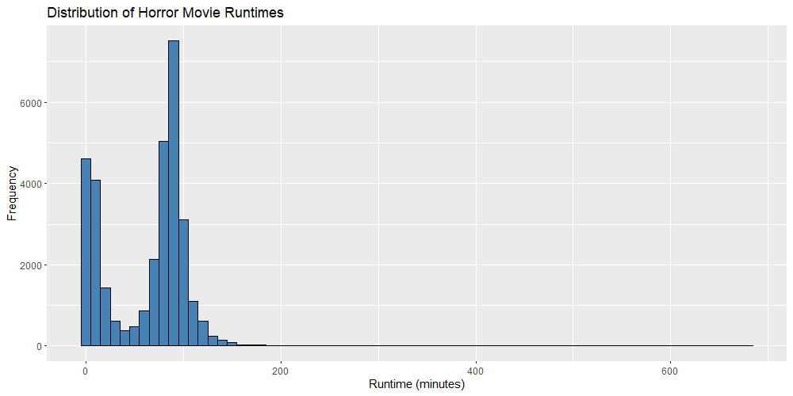{width="100%"}

2.  **Density Plots**: Density plots are smoothed representations of the data distribution and can provide a clearer picture of the underlying pattern compared to histograms, particularly with large datasets.

``` r
ggplot(data = anime, aes(x = score)) +
  geom_density(fill = "lightblue") +
  labs(title = "Density Plot of Anime Episode Counts", x = "Episodes", y = "Density")
```

{width="100%"}

3.  **Box Plots**: Box plots summarize the distribution using five-number summaries (minimum, first quartile, median, third quartile, and maximum), making them effective for identifying outliers.

``` r
ggplot(data = video_games, aes(x = owners, y = metascore)) +
  geom_boxplot(fill = "tomato") +
  labs(title = "Box Plot of Video Game Ratings", y = "Rating") +
  coord_flip()
```

{width="100%"}

#### Two Variables: Both Continuous {.unnumbered}

Plots involving two continuous variables reveal relationships, trends, and potential correlations. These visualizations are often used to study associations, such as the relationship between budget and revenue for horror movies or ratings versus popularity in anime.

1.  **Scatter Plots**: Scatter plots show the relationship between two continuous variables by plotting individual points. Adding trend lines can help to visualize the direction of the relationship.

``` r
ggplot(data = horror_movies, aes(x = budget, y = revenue)) +
  geom_point(color = "purple") +
  geom_smooth(method = "lm", color = "darkblue") +
  labs(title = "Scatter Plot of Budget vs. Revenue", x = "Budget", y = "Revenue")
```

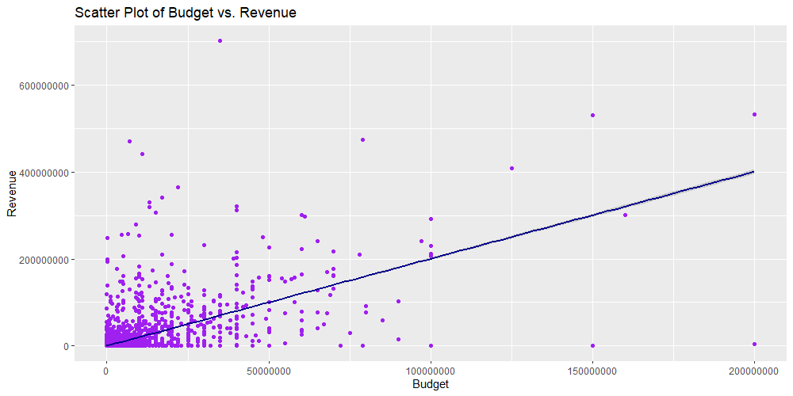{width="100%"}

2.  **Line Plots**: Line plots are suitable for time-series data or when data points are sequential. This plot type is helpful to show trends over time, such as tracking the average rating of horror movies by year.

``` r
# Get average score by year
horror_score_date <- horror_movies %>%
  mutate(release_date = floor_date(as.Date(release_date, "%Y-%m-%d"), unit = "year")) %>%
  group_by(release_date) %>%
  summarize(mean_score = mean(vote_average, na.rm = TRUE))

# Plot average score by year
ggplot(data = horror_score_date, aes(x = release_date, y = mean_score)) +
  geom_line(color = "darkgreen") +
  labs(title = "Average Vote Score of Horror Movies Over Time", x = "Year", y = "Average Rating")
```

{width="100%"}

3.  **Hexbin Plots**: When scatter plots become overcrowded, hexbin plots provide a clearer view by grouping points into hexagonal bins, which display density through color gradients.

``` r
# Plot with swift_songs data
ggplot(data = swift_songs, aes(x = danceability, y = energy)) +
  geom_hex() +
  labs(title = "Hexbin Plot of Danceability vs. Energy", x = "Danceability", y = "Energy")
```

{width="100%"}

#### Two Variables: One Discrete, One Continuous {.unnumbered}

Visualizations with one discrete and one continuous variable are particularly useful for comparing groups or categories. These plots often show how a continuous variable differs across categories, such as movie genres, anime types, or game platforms.

1.  **Bar Charts**: Bar charts display the average or total of a continuous variable across different categories. For instance, a bar chart could show the median playtime for different video game publishers.

``` r
# Filter for top publishers
top_game_publishers <- video_games %>%
  filter(publisher %in% c("SEGA", "Ubisoft", "Square Enix"))

# Plot with new data subset
ggplot(data = top_game_publishers, aes(x = publisher, y = median_playtime)) +
  geom_bar(stat = "summary", fun = "mean", fill = "darkorange") +
  labs(title = "Median Playtime of Video Game by Publisher", x = "Publisher", y = "Median Playtime (hours)")
```

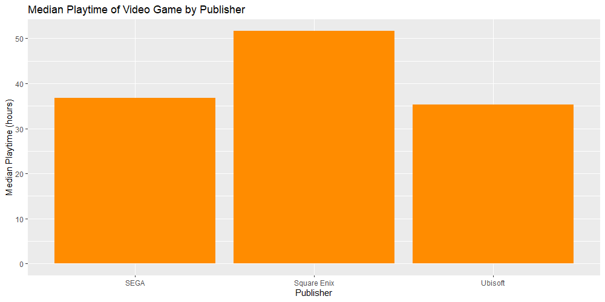{width="100%"}

2.  **Box Plots (Grouped)**: Grouped box plots display the distribution of a continuous variable across discrete categories, showing medians, quartiles, and outliers.

``` r
# Filter for two source types
original_manga <- anime %>%
  filter(source %in% c("Manga", "Original"))

ggplot(data = original_manga, aes(x = source, y = score)) +
  geom_boxplot(fill = "lightcoral") +
  labs(title = "Distribution of Episodes by Anime Genre", x = "Genre", y = "Episodes") +
  coord_flip()
```

{width="100%"}

3.  **Violin Plots**: Violin plots combine box plot information with a rotated density plot, making it easy to compare distributions across categories.

``` r
ggplot(data = top_game_publishers, aes(x = publisher, y = price)) +
  geom_violin(fill = "turquoise") +
  labs(title = "Distribution of Price by Publisher", x = "Publisher", y = "Price ($)") +
  coord_flip()
```

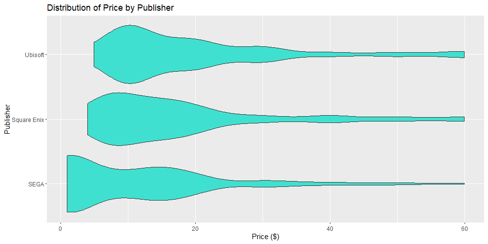{width="100%"}

#### Two Variables: Both Discrete {.unnumbered}

Plots with two discrete variables are helpful in visualizing frequencies or proportions across categories. Such visualizations are valuable for summarizing categorical data, such as counts of anime by genre and season or the distribution of horror movies by subgenre and rating.

1.  **Count Plots**: These plots count the occurrences of combinations of two discrete variables, like the frequency of anime genres across different sources.

``` r
ggplot(data = original_manga, aes(x = source, fill = type)) +
  geom_bar(position = "dodge") +
  labs(title = "Count of Anime by Source and Type", x = "Source", y = "Type")
```

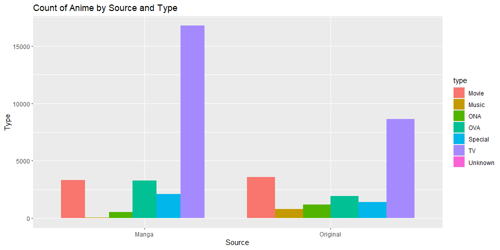{width="100%"}

2.  **Heatmaps**: Heatmaps use color gradients to display counts or intensities of combinations of two categorical variables, making them particularly useful for understanding interactions between two factors.

``` r
ggplot(data = top_game_publishers, aes(x = publisher, y = owners, fill = metascore)) +
  geom_tile() +
  labs(title = "Heatmap of Metascores by Publisher and Owner", x = "Publisher", y = "Owner")
```

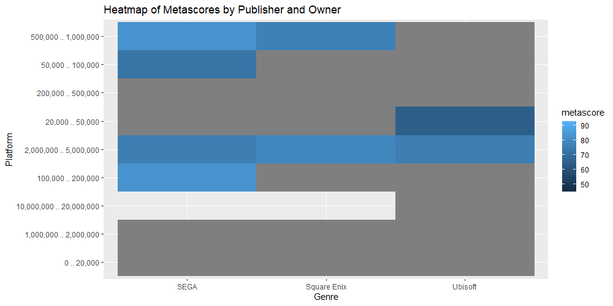{width="100%"}

These plot types provide a range of tools for visualizing data based on the structure of variables, allowing researchers to select the plot that best communicates their data’s story. By utilizing `ggplot2` in R, these visualizations can be tailored to suit specific research questions, enhancing the clarity and impact of findings in media and mass communication research.

### Add Theme to `ggplot2` Plots {.unnumbered}

### Customizing `ggplot2` Plots with Themes {.unnumbered}

Themes are essential in `ggplot2` for transforming the look of your visualizations to better communicate your data’s story. Beyond colors and labels, themes adjust non-data elements like backgrounds, gridlines, and fonts, enhancing both readability and visual appeal. Themes are particularly valuable in media research, where graphs may need to engage diverse audiences or align with specific branding requirements. This section will introduce base `ggplot2` themes and themes from the `ggthemes` package, with examples showing how each theme can alter a plot’s presentation.

#### Introduction to Base Themes in `ggplot2` {.unnumbered}

`ggplot2` comes with several pre-built themes that cater to a variety of needs:

1.  **`theme_gray()`**: The default theme, providing a balanced gray background.
2.  **`theme_bw()`**: A black-and-white theme that’s ideal for print.
3.  **`theme_minimal()`**: Reduces visual clutter by removing background elements, making it great for presentations.
4.  **`theme_classic()`**: Offers a clean look with a simple white background and minimal gridlines.

To illustrate, let’s start with a bar plot of Taylor Swift albums. We will present the original and the and thenapply `theme_minimal()` to give it a modern, stripped-down look.

``` r
album_bar <- ggplot(swift_albums, aes(x = reorder(album_name, duration_hrs), y = duration_hrs)) +
  geom_bar(stat = "identity") +
  labs(title = "Length of Taylor Swift Albums", x = "Album Name", y = "Duration (Hours)") +
  coord_flip()

album_bar 

album_bar +
  theme_minimal()
```

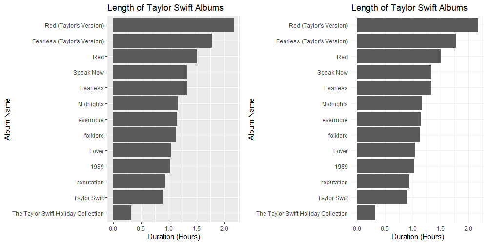{width="100%"}

Here, `theme_minimal()` eliminates the default gray background and focuses attention on the bars and labels. You can further customize it by adjusting text, line weights, and colors.

#### Introducing `ggthemes`: Expanding Visual Styles {.unnumbered}

For more specialized visual styles, the `ggthemes` package offers themes modeled after popular media and publication aesthetics, including:

-   **`theme_fivethirtyeight()`**: Mimics the data-rich but clean style of FiveThirtyEight’s graphics.
-   **`theme_economist()`**: Matches The Economist’s style, with structured gridlines and muted colors.
-   **`theme_tufte()`**: Inspired by Edward Tufte, this theme minimizes non-data elements for clarity.

Let’s apply `theme_economist()` to a scatter plot, showcasing its impact:

``` r
ggplot(horror_movies, aes(x = budget/1000000, y = revenue/1000000)) +
  geom_point(color = "purple") +
  geom_smooth(method = "lm", color = "darkblue") +
  labs(title = "Budget vs. Revenue of Horror Movies", x = "Budget (millions)", y = "Revenue (millions)") +
  theme_economist()
```

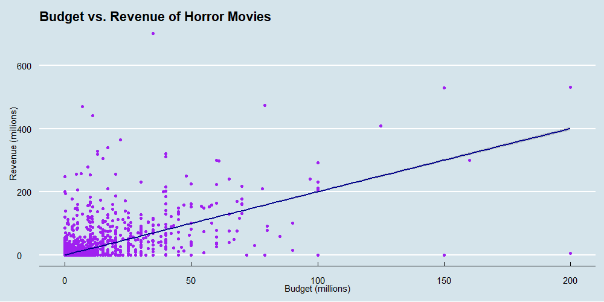{width="100%"}

In this example, `theme_economist()` adds a subtle background with structured gridlines, helping distinguish data points in a way that resembles financial media graphics. The color scheme and layout enhance the professional tone of the plot.

#### Customizing Themes for Adobe Express Export {.unnumbered}

Before exporting to Adobe Express, it’s useful to apply a theme that maintains readability across platforms and allows further editing. Themes like `theme_minimal()` or `theme_classic()` work well, as they provide a clean base, while more complex themes (e.g., `theme_tufte()`) can add polish for final presentations.

``` r
# Example for Adobe Express export-ready plot
ggplot(horror_score_date, aes(x = release_date, y = mean_score)) +
  geom_line(color = "darkgreen") +
  labs(title = "Horror Movie Ratings Over Time", x = "Year", y = "Average Rating") +
  theme_classic()
```

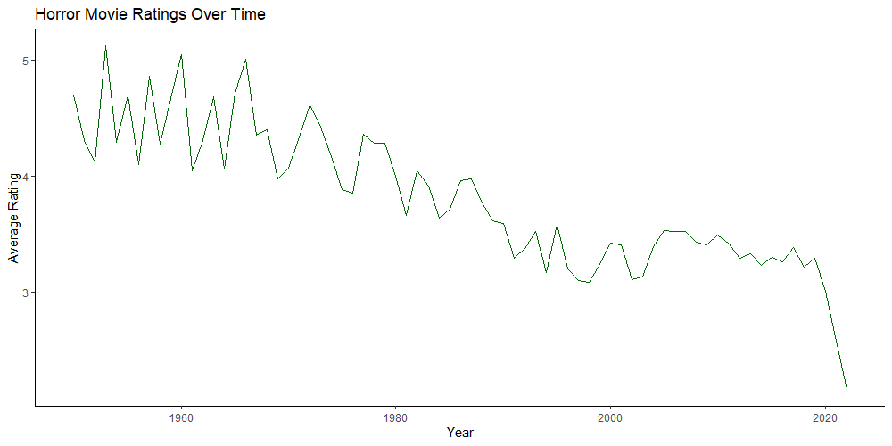{width="100%"}

This plot uses `theme_classic()`, presenting data in a format that will look consistent across platforms. When using Adobe Express, this clean layout allows you to add custom branding or text overlays without visual interference.

#### Enhancing Readability with Custom Theme Adjustments {.unnumbered}

Beyond pre-built themes, you can fine-tune aspects of any theme to better suit your audience:

``` r
album_bar + 
  theme_minimal() +
  theme(
    plot.title = element_text(size = 16, face = "bold"),
    axis.title.x = element_text(size = 14, color = "darkgray"),
    axis.text = element_text(size = 12)
  )
```

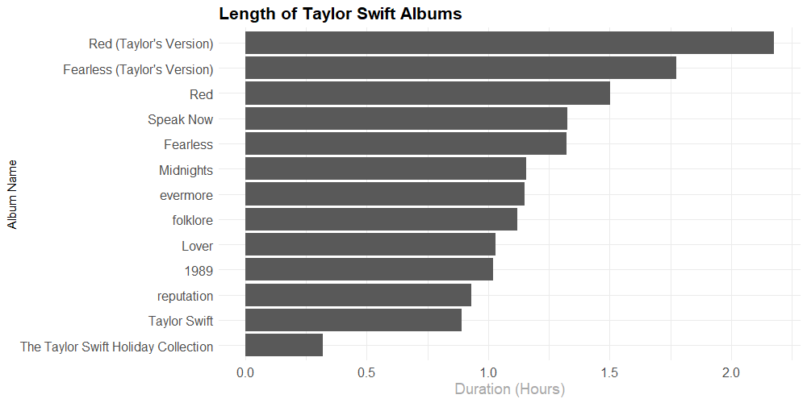{width="100%"}

In this example, we add custom font sizes and colors to `theme_minimal()`, enhancing readability for both print and digital displays. This flexibility lets you create visualizations that are both data-rich and aesthetically tailored, ready for Adobe Express or any other platform.

Experimenting with themes in `ggplot2` and `ggthemes` allows you to develop a cohesive visual style, whether for academic papers, presentations, or social media posts.

## Data Visualization with Adobe Express

### Adapting Plots for Public Content Using Adobe Express {.unnumbered}

After creating research visuals in RStudio, Adobe Express enables researchers to adapt these visuals into polished, professional graphics suitable for wider audiences, including presentations, reports, and social media. Adobe Express provides customizable templates, allowing users to upload exported visuals and adjust color schemes, fonts, and layouts. This customization process improves readability and visual appeal, ensuring that complex data is both understandable and engaging.

### Exporting Plots from RStudio {.unnumbered}

To prepare a plot created in `ggplot2` for Adobe Express, first export the plot as a high-resolution image. RStudio allows you to export plots in both raster (e.g., PNG or JPEG) and vector formats (e.g., PDF or SVG), depending on the intended usage. For presentations or web content, PNG files work well; for printed reports or large displays, vector formats like SVG ensure crisp quality.

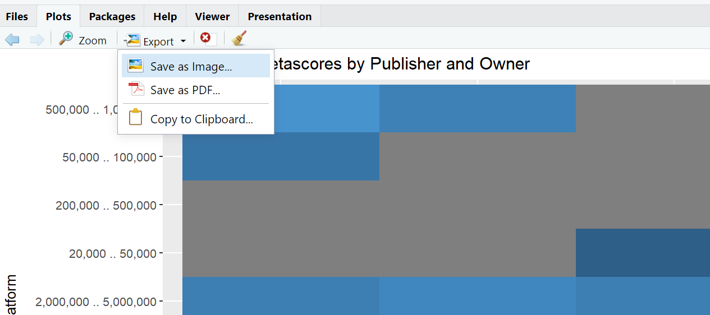{width="100%"}

#### Exporting via the `ggsave()` Function {.unnumbered}

The `ggsave()` function in `ggplot2` enables you to save the last generated plot with custom dimensions and resolution settings. Here is an example:

``` r
# Save the plot as a PNG file with specified dimensions and resolution
ggsave("plot.png", plot = last_plot(), width = 8, height = 5, dpi = 300)
```

-   **File Type**: `ggsave()` recognizes the file type based on the file extension. Use `.png`, `.jpg`, or `.pdf` depending on your requirements.
-   **Width and Height**: Define the plot’s dimensions in inches to ensure consistent sizing across different media.
-   **Resolution (`dpi`)**: For screen presentations, 72-150 dpi is generally sufficient, while 300 dpi is recommended for high-quality print.

#### Step-by-Step: Exporting the Plot Image {.unnumbered}

1.  Generate and finalize your plot in RStudio.
2.  Save the plot using `ggsave()` with appropriate dimensions and resolution.
3.  Locate the saved file in your working directory and upload it to Adobe Express for further customization.

### Customizing with Adobe Express {.unnumbered}

Once your plot is in Adobe Express, you have a wide array of customization tools to enhance its effectiveness for the target audience. Adobe Express allows users to apply design adjustments that ensure the plot remains professional, visually appealing, and aligned with the overall message of the content.

1.  **Add Titles and Annotations**: Titles, subtitles, and annotations are essential for guiding the viewer’s attention and clarifying the story behind the data. Use text boxes in Adobe Express to label key findings, highlight trends, or provide context. Annotations should be clear and positioned strategically to minimize distraction. Titles can be bold and slightly larger than other text to stand out, and subtitles can provide additional context or highlight the plot's relevance.

2.  **Adjust Color and Branding**: Adobe Express provides flexibility in adjusting colors to align with institutional or project branding, ensuring a cohesive look for professional presentations or reports. Consistent branding reinforces a visual identity, which is especially important when multiple plots or visuals are presented together. Select color schemes that are easy to interpret and consider accessibility guidelines, such as choosing colors that are distinguishable for those with color vision deficiencies.

3.  **Incorporate Layouts and Design Elements**: Adobe Express includes numerous templates and design elements like shapes, icons, and dividers, which can enhance readability and structure. Experiment with layout options that suit the plot’s purpose. For instance, adding shapes or arrows can draw attention to specific data points, while icons can add thematic relevance to presentations. Balance visual elements to avoid clutter; simplicity often enhances interpretability.

4.  **Enhance Readability with Font Customization**: Adobe Express offers a variety of fonts and text styles that allow you to align the visual's tone with your content’s purpose. For academic or professional presentations, choose clean, straightforward fonts like Arial or Helvetica. Adobe Express allows you to adjust font size, weight, and color for better readability. Use different font sizes to create a natural hierarchy; for example, titles and subtitles can be larger, with annotations in a smaller, yet readable, font.

5.  **Optimize for Different Platforms and Formats**: Adobe Express enables users to adapt their visuals to specific platforms, such as Instagram, LinkedIn, or presentation slides, by adjusting the aspect ratio and resolution. For social media, consider square or vertical formats, while horizontal layouts may be preferable for presentation slides. Adobe Express also allows you to save images in high resolution, making them suitable for print or digital publication.

6.  **Add Interactive Elements for Digital Presentations**: For interactive or digital presentations, Adobe Express enables the addition of clickable elements, embedded links, or QR codes. Although Adobe Express does not support interactive plotting, it allows for links to other resources or interactive plots hosted on external platforms. Adding QR codes to static visuals can provide viewers with access to dynamic data or related resources.

[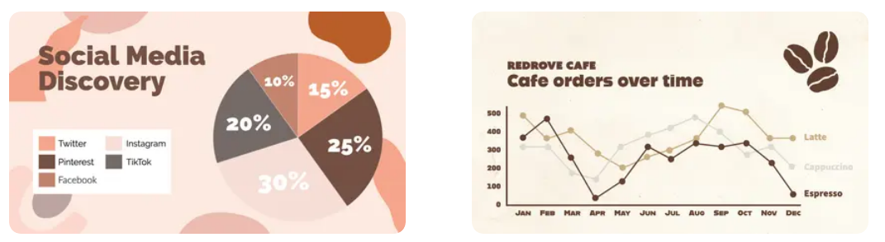{width="100%"}](https://www.adobe.com/express/learn/blog/data-visualization)

### Example Workflow: Enhancing a Plot with Adobe Express {.unnumbered}

Consider a scatter plot of "Budget vs. Revenue" for horror movies. Here’s a step-by-step example of how to enhance it in Adobe Express for a presentation:

1.  **Upload the Plot**: Import the plot image saved from `ggplot2` into Adobe Express.
2.  **Add a Title**: Use a large, bold title like “Budget vs. Revenue for Horror Movies” at the top to capture attention.
3.  **Add Annotations**: Place smaller text boxes near significant outliers to provide explanations, such as “High-budget, low-revenue outlier.”
4.  **Adjust Colors**: Change the plot’s color scheme to align with the branding of the institution or presentation theme.
5.  **Incorporate Design Elements**: Add arrows pointing to clusters of data points that show particular trends, such as movies with moderate budgets and high revenue.
6.  **Save and Export**: Once complete, download the enhanced plot in a high-resolution format suitable for your presentation medium.

### Final Thoughts on Adobe Express Customization {.unnumbered}

Adobe Express’s design flexibility allows researchers to create polished, visually compelling data visualizations that are suitable for diverse applications. By enhancing RStudio-generated plots with custom titles, branding, and accessible layouts, researchers can create visuals that effectively communicate their data’s story. Whether for academic conferences, public reports, or social media, these adaptations ensure that the visualization resonates with the intended audience, promoting clearer communication and broader engagement with the research findings.
