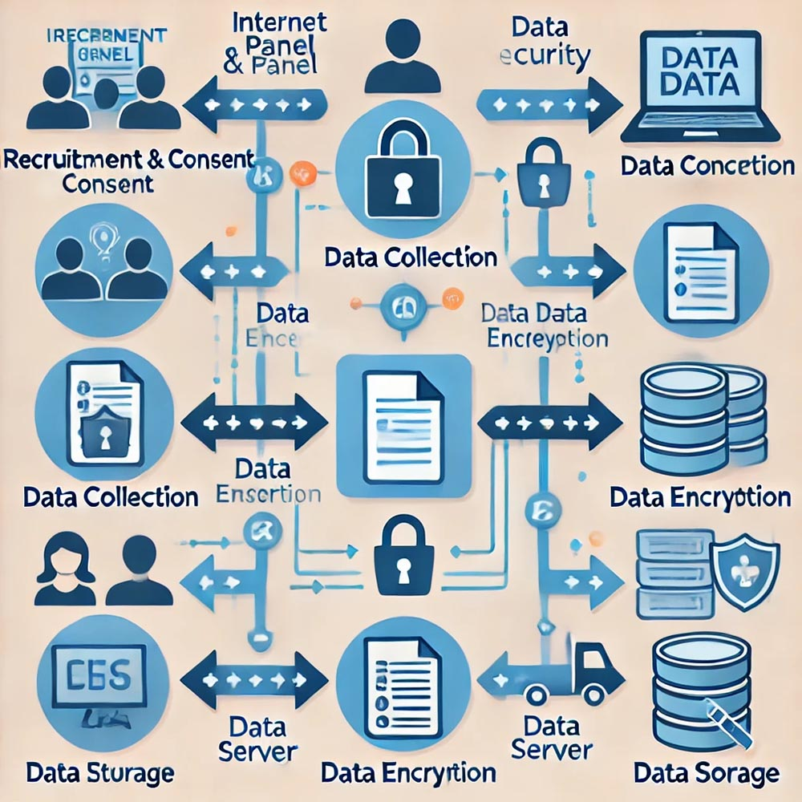

# Special Topics in Research Methods

## Ethical Issues in Emerging Media Research

### Digital Privacy and Research

In the digital age, research increasingly involves collecting data from participants over the internet, whether through surveys, online studies, or participation in internet panels. While this method offers convenience and access to a broader participant pool, it also introduces significant ethical challenges, particularly concerning privacy and data security. Understanding these challenges and learning how to navigate them is crucial for conducting responsible and ethical research in the digital realm.

#### Internet Panels

Internet panels are a common method of gathering data from participants who regularly engage in online surveys or studies. These panels involve recruiting individuals to participate in ongoing research, often with the promise of incentives such as monetary rewards or gift cards. While internet panels can provide valuable longitudinal data, they raise critical privacy concerns. Researchers must ensure that participants' personal information is protected and that data ownership is clearly defined.

Ethical considerations are paramount when designing and conducting research using internet panels. One must consider the informed consent process, where participants should fully understand how their data will be used, who will have access to it, and how it will be stored. Additionally, researchers must be aware of potential biases that can arise from self-selection, as individuals who choose to join internet panels may differ significantly from the general population.

To illustrate the importance of these issues, we will discuss several case studies where privacy concerns in internet panels were brought to light. For instance, one case might involve a breach of data security where participants' personal information was accessed by unauthorized parties. In another, participants may have been unaware of the extent to which their data was being shared with third parties, leading to concerns about data ownership and consent.

{width="100%"}

*Figure 094. A diagram showing the flow of data in an internet panel study, highlighting key points where privacy and security measures must be implemented, such as consent forms, data encryption, and storage protocols.*

As part of your learning, you will be tasked with designing an internet panel study. This exercise will focus on developing clear and robust privacy policies and consent procedures. You will need to consider how to communicate these policies to participants in a transparent and understandable way, ensuring that their privacy is respected throughout the research process.

#### Internet Surveys

Internet surveys are another widely used tool in digital research, offering a convenient way to collect data from a large and geographically diverse group of participants. However, conducting surveys online comes with its own set of privacy challenges. The risk of data breaches, unauthorized access, and the potential misuse of collected data are all concerns that researchers must address proactively.

To ensure the security of data collected through internet surveys, researchers should implement best practices such as encryption of data during transmission and storage, anonymization of responses to protect participant identities, and secure storage solutions that prevent unauthorized access. Additionally, the ethical implications of these practices must be considered, particularly in relation to the digital divide, where unequal access to technology can influence who participates in online surveys and how they respond.

{width="100%"}

*Figure 095. A flowchart illustrating the process of conducting an internet survey, from design to data collection, with emphasis on points where privacy and security measures should be implemented, such as data encryption and anonymization techniques.*

In class, we will discuss these best practices and review real-world examples where internet surveys have encountered privacy challenges. You will then engage in a project where you create your own internet survey, paying particular attention to how you address privacy concerns and ethical considerations in the design of your study.

#### Social Desirability

Social desirability bias is a well-known issue in survey research, where participants may respond to questions in a manner they believe will be viewed favorably by others rather than how they truly feel. This bias can be particularly pronounced in online surveys, where the perceived anonymity of the internet might either diminish or exacerbate the effect.

For example, in surveys about socially sensitive topics, participants might alter their responses to align with what they perceive as socially acceptable opinions. This can lead to skewed data and misinterpretations of the research findings. Understanding and mitigating social desirability bias is essential for ensuring the accuracy and validity of your research.

We will explore this concept through examples of online surveys where social desirability bias may have influenced the results. For instance, consider a survey on political beliefs conducted online, where respondents may alter their answers depending on the political climate or the perceived anonymity of the platform.

{width="100%"}

*Figure 096. A comparison of survey responses on a sensitive topic, showing how social desirability bias might influence the difference between anonymous and non-anonymous responses.*

To deepen your understanding, we will conduct a classroom experiment where you will anonymously answer sensitive questions online. Afterward, we will discuss the results and how social desirability may have influenced your answers. This discussion will lead to strategies for minimizing this bias in your research, such as using indirect questioning techniques or ensuring complete anonymity for respondents.

By the end of this section, you should have a solid understanding of the ethical challenges and considerations associated with digital privacy in research. You will also be equipped with practical strategies for designing studies that respect participants' privacy, address potential biases, and produce reliable and valid data.

## Current Trends in Mass Media Research

### Data-Driven Journalism

In the evolving landscape of journalism, data-driven journalism has emerged as a powerful tool for uncovering stories that might not be immediately apparent through traditional reporting methods. This approach involves the collection, analysis, and visualization of large datasets to reveal trends, patterns, and insights that inform public understanding.

#### Data Collection

Data-driven journalism begins with the meticulous collection of data. Unlike traditional reporting, which often relies on interviews and observations, data-driven journalism depends on gathering large datasets, which might include anything from government statistics to social media activity. The ability to uncover hidden stories and trends lies in the careful selection and collection of this data.

To help you understand the importance of data collection, we will explore the principles that guide this process, emphasizing accuracy, transparency, and ethical data use. You will engage in a hands-on project where you will collect and analyze a dataset related to a current news topic, such as economic trends or public health data. This project will illustrate how data can shape the narrative in journalism.

Ethical considerations are paramount in this process, particularly regarding issues of consent, privacy, and potential misuse of data. Journalists must navigate these challenges carefully to ensure that their work upholds the highest standards of integrity.

{width="100%"}

*Figure 097. A flowchart illustrating the data collection process in journalism, from identifying sources to ensuring data accuracy and addressing ethical considerations.*

#### Data Analysis

Once the data has been collected, the next step is analysis. Data analysis in journalism involves using statistical techniques to interpret the data and draw meaningful conclusions. This process requires a balance between rigorous statistical methods and the ability to communicate findings in a way that is accessible to the general public.

In this section, we will cover basic statistical techniques commonly used in data journalism, such as frequency analysis, cross-tabulation, and regression. You will be assigned to analyze a dataset, identify key insights, and consider how these insights could inform a news story. The focus will be on maintaining accuracy and integrity in data interpretation, ensuring that the story told by the data is both truthful and compelling.

{width="100%"}

*Figure 098. A bar chart showing the results of a data analysis, with annotations that highlight key findings and how they might inform a news story.

#### Data Visualization

The final step in data-driven journalism is data visualization, which allows journalists to communicate complex data effectively through visual means. Data visualizations, such as charts, graphs, and interactive tools, help make data more accessible to the audience, enabling them to grasp complex information quickly.

You will be introduced to various tools and techniques for creating effective data visualizations. For instance, we will explore how to use `ggplot2` in R for creating customized visualizations, as well as platforms like Tableau and Datawrapper for more interactive and web-based visual content. The goal is to create a visualization that not only accurately represents the data but also engages and informs the audience.

We will also discuss the ethical implications of data visualization, such as the potential for creating misleading visuals. Transparency in design choices is critical to maintaining the credibility of the work.

{width="100%"}

*Figure 099. A sample data visualization created using `ggplot2`, showing a well-designed, clear, and engaging chart that effectively communicates a data-driven story.*

Through this process, you will gain a comprehensive understanding of how data-driven journalism is conducted, from data collection to the final presentation of the findings. By applying these skills, you will be able to contribute to the field of journalism with stories that are not only compelling but also grounded in robust data analysis.

### Critical Analysis and Rhetorical Criticism

In the study of media and communication, critical analysis and rhetorical criticism play a crucial role in understanding how messages are constructed and how they influence audiences. This chapter will introduce you to key methods and theories used in the analysis of media texts, focusing on discourse analysis, conversation analysis, and standpoint theory.

#### Discourse Analysis

Discourse analysis is a method used to examine how language in media texts constructs meaning, power relations, and social identities. By analyzing the words, phrases, and structures used in texts, researchers can uncover the underlying messages and assumptions that shape public perception and social norms.

In this section, we will explore examples of discourse analysis applied to various media texts, such as political speeches, news reports, and advertisements. You will engage in close reading exercises to identify key discursive strategies, such as framing, metaphor, and narrative, and discuss their implications for the audience.

You will also be assigned a project to conduct a discourse analysis on a chosen media text, such as a commercial, a political ad, or a news article. This project will help you develop the skills needed to critically evaluate how language shapes the audience's perception of reality.

{width="100%"}

*Figure 100. A visual breakdown of a political speech, highlighting key phrases, metaphors, and rhetorical strategies used to influence public opinion. The image should include annotations explaining how these elements contribute to the construction of meaning and power relations.*

#### Conversation Analysis

Conversation analysis is a method focused on the structure and patterns of interactions in spoken or written communication. It often examines how participants take turns, manage pauses, and repair communication breakdowns. This method is particularly useful in understanding the subtleties of everyday communication and the underlying social norms and power dynamics present in interactions.

We will begin by introducing the basic principles of conversation analysis using examples from real-life interactions or media transcripts. You will participate in a classroom activity where you analyze a recorded conversation or media interview, identifying patterns such as turn-taking, interruptions, and pauses. Through this analysis, we will discuss the significance of these patterns and what they reveal about the social dynamics at play.

The insights gained from conversation analysis can help you better understand how media representations of conversations, such as those in talk shows or news interviews, reflect and reinforce social norms and power structures.

{width="100%"}

*Figure 101. A diagram showing a transcript of a conversation with highlighted sections that illustrate key conversational features like turn-taking, pauses, and repairs. Annotations should explain how these features contribute to the overall flow and meaning of the interaction.*

#### Standpoint Theory

Standpoint theory argues that an individual's perspectives are shaped by their social position, and these perspectives influence how they understand and communicate about the world. This theory highlights the importance of considering diverse viewpoints in media analysis, as different social groups may interpret the same media content in varied ways.

In this section, we will explore how standpoint theory has been applied in media research to understand how different social identities—such as race, gender, and class—affect media interpretation. You will be encouraged to reflect on your own standpoint and how it influences your interpretation of media texts.

A reflective writing exercise will be assigned where you will analyze a media text from your perspective, considering how your social position shapes your understanding and interpretation. This exercise will help you appreciate the diversity of perspectives in media interpretation and challenge dominant narratives that may marginalize certain viewpoints.

{width="100%"}

*Figure 102. A visual representation of how different social groups (e.g., based on race, gender, class) might interpret the same media content differently. The image could depict a diverse group of individuals watching the same news report, with thought bubbles showing their different interpretations and reactions.*

By the end of this chapter, you will have developed a deeper understanding of the critical tools and theories used in media analysis. You will be able to apply these methods to dissect and critically engage with media texts, uncovering the complex ways in which language and communication shape our understanding of the world.
